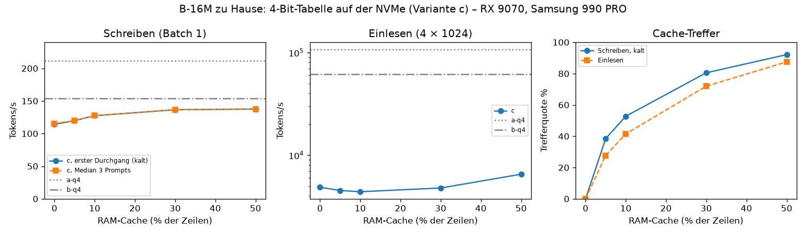

# sparse-memory-lm

What happens if you give a tiny language model a really big lookup table?

I trained a small Llama-style model (21M parameters) and added a product-key memory to it: a table with up to
16.8 million learned vectors, of which the model only reads a few hundred per token. Then I measured what that is
actually worth, what it costs, and whether the table even has to sit in GPU memory. Most of this ran on my own PC
(Radeon RX 9070). The big runs were on rented cloud GPUs, about 65 dollars in total.

Before every run I wrote down what would count as a success. Some things worked out, some didn't. Both are in
here. The full lab notebook with every criterion, every number and every mishap is [REPORT.md](REPORT.md)
(in German).

## Short version

- **Training from scratch:** the 16.8M-row table makes the 21M model about as good as a normal 114M model trained
  on the same data. Per token it does roughly a third of the compute.
- **Bigger keeps helping:** going from 1M to 4M to 16M rows gives about 1.4x "equivalent model size" per step, and
  it isn't flattening out yet.
- **Generating text doesn't need the table in VRAM:** from RAM or straight off an NVMe SSD the model still writes
  114 to 154 tokens/s on my PC, with bit-identical output. Reading long prompts is a different story.
- **Portable kernels:** the same hand-written Triton kernels run on three very different GPUs with the same results:
  a consumer Radeon (RDNA4), AMD's data-centre MI350X (CDNA4) and NVIDIA H100/H200 (Hopper).
- **Adding a table to a finished model didn't work:** on Qwen3.5-0.8B it was no better than a small dense add-on with
  the same compute. It memorised its training articles really well, but it couldn't pull the facts back out.

## Results

### Training from scratch

All models saw the same 500M Wikipedia tokens and are scored on the same held-out Wikipedia articles. The memory
models share one table between three memory layers.

| Model | Params used per token | Table | Val PPL | As good as a dense model with |
|---|---|---|---|---|
| A (no table) | 21M | | 25.67 | |
| B-1M | 23M | 0.4B | 21.84 | ~60M params |
| B-4M | 26M | 1.6B | 20.80 | ~83M params |
| B-16M | 33M | 6.4B | 19.96 | ~114M params (106 to 123M) |

The "as good as" column comes from dense models with 50M, 100M, 200M and 400M parameters (non-embedding) that I
trained on exactly the same data, interpolated on a log-log curve:


**Catches:**
- **Equal compute time:** this compares models at equal *tokens*. At equal *training time* on my GPU, B-1M was
  only 3% ahead of the plain model, because the memory layers make every step slower.
- **Memory:** B-16M needed about 101 GB of GPU memory to train.
- **Other text:** on WikiText-103, which is formatted differently, the advantage is smaller (B-16M ~ 95M).

### Running the 16.8M table on my PC

B-16M with the table in VRAM, in RAM, or as a 4-bit file on an NVMe SSD (Samsung 990 PRO, memory-mapped, with a
RAM cache for the rows that get read most):

| Table in | Writing (batch 1) | Reading a long prompt | VRAM used |
|---|---|---|---|
| VRAM | 212 to 216 tok/s | 108,000 tok/s | 3.6 GB (4-bit) / 13.1 GB (bf16) |
| RAM | 139 to 154 tok/s | 19,000 to 62,000 tok/s | 0.5 GB |
| NVMe | 114 to 138 tok/s | 1,500 to 6,500 tok/s | 0.5 GB |

All three give exactly the same numbers (same perplexity down to the last digit). When writing, the slow part isn't
the SSD but the three round trips between GPU and CPU per token: even with no cache at all the NVMe version is only
18% slower than RAM. When reading a prompt every token needs ~270 different rows, and every missed row costs a
whole 4 KB page from the SSD. That's where it falls apart.



### Adding a table to Qwen3.5-0.8B

**Setup:**
- Qwen stays frozen. Three extra memory blocks (1M-row table) sit behind its layers, each with a gate that starts at
  zero, so at the start the model is bit-for-bit the original Qwen.
- Training data: 55M tokens of Wikipedia articles created after Qwen was released, two passes.
- Compared against Qwen alone (Q) and against a small dense add-on with the same compute (Q+D).

| | Q | Q + table | Q + dense |
|---|---|---|---|
| PPL on new, held-out articles | 12.98 | 10.09 | 10.01 |
| PPL on the training articles | 13.36 | 5.64 | 9.38 |
| Fact test, training articles (exact fill-in) | 4.8% | 10.2% | 7.8% |
| Fact test, articles never seen | 4.0% | 10.2% | 8.0% |
| MMLU | 49.7 | 47.0 | 49.6 |

**What came out:**
- **No gain over the dense add-on:** the table helps on new text exactly as much as the dense add-on does. That's
  adapting to Wikipedia, not the table.
- **Stored, but not retrievable:** it stores the training articles far better, but finds their facts only 2.4
  points more often than the dense version, and the same 2.2 points more often on articles it has never seen. My
  bar for "it learned new facts" was +10 points.
- **Side effects:** it also cost some MMLU, the dense add-on didn't.

## How it works

- **Base model:** Llama-style decoder, d=384, 12 layers, 6 heads, SwiGLU, RoPE, RMSNorm, GPT-2 tokenizer
  (`smlm/model.py`).
- **Memory layers:** in layers 3, 7 and 11 the FFN is replaced by a memory layer (`smlm/pkm.py`), following Lample et
  al. 2019 and Meta's *Memory Layers at Scale*.
  - 4 heads, each picking the exact top 32 out of n² product keys.
  - BatchNorm on the query, softmax over the 32, the "swilu" output path.
  - One value table shared by all three layers.
- **Training the table:** row-sparse gradients and a lazy Adam that only touches the rows read in a step
  (`smlm/sparse_values.py`). Same quality as dense Adam on the table, faster, and much less memory.
- **Triton kernels** (`smlm/kernels.py`), on ROCm and CUDA with identical results:
  - the backward pass of the table lookup
  - the product-key selection
  - the lookup itself for fp32, bf16 or 4-bit tables
  - the fused lazy Adam step
  - a graph-captured decode path

  On the RX 9070 this made training 1.47x faster and brought decoding to the speed of the plain model. What each
  kernel does, how much it brings and where its limits are: [docs/kernels.md](docs/kernels.md).
- **Table outside the GPU:** `smlm/offload.py`.
- **Qwen add-on:** `smlm/qwen_memory.py`.

## Running it yourself

```bash
python -m venv --system-site-packages .venv          # PyTorch with ROCm or CUDA
.venv/bin/pip install -r requirements.txt
.venv/bin/python cloud/fetch_data.py                 # WikiText-103 + Wikipedia at pinned revisions, sha256-checked
.venv/bin/python -m pytest -q tests                  # TRITON_INTERPRET=1 runs the kernel tests on the CPU

# plain model and B-1M on 500M Wikipedia tokens
.venv/bin/python -m smlm.train --model A --out_dir runs/A --data wikipedia --tokens 500e6 --extra_val wikitext103
.venv/bin/python -m smlm.train --model B-1M-sparse --mem_impl triton --value_lr 2.4e-3 --out_dir runs/B-1M \
    --data wikipedia --tokens 500e6 --extra_val wikitext103
```

**Bigger runs:**
- `B-4M-sparse` and `B-16M-sparse` need ~29 GB and ~101 GB of GPU memory.
- The dense comparison models are `D-50M` … `D-400M`.
- Everything I ran in the cloud, including a one-command Runpod setup with budget guard, lives in `cloud/` and
  `scripts/run_*.py` (notes in German: [docs/notes/CLOUD.md](docs/notes/CLOUD.md)).

**Table outside the GPU:** `scripts/convert_table.py` turns a checkpoint into bf16 / 4-bit table files, and
`scripts/bench_offload.py` runs the measurements above.

**Qwen experiment:**
- Separate environment: `pip install -r requirements-qwen.txt`.
- Data: `scripts/prepare_qwen_data.py`. Fact test: `scripts/make_fact_cloze.py`. Training:
  `scripts/train_qwen_memory.py`. Evaluation: `scripts/eval_*.py`, `scripts/qwen_step3_eval.py`.
- Model in `models/Qwen3.5-0.8B` or `QWEN_DIR`, data in `data/qwen_wiki` or `QWEN_DATA`.

## Runs on AMD Instinct too

I also ran the whole thing on an **AMD Instinct MI350X** (288 GB, rented for ~3 dollars):
- **Tests:** all 107 tests pass, Triton kernels included, with no code changes.
- **Same numbers:** the same training run gives the same validation curve as on my RX 9070 and on an H200.
- **Kernels:** they make B-1M 1.6x faster to train and 1.9x faster at reading prompts than plain PyTorch on that
  card.
- **One card:** the full B-16M model trains on a single GPU at ~113k tokens/s.

Details: [REPORT.md](REPORT.md), section "AMD Instinct MI350X".


## Notes for AMD / ROCm

Everything was built and tested on an RX 9070 (gfx1201, ROCm 7.2, Triton 3.5) and gives the same results on an
MI350X (gfx950, ROCm 7.1, Triton 3.7), an H100 and an H200. Two things to know on consumer AMD cards:

- **Atomics are slow:** `tl.atomic_add` on fp32 compiles to the native instruction, but it's about 8x slower than a
  plain store ([repro](docs/rocm-issues/repro_atomic_add.py)). Sorting by row and only using atomics at program
  borders took one kernel from 17 ms to 2.7 ms.
- **Batch-1 decoding is launch-bound:** replaying the memory layer as a HIP graph fixed that, not faster kernels.

More in [docs/rocm-issues](docs/rocm-issues/README.md).

## What this doesn't show

- **Scale:** it's a small model on at most 500M tokens. I don't know how this behaves at 1B+ parameters.
- **Seeds:** one seed each for the big tables and the dense comparison models. The seed noise I measured elsewhere
  is about 0.4%.
- **Learning rate:** I didn't tune it for each dense model size, which probably makes the table look a bit better
  than it is.
- **Equal tokens vs. equal time:** equal tokens isn't equal time. On my hardware the table mostly pays off in
  quality per token, not in quality per hour.
- **Offloading code:** the RAM/NVMe paths are plain Python/NumPy. There's room for a lot more speed there.

## Related work

- Lample et al., *Large Memory Layers with Product Keys*, NeurIPS 2019.
- Berges et al., *Memory Layers at Scale*, 2024. They showed memory layers beating dense models at much larger
  scale. This repo is a small, open counterpart, plus the offloading measurements and the Qwen experiment.
- Qwen Team, *Qwen3.5*, 2026 (Qwen3.5-0.8B, Apache 2.0).

## License

- **Code:** Apache 2.0 ([LICENSE](LICENSE)).
- **Datasets:** WikiText-103 and Wikipedia (CC BY-SA) are downloaded by the scripts, not included.
- **[data/qwen_fact_cloze.jsonl](data/qwen_fact_cloze.jsonl):** contains short excerpts from English Wikipedia
  articles (CC BY-SA 4.0, © Wikipedia contributors; titles and page ids included).
- **Qwen3.5-0.8B:** used as is (Apache 2.0) and not redistributed. No checkpoints in the repo.
