# Stufe 1: Verbessert eine Product-Key-Speicherschicht ein kleines Sprachmodell bei gleichem Rechenaufwand?

> **Kurzfassung.** Ja, aber nur wenig. Bei gleichem Rechenaufwand pro Token senkt die Speicherschicht (B)
> die Validierungs-Perplexity gegenüber der Baseline (A) um 2,0 % nach 1 Epoche und um 4,4 % nach 3 Epochen.
> Nach den **vor den Läufen festgelegten** Kriterien heißt das: **1 Epoche „lohnt sich nicht“** (Unterschied
> innerhalb des Seed-Rauschens), **3 Epochen „unklar“** (Unterschied echt, aber B schließt nur 20 % der
> Lücke zum gleich großen dichten Modell C, gefordert waren 50 %). Die Tabelle ist gesund (≈ 100 % Nutzung)
> und wird stark genutzt; ein Implementierungsfehler wurde nicht gefunden. Auffällig ist eine fast flache
> Gewichtung innerhalb der Top-32. Dafür ist der Branch `v2-sharpness` vorbereitet (später gelaufen: v2b wird
> schärfer, gewinnt aber praktisch nichts, siehe `docs/notes/V2_SHARPNESS.md`; korrigiert 2026-10-05 nach Codex-Review).
> Kosten von B trotz gleicher FLOPs: −21 % Trainings-, −31 % Prefill-Durchsatz, +1,6 GiB VRAM.
>
> **Nachtrag Stufe 1b/1c (2026-10-03):** Mit 1M-Tabelle, 3 Speicherschichten und frischen Wikipedia-Daten
> liegt B-1M bei gleicher Tokenzahl stabil 15 % vor A (2 Seeds je Modell). Ein sparsamer Optimizer
> liefert dieselbe Qualität und ist 1,15× schneller. Bei **gleicher Trainingszeit** schrumpft der Vorsprung
> aber auf 3 % („konkurrenzfähig“, der „klare Vorteil“ von 5 % wurde verfehlt). Details: Abschnitte Stufe 1b und 1c.
>
> **Nachtrag Cloud (2026-10-04, Runpod H200):** Größere Tabellen bringen bei gleicher Tokenzahl deutlich mehr.
> B-4M ist 4,75 % besser als B-1M, B-16M weitere 4,0 % (gegenüber B-1M −8,6 %). Das vorher festgelegte
> Kriterium „lohnt sich“ ist erfüllt. B-1M in der Cloud trifft den Wert von zu Hause exakt (21,837), die
> Triton-Kernels verändern also nichts. Ein Seed je Größe, Kosten 25,51 $ (zuerst zu niedrig mit 21 $ angegeben).
>
> **Nachtrag Schritte 1–3 (2026-10-05):**
> - **Schritt 1 (H100):** Dichte Vergleichsmodelle zeigen: B-1M, B-4M und B-16M sind so gut wie dichte Modelle mit
>   ≈ 60, 83 und 114 M Parametern ohne Embeddings, bei einem Drittel bis der Hälfte der Rechenarbeit pro Token.
> - **Schritt 2 (zu Hause):** B-16M schreibt mit der Tabelle im RAM (139–154 tok/s) oder auf der NVMe (114–138 tok/s)
>   bitgleich zur Tabelle im Grafikspeicher (212 tok/s). Die Logits sind einzeln verglichen
>   (`report/offload/identical_check.json`); das gilt für Triton 3.5, mit Triton 3.8 weichen sie in den letzten
>   Bits ab (Abschnitt „Codex-Review“). Lange Texte einlesen ist außerhalb des Grafikspeichers aber 2- bis 70-mal
>   langsamer.
> - **Schritt 3 (Qwen3.5-0.8B mit Tabelle als Zusatz):**
>   - Hilft nur so viel wie ein gleich teurer dichter Zusatzblock.
>   - Schadet nach den Kriterien: MMLU −2,7 Pp., +7 % PPL auf anders aufbereitetem Text.
>   - Pflanzt kein abrufbares Wissen ein (+2,4 Pp. Faktentreffer gegenüber der Kontrolle, gefordert 10).
> - **Kosten:** Schritt 1 ≈ 17 $, Schritt 3 ≈ 22,50 $; darin ≈ 7,40 $ Leerlauf durch einen eigenen Fehler (siehe
>   Schritt 3). Die Beträge sind vorläufig, weil die Runpod-Abrechnung nachhinkt.

Die Erfolgskriterien wurden festgelegt, bevor ein Lauf gestartet wurde (Commit `bc13f1b`, präzisiert in
`f79e240` vor dem ersten Ergebnis).

## Erfolgskriterien (vor den Läufen festgelegt)

Vorgabe (wörtlich übernommen):

- **lohnt sich:** Key-Nutzung deutlich über 50 % **und** B schließt mindestens die halbe
  Perplexity-Lücke zwischen A und C
- **unklar:** B besser als A, aber knapp → erst Implementierung und Tabellengesundheit prüfen
- **lohnt sich nicht:** B trotz gesunder Tabelle auf A-Niveau

Operationalisierung (so wird es ausgewertet, getrennt für den 1-Epochen- und den 3-Epochen-Lauf):

| Größe | Definition |
|---|---|
| PPL | Token-Perplexity (GPT-2-BPE) auf dem **gesamten** WikiText-103-Validierungsset am Ende des Trainings, nicht überlappende 1024er-Fenster, Modell im Eval-Modus. A und B: Mittel über 2 Init-Seeds, C: 1 Seed. |
| Lückenschluss G | G = (PPL_A − PPL_B) / (PPL_A − PPL_C). „Mindestens die halbe Lücke“ heißt G ≥ 0,5. |
| Key-Nutzung | Anteil der 262.144 Einträge, die auf dem Validierungsset (≈ 247 k Tokens, ≈ 31,7 M Lesezugriffe) mindestens einmal gelesen werden (Definition „memory usage“ nach Lample et al. 2019). „Deutlich über 50 %“ lege ich als **≥ 60 % bei beiden B-Seeds** fest (meine Interpretation). |
| Tabellengesundheit | Nutzung wie oben, dazu KL(Zugriffsgewichte ‖ Gleichverteilung) und der Anteil der Zugriffe, der auf das meistgelesene 1 % der Einträge fällt. Eine Tabelle mit ≥ 60 % Nutzung, bei der aber > 50 % aller Zugriffe auf 1 % der Einträge fallen, gilt **nicht** als gesund. |
| Zufallsrauschen | Seed-Spanne s = max(\|PPL_A,s0 − PPL_A,s1\|, \|PPL_B,s0 − PPL_B,s1\|). Ein Unterschied A↔B gilt erst als echt, wenn \|PPL_A − PPL_B\| > 2·s. |
| „knapp“ (→ unklar) | B besser als A um mehr als 2·s, aber G < 0,5. |
| „auf A-Niveau“ (→ lohnt sich nicht) | \|PPL_A − PPL_B\| ≤ 2·s, oder B schlechter als A. |

Fälle, die die Vorgabe nicht abdeckt: Ist die Tabelle **nicht** gesund (Nutzung < 60 % oder starke
Konzentration), ist das Ergebnis **nicht schlüssig**, unabhängig von der Perplexity. Dann wird zuerst
die Speicherschicht repariert (Query-Normalisierung, Lernraten), bevor ein Urteil gefällt wird.

## Versuchsaufbau

**Daten.** WikiText-103 (raw, HF `Salesforce/wikitext`), GPT-2-BPE via `tiktoken`: 117,98 M Trainings-,
247 k Validierungs-, 283 k Test-Tokens. Training auf nicht überlappenden 1025er-Fenstern, deren
Reihenfolge pro Epoche nur vom Daten-Seed (1234) abhängt. Alle Modelle sehen also exakt denselben
Token-Strom in derselben Reihenfolge. 1 Epoche = 3600 Schritte à 32 × 1024 = 32.768 Tokens.

**Modelle** (Llama-Stil: RMSNorm, RoPE, SwiGLU, keine Biases, Ein-/Ausgabe-Embedding geteilt, Kontext 1024):

| | Aufbau | Params ohne Emb. | Params gesamt | aktiv/Token ohne Emb. | MACs/Token (Forward) |
|---|---|---|---|---|---|
| A | d=384, 12 Layer, 6 Köpfe, SwiGLU 1024 | 21,24 M | 40,56 M | 21,24 M | 45,27 M |
| B | wie A, FFN von Layer 7 (Index 6) → PKM | 121,94 M | 141,26 M | 21,33 M | 45,35 M |
| C | d=768, 16 Layer, 12 Köpfe, SwiGLU 2304 | 122,71 M | 161,34 M | 122,71 M | 173,90 M |

C ist auf B's Parameter **ohne Embeddings** abgeglichen (wie A „ohne Embeddings“ spezifiziert ist).
„Aktiv/Token“ für B = alle dichten Parameter außer der Wertetabelle (inkl. aller Sub-Keys, die
vollständig gescannt werden) + die 4 × 32 × 384 tatsächlich gelesenen Werte. MACs enthalten LM-Kopf
und Attention (mittlerer kausaler Kontext 512).

**Speicherschicht (B).** 512² = 262.144 Einträge, 4 Köpfe, Top-k 32, Key-Dim 256 (2 × 128), Werte-Dim 384,
geteilte Wertetabelle (100,7 M Parameter). Aufbau nach der Meta-Referenzimplementierung
(`facebookresearch/memory`, `lingua/product_key/memory.py`): eigene Sub-Keys je Kopf, exakte Top-k über
das Produkt (Top-k je Hälfte, dann k×k-Kandidaten), Softmax über die k Scores je Kopf, Köpfe summiert,
swilu-Ausgang `W2(m(x) ⊙ silu(W1 x))` („Memory+“), Initialisierung wie dort. Zusätzlich **BatchNorm auf
der Query** (Lample et al. 2019, Abschn. 4.5: hebt die Nutzung bei 1 M Einträgen von 25,8 % auf 80,3 %;
PEER nutzt es ebenso). Im Training sieht BatchNorm Statistiken über die Batch (also auch spätere Tokens);
alle Auswertungen laufen im Eval-Modus mit festen Statistiken, ein Unit-Test prüft die Kausalität dort.
Rechenaufwand des Ersatzes: entferntes FFN 1,18 M MACs/Token, Speicherschicht 1,26 M (Query 0,39 M,
Sub-Key-Scores 0,52 M, Werte lesen 0,05 M, swilu 0,30 M).

**Optimierung** (identisch für A/B/C): AdamW (β = 0,9/0,95, ε = 1e-8, Weight Decay 0,1 auf Matrizen),
Spitzen-LR 6e-4, linearer Warmup über 5 % der Schritte, Cosine auf 10 %, Gradient-Clipping 1,0, bf16-Autocast
mit fp32-Gewichten. **Ausnahme Speicherwerte** (laut Papern): LR 1e-3 absolut (Lample et al.: „higher Adam
learning rate of 10⁻³“ für die sparse aktualisierten Werte; Meta: `value_fixed_lr=0.001`), gleicher
Verlaufs-Multiplikator, kein Weight Decay, eigenes Clipping (wie Meta `train.py`). Verhältnis Werte/Rest
also 1,7× statt 4× bei Lample. Mikro-Batch 8 (A, B) bzw. 4 (C) mit Gradient-Akkumulation auf 32 Sequenzen.

**Seeds.** Daten-Seed 1234 für alle. Init-Seeds 0 und 1 für A und B, 0 für C. GPU-Kernels (Atomics in
`embedding_bag`-Backward, Flash-Attention-Backward) sind nicht bitgenau deterministisch.

**Messungen.** Validierungs-PPL alle 4 M (1 Epoche) bzw. 8 M Tokens (3 Epochen) über das ganze Val-Set,
dazu der mittlere Train-Loss im selben Intervall. Tokens/s im Training ohne Evaluierungszeit (Median über
10-Schritt-Fenster). Inferenz: (a) Batch-1-Decoding mit KV-Cache, 128 Prompt- + 256 neue Tokens,
gierig; (b) Batched-Forward 16 × 1024 („Prefill“). Spitzen-VRAM = `torch.cuda.max_memory_allocated`
während des Trainings (ohne Evaluierung). Für B: Key-Nutzung, KL und Konzentration auf dem Val-Set bei
jeder Evaluierung, Nutzung im Training je Intervall, Zugriffshistogramm über das gesamte Training und
über das Val-Set, sowie eine Index-Stichprobe (die ersten 65.536 Val-Tokens in Textreihenfolge:
Indizes [Token, Kopf, k] als int32, rohe Scores, Token-IDs) in `runs/*/B-*/mem_index_sample.npz`.

**Unit-Tests** (`tests/test_pkm.py`, CPU und GPU, fp64): Product-Key-Top-k = Brute-Force-Top-k über alle
n² Keys (Scores und Index-Mengen exakt); Gradient der Wertetabelle ist genau auf den gelesenen Zeilen
≠ 0 (beide Implementierungen); beide Wertelese-Implementierungen stimmen in Ausgabe und Gradienten
überein; Kausalität im Eval-Modus (mit und ohne Speicher); KV-Cache-Decoding = voller Forward.

## Ergebnisse

### Probelauf: 20 M Tokens, je 1 Seed (Pipeline-Check, nicht für das Urteil)

| Lauf | Val-PPL | Test-PPL | Val-PPL (Wort) | Train tok/s | Decode b=1 tok/s | Prefill tok/s | VRAM Train | Key-Nutzung Val | Top-1 %-Anteil | KL |
|---|---|---|---|---|---|---|---|---|---|---|
| A-s0 | 138,92 | 140,84 | 272,8 | 91.542 | 213 | 383.125 | 7,89 GiB | – | – | – |
| B-s0 | 135,68 | 137,64 | 265,6 | 73.043 | 197 | 269.315 | 9,47 GiB | 81,8 % | 33,0 % | 2,03 |
| C-s0 | 107,75 | 110,12 | 204,4 | 34.441 | 165 | 131.093 | 7,91 GiB | – | – | – |

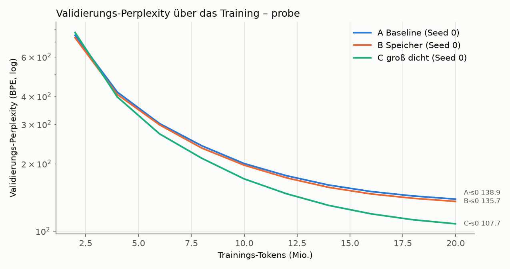

- B liegt 2,3 % unter A (−3,2 PPL), C 22 % darunter. Lückenschluss G = 0,10. Mit nur einem Seed ist das
  Rauschen nicht messbar; der Probelauf diente nur dazu, die Pipeline zu prüfen.
- **Die Key-Nutzung bricht am Anfang ein und erholt sich dann.** Nach der Initialisierung werden 99 %
  der Einträge gelesen, nach 2 M Tokens nur noch 9 % (85 % aller Zugriffe auf 1 % der Einträge),
  danach steigt die Nutzung stetig auf 82 % bei 20 M Tokens (Top-1 %-Anteil 33 %, weiter fallend).
  Die Key-Normen bleiben dabei gleichmäßig (max/min ≈ 1,3) und fast alle 512 Sub-Keys je Hälfte werden
  gelesen. Der Einbruch kommt also nicht von „Hub-Keys“ mit großer Norm, sondern daher, dass die Queries
  früh im Training wenig divers sind (Residual-Stream noch niedrigrangig) und sich nur wenige
  Kombinationen der beiden Hälften durchsetzen. Für Stufe 3 heißt das: Die Zugriffsverteilung hängt
  stark vom Trainingsstand ab, Messungen an früh gestoppten Modellen sind nicht repräsentativ.

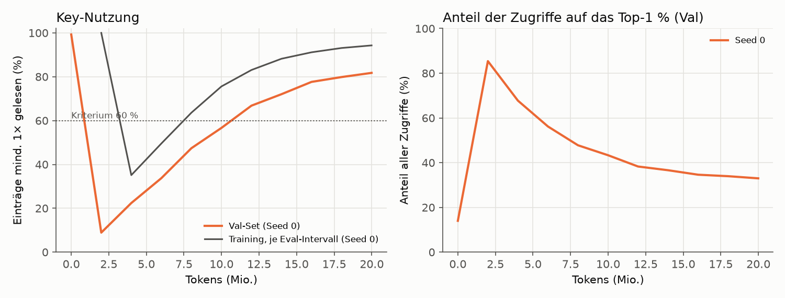

- Git: A-s0 lief auf `bc13f1b`, B-s0 und C-s0 auf `fef54eb`. Dazwischen änderten sich nur `REPORT.md`
  und das Auswerte-Skript, nicht der Trainingscode. Das `dirty: true` in deren `run-info.json` kommt
  allein vom damals noch nicht versionierten Ordner `runs/` (danach behoben: Ausgaben zählen nicht mehr).

### 1 Epoche: 118 M Tokens (A, B je 2 Seeds; C 1 Seed)

| Lauf | Val-PPL | Test-PPL | Val-PPL (Wort) | Train tok/s | Decode b=1 tok/s | Prefill tok/s | VRAM Train | Trainzeit | Key-Nutzung Val | Top-1 %-Anteil | KL |
|---|---|---|---|---|---|---|---|---|---|---|---|
| A-s0 | 35,26 | 35,24 | 57,4 | 91.705 | 217 | 383.407 | 7,89 GiB | 21 min | – | – | – |
| A-s1 | 34,93 | 34,77 | 56,8 | 91.640 | 218 | 384.460 | 7,89 GiB | 21 min | – | – | – |
| B-s0 | 34,63 | 34,56 | 56,2 | 72.445 | 199 | 264.882 | 9,47 GiB | 27 min | 99,2 % | 18,4 % | 1,08 |
| B-s1 | 34,12 | 34,05 | 55,3 | 72.241 | 203 | 264.573 | 9,47 GiB | 27 min | 99,7 % | 15,5 % | 0,91 |
| C-s0 | 25,80 | 26,02 | 40,3 | 34.468 | 165 | 130.976 | 7,91 GiB | 57 min | – | – | – |

**Auswertung gegen die vorab festgelegten Kriterien:**

| Größe | Wert |
|---|---|
| PPL A (Mittel; Seeds) | 35,09 (35,26 / 34,93) |
| PPL B (Mittel; Seeds) | 34,38 (34,63 / 34,12) |
| PPL C | 25,80 |
| Seed-Spanne s | 0,51 (aus B; A: 0,32) → Schwelle 2·s = 1,02 |
| PPL_A − PPL_B | +0,72 (**innerhalb** 2·s) |
| Lückenschluss G | **0,08** |
| Key-Nutzung (min.) / Top-1 %-Anteil (max.) | 99,2 % / 18,4 % → **Tabelle gesund** |
| **Urteil** | **lohnt sich nicht** (B auf A-Niveau, trotz gesunder Tabelle) |

Hinweis zur Einstufung: Die Schwelle 2·s und die Zuordnung „B besser, aber innerhalb 2·s → auf
A-Niveau“ sind **meine** Operationalisierung der Vorgabe. Nach dem Wortlaut („B besser als A, aber
knapp“) wäre auch **„unklar“** vertretbar, denn B ist in allen vier Paarungen besser. Die bei „unklar“
verlangten Prüfungen (Implementierung, Tabellengesundheit) sind unten trotzdem gemacht.

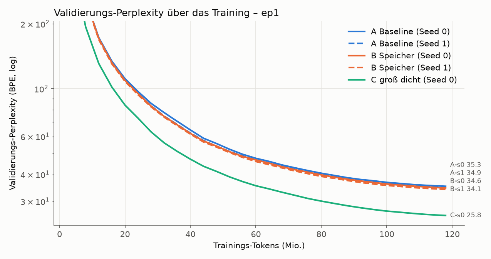

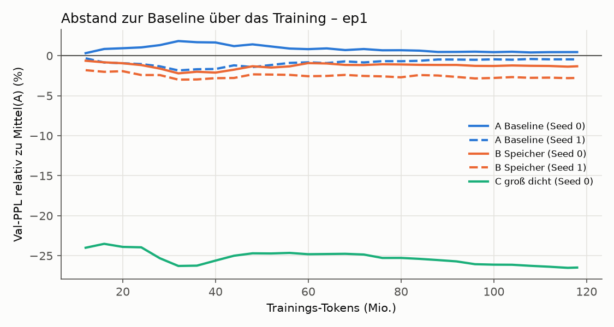

**Was die Zahlen sagen, ohne Schönfärberei:**

- B ist in allen vier A/B-Paarungen besser als A, und das gleichmäßig ab etwa 30 M Tokens um ≈ 2 %
  (Val wie Test). Das spricht für einen echten, aber kleinen Effekt. Nach dem vorab festgelegten
  Kriterium reicht er nicht: 0,72 PPL liegen unter 2·s = 1,02, und mit zwei Seeds je Modell ist auch
  „B schlägt A in allen Paarungen“ nicht belastbar (bei Zufall träte das in 1 von 6 Fällen auf).
- **Selbst wenn der Effekt echt ist, ist er viel zu klein.** B schließt 8 % der Lücke zu C, gefordert
  waren 50 %. Der Vorsprung wächst über die Epoche auch nicht, er bleibt bei ≈ 2 % (siehe Grafik).
  Die 100 M zusätzlichen Parameter von B bringen also bei weitem nicht, was dieselbe Zahl dichter
  Parameter in C bringt (−26,5 % PPL), allerdings bei 3,8× so vielen MACs pro Token für C.
- **C ist bei 1 Epoche deutlich untertrainiert** (≈ 1 Token je Parameter statt ≈ 20). Die Lücke A↔C
  wäre bei einem ausgereizten C eher noch größer; der Vergleich ist für B damit eher günstig.
- **Kosten von B:** gleiche FLOPs wie A, aber 21 % weniger Trainingsdurchsatz, 31 % weniger
  Prefill-Durchsatz, 7 % langsameres Batch-1-Decoding und 1,6 GiB mehr VRAM (Wertetabelle mit
  Gradient und Adam-Zuständen: 100,7 M × 16 Byte).

**Tabellengesundheit und Implementierung** (Pflichtprüfung, bevor ein Urteil zählt):

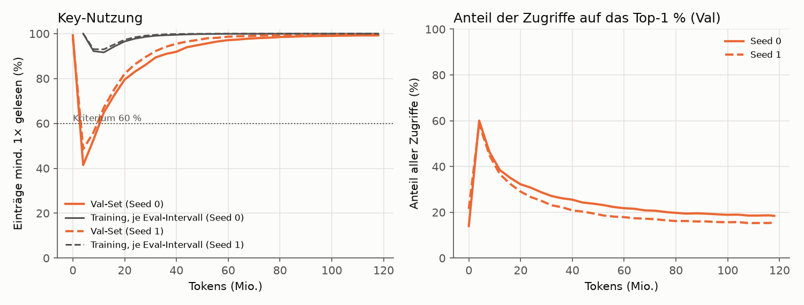

- Nutzung 99,2 / 99,7 %, KL 1,08 / 0,91, das meistgelesene 1 % der Einträge bekommt 18 / 16 % der
  Zugriffe, nur 0,3–0,8 % der Einträge werden auf dem Val-Set nie gelesen. Im Training wurde jeder
  Eintrag gelesen (seltenster ≈ 2.400×). Der Einbruch am Anfang (s. Probelauf) erholt sich nach
  ≈ 20 M Tokens vollständig.
- **Die Speicherschicht trägt tatsächlich etwas bei** (`scripts/diagnose_memory.py`, erste 32.768
  Val-Tokens, `runs/ep1/B-*/diagnostics.json`): Setzt man ihre Ausgabe auf null, steigt die PPL von 31,3
  auf 35,5 (s0) bzw. 30,6 auf 35,7 (s1). Liest man statt der gefundenen zufällige Einträge, steigt sie
  auf 36,0 bzw. 36,5. Es kommt also darauf an, *welche* Einträge die Suche findet. Die Ausgabenorm der
  Schicht (2,5–2,8) liegt über der der benachbarten dichten FFNs (1,2–2,6). Die 4 Köpfe lesen pro Token
  fast immer 128 verschiedene Einträge.
- Die Unit-Tests (exakte Top-k, Gradient nur in gelesene Werte, Kausalität, KV-Cache) sind grün.
  Einen Implementierungsfehler habe ich nicht gefunden.
- **Auffälligkeit: Die Gewichtung innerhalb der Top-32 ist fast flach.** Effektiv mischt jeder Kopf
  30,5 von 32 Einträgen (exp(Entropie)), das Top-1-Gewicht liegt bei 0,066 (gleichverteilt: 0,031).
  Die Score-Skala ist seit der Initialisierung kaum gewachsen (Key-Norm 0,41 → 0,48, BatchNorm-γ ≈ 1,09).
  Die Schicht ruft also nicht gezielt wenige Einträge ab, sondern mittelt grob über 128. Das passt zum
  Befund „ersetzt ein FFN und etwas mehr, aber nicht viel mehr“: Ohne Speicher fehlt dem Modell eine
  ganze Schicht (+14–16 % PPL), mit Speicher ist es nur 2 % besser als A.

**Zugriffsmuster (für Stufe 3, `report/ep1_access_stats.json`):**

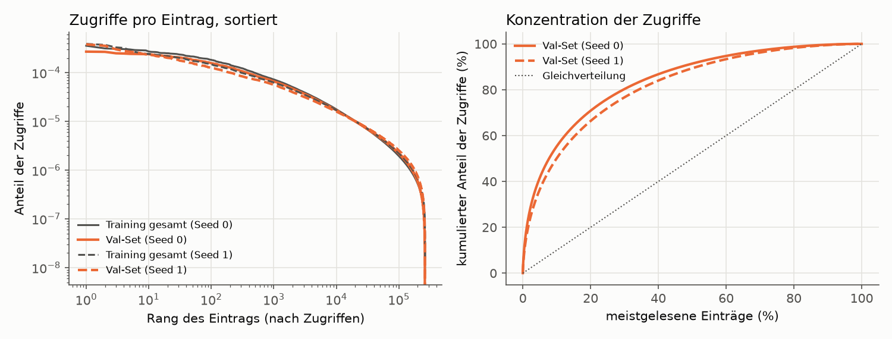

| | B-s0 | B-s1 |
|---|---|---|
| Anteil der Zugriffe auf die Top 1 / 10 / 20 / 50 % (Val) | 18 / 55 / 71 / 91 % | 16 / 50 / 66 / 89 % |
| Val-Zugriffe, die die Top 20 % aus dem **Training** abdecken | 68 % | 63 % |
| Rangkorrelation der Zugriffszahlen Training ↔ Val (Spearman) | 0,89 | 0,89 |
| Zugriffe, die schon in den letzten 1 / 16 / 256 Tokens gelesen wurden | 0,7 / 11,7 / 52,5 % | 0,9 / 11,5 / 50,2 % |

Die Verteilung ist deutlich schief, aber kein extremer Zipf: Ein Cache mit den 20 % meistgelesenen
Einträgen (im Training ermittelt; hier 52 k Einträge × 384 × 2 Byte ≈ 40 MB in bf16) fängt ≈ 65 % der
Lesezugriffe auf dem Val-Set ab. Aufeinanderfolgende Tokens lesen
fast disjunkte Einträge (< 1 % Wiederholung zum direkten Vorgänger); über ein Fenster von 256 Tokens
wiederholt sich aber die Hälfte. Für die SSD-Auslagerung heißt das: ≈ 35 % der 128 Lesezugriffe pro
Token müssten auch mit einem Hot-Set-Cache noch zufällig von der SSD kommen.

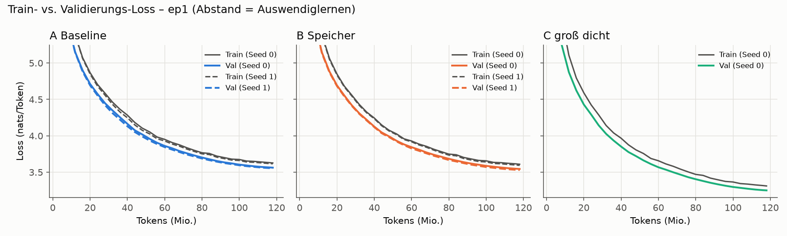

Bei 1 Epoche gibt es erwartungsgemäß kein Auswendiglernen (jedes Fenster wird genau einmal gesehen);
dass Train über Val liegt, ist der nachlaufende Intervall-Mittelwert, s. Grenzen.

**Inferenz-VRAM** (fp32-Gewichte unter bf16-Autocast, Spitze `max_memory_allocated`; gilt auch für 3 Epochen):
Batch-1-Decoding A 1,16 GiB, B 1,54 GiB, C 1,46 GiB; Prefill 16 × 1024 A 2,75 GiB, B 3,13 GiB, C 3,11 GiB.
Die Wertetabelle von B belegt allein 0,38 GiB (fp32), in bf16 wären es 0,19 GiB.

**Herkunft:** A-s0 lief auf `4f0e5fb`, alle anderen 1-Epochen-Läufe auf `6859f1f`. Zwischen diesen
Commits hat sich nur der Bericht geändert, nicht `smlm/` oder `scripts/run_suite.py`. B-s1 ist als
`dirty` markiert, allein wegen des damals noch nicht versionierten Analyse-Skripts
`scripts/diagnose_memory.py`, das beim Training nicht verwendet wird.

### 3 Epochen: 354 M Tokens, eigener Cosine-Plan (A, B je 2 Seeds; C 1 Seed)

Eigener Lauf mit Warmup (540 Schritte) und Cosine über alle 10.800 Schritte; die Zwischenstände bei
118 M Tokens sind daher **nicht** mit dem Ende des 1-Epochen-Laufs vergleichbar (dort war die LR schon
abgeklungen). Jede Epoche hat ihre eigene, vom Daten-Seed festgelegte Reihenfolge.

| Lauf | Val-PPL | Test-PPL | Val-PPL (Wort) | Train tok/s | Decode b=1 tok/s | Prefill tok/s | VRAM Train | Trainzeit | Key-Nutzung Val | Top-1 %-Anteil | KL |
|---|---|---|---|---|---|---|---|---|---|---|---|
| A-s0 | 24,81 | 24,99 | 38,5 | 91.659 | 219 | 383.220 | 7,89 GiB | 64 min | – | – | – |
| A-s1 | 24,65 | 24,84 | 38,2 | 91.478 | 217 | 384.725 | 7,89 GiB | 64 min | – | – | – |
| B-s0 | 23,80 | 24,02 | 36,7 | 71.935 | 203 | 264.825 | 9,47 GiB | 82 min | 99,97 % | 11,0 % | 0,63 |
| B-s1 | 23,47 | 23,76 | 36,1 | 71.640 | 206 | 265.278 | 9,47 GiB | 82 min | 99,99 % | 11,0 % | 0,59 |
| C-s0 | 19,15 | 19,51 | 28,7 | 34.607 | 164 | 131.352 | 7,91 GiB | 170 min | – | – | – |

**Auswertung gegen die vorab festgelegten Kriterien:**

| Größe | Wert |
|---|---|
| PPL A (Mittel; Seeds) | 24,73 (24,81 / 24,65) |
| PPL B (Mittel; Seeds) | 23,63 (23,80 / 23,47) |
| PPL C | 19,15 |
| Seed-Spanne s | 0,33 (aus B; A: 0,16) → Schwelle 2·s = 0,67 |
| PPL_A − PPL_B | +1,10 (**über** 2·s) |
| Lückenschluss G | **0,20** |
| Key-Nutzung (min.) / Top-1 %-Anteil (max.) | 99,97 % / 11,0 % → **Tabelle gesund** |
| **Urteil** | **unklar** (B echt besser als A, aber knapp: G < 0,5) |

Auf dem Test-Set ergibt sich dasselbe Bild (A 24,92, B 23,89, C 19,51 → −4,1 %, G = 0,19).

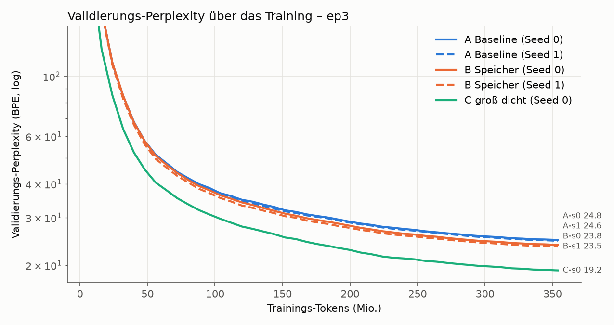

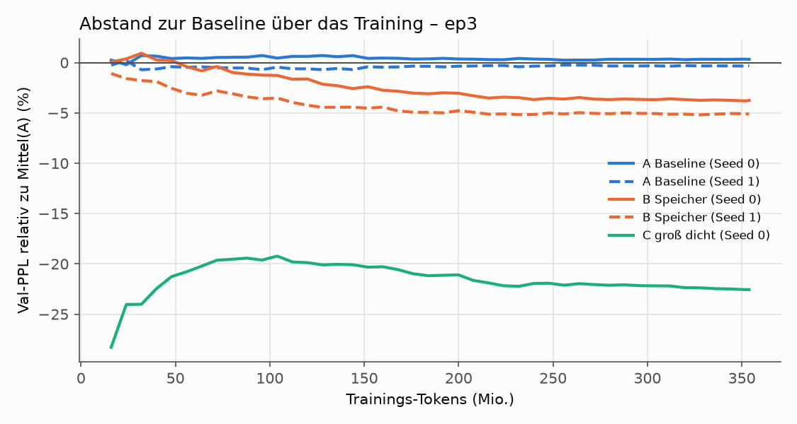

**Was die Zahlen sagen:**

- **Mit mehr Daten wächst der Vorsprung von B, bleibt aber klein.** Relativ zu A: −0,8 % bei 40 M Tokens,
  −2,0 % bei 80 M, −2,9 % bei 120 M, −4,0 % bei 176 M, dann ab ≈ 240 M Tokens konstant bei −4,4 %
  (beide Seeds, siehe Grafik). Der Lückenschluss G steigt entsprechend auf ≈ 0,20 und bleibt dort.
  Beide B-Seeds liegen jetzt klar unter beiden A-Seeds.
- **Für „lohnt sich“ fehlt mehr als die Hälfte.** C ist auch nach 3 Epochen 22,6 % besser als A
  (bei 3,8× MACs/Token und weiter untertrainiert: ≈ 3 Tokens je Parameter). B holt davon ein Fünftel.
- **Auswendiglernen** (Val-Loss minus Train-Loss am Ende, nats): A 0,014 / 0,015, B 0,035 / 0,043,
  C 0,119. In Epoche 2 und 3 fällt der Train-Loss an den Epochengrenzen sichtbar ab. B lernt etwas
  mehr auswendig als A, viel weniger als C; der Val-Loss von B fällt trotzdem bis zum Ende weiter.

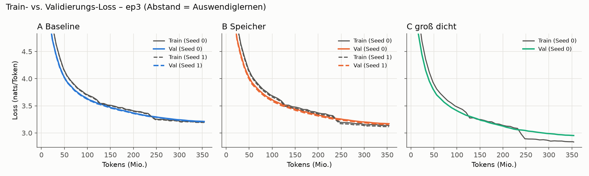

**Tabellengesundheit und Implementierung** (Pflichtprüfung bei „unklar“, `runs/ep3/B-*/diagnostics.json`,
erste 32.768 Val-Tokens, GPU):

- Nutzung 99,97 / 99,99 %, KL 0,63 / 0,59, das meistgelesene 1 % bekommt 11 % der Zugriffe; im Training
  wurde jeder Eintrag gelesen (seltenster 961× bzw. 1.632×, Median ≈ 100 k×). Gesünder als nach 1 Epoche.
- **Das Modell stützt sich nach 3 Epochen viel stärker auf den Speicher:** Ausgabe auf null → PPL
  21,8 → 31,3 (s0) bzw. 21,4 → 32,7 (s1), also +44 / +53 % (nach 1 Epoche: +14 / +16 %). Zufällige statt
  gefundener Einträge → 34,3 bzw. 37,3. Ohne Speicher ist B damit deutlich schlechter als A. Die
  Ausgabenorm der Schicht (7,4 / 8,3) ist die größte aller FFN-Positionen in der Mitte (Nachbarn 2,8–5,2).
- **Die Gewichtung innerhalb der Top-32 wird mit dem Training etwas schärfer, bleibt aber flach:**
  effektiv 28,6 / 28,3 von 32 Einträgen je Kopf (nach 1 Epoche 30,5), Top-1-Gewicht 0,094 / 0,097.
  Key-Norm 0,41 → 0,59 / 0,61, BatchNorm-γ 1,0 → 1,33 / 1,37. Die Skala wächst also, aber langsam.
- Unit-Tests grün; kein Implementierungsfehler gefunden. Die Tabelle funktioniert und wird genutzt;
  offen ist, warum sie so wenig über eine zusätzliche dichte Schicht hinaus bringt (siehe Einordnung).

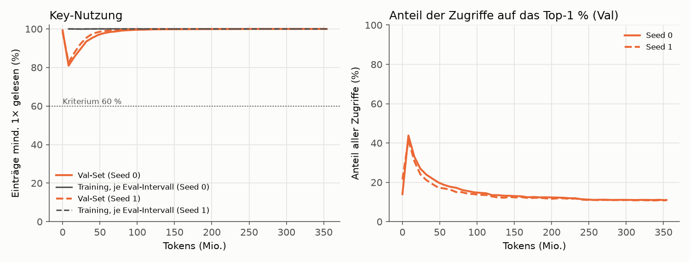

**Zugriffsmuster (für Stufe 3, `report/ep3_access_stats.json`):**

| | B-s0 | B-s1 |
|---|---|---|
| Anteil der Zugriffe auf die Top 1 / 10 / 20 / 50 % (Val) | 11 / 40 / 56 / 83 % | 11 / 39 / 55 / 82 % |
| Val-Zugriffe, die die Top 20 % aus dem **Training** abdecken | 54 % | 52 % |
| Rangkorrelation der Zugriffszahlen Training ↔ Val (Spearman) | 0,90 | 0,90 |
| Zugriffe, die schon in den letzten 1 / 16 / 256 Tokens gelesen wurden | 0,9 / 9,4 / 44,8 % | 0,7 / 8,9 / 42,8 % |

Mit längerem Training verteilen sich die Zugriffe **gleichmäßiger**: Ein Hot-Set-Cache aus 20 % der
Einträge fängt nach 3 Epochen nur noch ≈ 53 % der Lesezugriffe ab (nach 1 Epoche ≈ 65 %). Für die
SSD-Auslagerung ist das eine schlechte Nachricht: Je besser die Tabelle genutzt wird, desto weniger hilft
Caching. Die Rangfolge „heißer“ Einträge ist zwischen Training und Val aber stabil (Spearman 0,90).

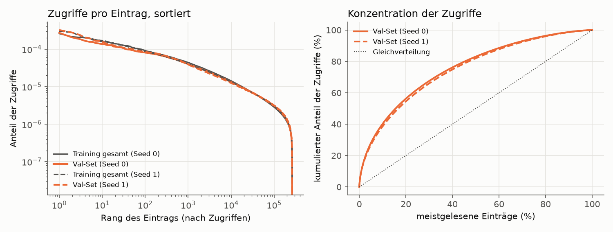

**Herkunft:** A-s0 lief auf `6859f1f` (als `dirty` markiert, nur wegen des unversionierten
`scripts/diagnose_memory.py`), alle anderen 3-Epochen-Läufe auf `e44a197`. Trainingscode identisch zu
allen 1-Epochen-Läufen (`git diff a27c99d 1a43e0d -- smlm/ scripts/run_suite.py` ist leer).

## Einordnung

**Antwort auf die Frage dieser Stufe.** Eine Product-Key-Speicherschicht verbessert das kleine Modell bei
gleichem Rechenaufwand pro Token **messbar, aber wenig**: −2,0 % PPL nach 118 M Tokens (nicht von
Seed-Rauschen zu trennen), −4,4 % nach 354 M Tokens (echt). Nach den vorab festgelegten Kriterien reicht
das in keinem der beiden Läufe für „lohnt sich“: B schließt 8 % bzw. 20 % der Lücke zum gleich großen
dichten Modell, gefordert waren 50 %. Ich rede das nicht schön: In dieser Konfiguration sind 100 M
zusätzliche Parameter in der Tabelle ungefähr so viel wert wie ein Fünftel der Wirkung derselben Zahl
dichter Parameter.

**Was dagegen spricht, dass es nur ein Bug ist:** Die Tests sind grün, die Tabelle ist gesund und wird
breit genutzt, und das Modell stützt sich nach 3 Epochen stark auf sie (+44–53 % PPL ohne Speicher;
zufällige Einträge sind noch schlechter). Der Speicher funktioniert also. Er bringt nur wenig mehr als
das FFN, das er ersetzt.

**Mögliche Gründe** (nach meiner Einschätzung der Wahrscheinlichkeit geordnet, keiner davon ist hier
belegt):

1. **Flache Gewichtung innerhalb der Top-k.** Jeder Kopf mischt 28–30 von 32 Einträgen fast gleich
   stark; die Schicht ruft kaum gezielt ab. Kandidaten: Die Query-BatchNorm fixiert die Query-Skala, und
   Weight Decay zieht die Keys klein. Dafür ist `v2-sharpness` vorbereitet (v2a: kein Weight Decay auf
   den Keys; v2b: zusätzlich lernbare Temperatur), siehe `docs/notes/V2_SHARPNESS.md`.
2. **Datenregime.** Der Vorsprung wächst mit den Daten (2 % → 4,4 %), sättigt aber ab ≈ 240 M Tokens,
   während das Training dieselben 118 M Tokens wiederholt. Die Paper zeigen den Nutzen bei Hunderten
   Milliarden Tokens und vor allem auf faktenlastigen QA-Aufgaben; Perplexity auf WikiText-103 misst
   „Wissen abrufen“ nur indirekt.
3. **Lernrate der Werte.** 1e-3 bei Basis-LR 6e-4 ist ein Verhältnis von 1,7× (Lample: 4×).
4. **Nur eine Speicherschicht.** Meta (Memory+) nutzt drei Schichten mit geteilter Tabelle.
5. **Kleiner Rechenkern.** Mit d = 384 und 21 M dichten Parametern ist auch die Query-Netz-Kapazität
   klein.

**Kosten.** Gleiche FLOPs, aber B trainiert 21 % langsamer, ist im Prefill 31 % und im Batch-1-Decoding
≈ 6 % langsamer und braucht 1,6 GiB mehr VRAM. Das liegt an den unregelmäßigen Speicherzugriffen
(Gather/Scatter, Adam über 100 M Werte), nicht an Rechenarbeit, und ist genau der Teil, um den es in
den späteren Stufen geht. **Wichtige Einschränkung:** Verglichen wurde bei gleicher Token-Zahl und
gleichen FLOPs, nicht bei gleicher Rechenzeit. In derselben Wall-Clock-Zeit hätte A auf dieser Hardware
≈ 27 % mehr Tokens gesehen. Ob B dann noch vorne läge, wurde nicht gemessen; beim Wachstum von A
zwischen 1 und 3 Epochen ist das nicht selbstverständlich.

**Für das Gesamtprojekt.** Stufe 1 widerlegt den Ansatz nicht, liefert aber noch keinen Grund, ihn zu
skalieren. Vor Stufe 2 würde ich die vorbereiteten v2-Varianten laufen lassen (≈ 2 h). Bringen sie die
Gewichtung nicht deutlich schärfer und B nicht deutlich weiter, wären mehr Daten (größerer Korpus statt
Wiederholung), mehrere Speicherschichten und eine höhere Werte-LR die nächsten Hebel. Für Stufe 3
wichtig: Die Zugriffe werden mit besserem Training gleichmäßiger verteilt, Hot-Set-Caching hilft dann
weniger (20 % der Einträge → 53 % der Zugriffe).

## Grenzen dieser Untersuchung

- **C ist bei 1 Epoche deutlich untertrainiert.** 118 M Tokens auf 122,7 M Parameter (ohne Embeddings)
  sind ≈ 1 Token pro Parameter; compute-optimal (Chinchilla) wären ≈ 20. Der Abstand A↔C und damit die
  Lücke, die B schließen soll, ist bei 1 Epoche kleiner als bei einem ausgereizten C. Der 3-Epochen-Lauf
  mildert das nur etwas (≈ 3 Tokens/Parameter), wiederholt dafür aber die Daten.
- **Seed-Rauschen ist grob geschätzt.** Mit 2 Seeds ist s eine einzelne Differenz, keine Streuung. Das
  Kriterium bleibt wie festgelegt, ist aber eher optimistisch, was die Trennschärfe angeht.
- **Der Train-Loss in den Kurven hinkt hinterher.** Er ist der Mittelwert über das jeweilige
  Eval-Intervall, in dem das Modell noch besser wird; Train > Val früh im Training ist ein Artefakt, kein
  Fehler. Aussagekräftig für Auswendiglernen ist im 3-Epochen-Lauf, ob sich der Abstand schließt oder umkehrt.
- **BatchNorm auf der Query** sieht im Training die Batch-Statistik inklusive späterer Tokens (bei 8.192
  Tokens pro Mikro-Batch ein sehr schwacher Kanal). Alle berichteten Zahlen sind im Eval-Modus mit
  festen Statistiken gemessen; die Kausalität dort ist per Test geprüft.
- **Dichter Adam auf der Wertetabelle.** Der Unit-Test zeigt, dass Gradienten nur in gelesene Einträge
  fließen. Adams Momentum bewegt aber auch ungelesene Einträge noch einige Schritte weiter. Für das
  spätere Ziel „einzelne Einträge gezielt aktualisieren“ braucht es einen sparsamen Optimierer
  (z. B. SparseAdam / lazy Adam); das war nicht Teil dieser Stufe.
- **Durchsatz** ist im PyTorch-Eager-Modus ohne eigene Kernels gemessen. Batch-1-Decoding ist durch den
  Kernel-Start-Overhead begrenzt (≈ 150–210 tok/s für alle Modelle) und sagt nichts über die
  Speicherbandbreite aus, um die es in späteren Stufen geht. B ist im Training ≈ 20 % langsamer als A,
  trotz gleicher FLOPs (Gather/Scatter auf der 100-M-Tabelle, Adam über 100 M Werte).
- **Perplexity** ist auf GPT-2-BPE-Tokens berechnet und nicht direkt mit den wortbasierten
  WikiText-103-Werten aus der Literatur vergleichbar (die Wort-PPL-Spalte rechnet die Gesamt-NLL auf die
  217.646 Wörter + `<eos>` um und ist nur grob vergleichbar).
- **Kleiner Maßstab, ein Datensatz.** Die Paper zeigen den Nutzen von Speicherschichten bei
  Billionen von Tokens und faktenlastigen QA-Aufgaben; WikiText-103 mit ≤ 354 M Tokens ist ein weit
  kleineres Regime.

## Artefakte

- `runs/<phase>/<lauf>/run-info.json`, `metrics.csv`, `train_log.csv`, `stdout.log`: in Git.
- `runs/<phase>/<lauf>/model.pt` (Gewichte, fp32), bei B zusätzlich `mem_access_train.npy`
  (Lesezugriffe je Eintrag über das ganze Training), `mem_access_val.npz` (Zugriffe und summierte
  Softmax-Gewichte je Eintrag auf dem Val-Set) und `mem_index_sample.npz` (Index-Stichprobe für Stufe 3):
  nur auf der Platte (`.gitignore`, zu groß für Git).
- Grafiken und Tabellen: `report/`, erzeugt mit `scripts/make_report.py probe ep1 ep3`.

## Stufe 1b: Schnelltest B-1M (Kriterium vor dem Lauf festgelegt, 2026-10-02)

> Status: **abgeschlossen am 2026-10-02.** Kriterium unverändert seit `0832753`; beide Läufe auf `5fe3245`,
> nicht dirty. **Ergebnis: Kriterium erfüllt** (B-1M −15,1 % Val-PPL gegenüber A) **→ großer Test.**

**Frage:** Bringt eine größere Speicherkonfiguration auf frischen (nicht wiederholten) Daten einen
deutlichen Vorteil? Erst wenn ja, folgt ein großer Test.

**Aufbau (je 1 Seed, Init-Seed 0, gleicher Daten-Seed):**

| | A | B-1M |
|---|---|---|
| Rechenkern | wie Stufe 1 (d = 384, 12 Layer) | wie A |
| Speicher | – | 3 Speicherschichten statt der FFNs in Layer 3, 7, 11 (Index 2, 6, 10; zentriert, Abstand 4 wie Meta „Memory+“) |
| Tabelle | – | **eine geteilte** Wertetabelle mit 1024² = 1.048.576 Einträgen × 384 (402,7 M Parameter); Keys, Query-Netz, BatchNorm und swilu je Schicht eigen |
| Suche | – | je Schicht 4 Köpfe, Top-32, Key-Dim 256 |
| Werte-LR | – | **4 × Basis-LR** = 2,4e-3 (Lample-Verhältnis), gleicher Verlauf, kein Weight Decay |
| Rest | Optimierung wie Stufe 1 (AdamW, LR 6e-4, Warmup 5 %, Cosine auf 10 %, 32.768 Tokens/Schritt) | wie A |
| Daten | **500 M frische Tokens**, jede Sequenz genau einmal (15.258 Schritte) | gleicher Token-Strom |

Parameter: A 40,6 M (21,2 M ohne Embeddings); B-1M 444,9 M (425,6 M ohne Embeddings, davon 402,7 M
Tabelle), aktiv pro Token 23,1 M. MACs/Token: A 45,3 M, B-1M 47,1 M (+4 %, weil die Sub-Key-Suche über
1024 statt 512 Keys pro Hälfte läuft).

**Daten:** englische Wikipedia (`wikimedia/wikipedia`, Dump 20231101.en, GPT-2-BPE). Artikel werden per
festem Seed gemischt; alle Artikel, deren Titel im WikiText-103-Validierungs- oder -Testset vorkommen,
werden ausgeschlossen. Ein disjunkter Satz Wikipedia-Artikel (≈ 1 M Tokens) dient als Validierungsset.

**Daten, tatsächlich** (`scripts/prepare_wikipedia.py`, `data/wikipedia_en_gpt2/meta.json`): 6.407.814
Artikel im Dump; Training 505 M Tokens aus 689.951 zufällig gewählten Artikeln (davon werden 500 M genutzt),
Validierung 1,48 M Tokens aus 1.917 disjunkten Artikeln. Von den 122 WikiText-103-Val/Test-Titeln lagen
14 in den ausgewählten Artikeln und wurden entfernt (erwartet bei 12,5 % Auswahl: ≈ 15). Umbenannte
Artikel können dem Titelabgleich entgehen.

**Vorab gemessen** (79 Schritte, Mikro-Batch 4): B-1M 35,7 k tok/s und 11,7 GiB VRAM-Spitze im Training
(geschätzt waren 40–55 k tok/s und 10,5–11,5 GiB; Abbruchgrenzen 30 k tok/s bzw. 15 GiB). Erwartete
Laufzeit damit ≈ 4,1 h für B-1M und ≈ 1,6 h für A.

**Kriterium (Vorgabe):** B-1M hat **mindestens 10 % niedrigere Val-PPL als A**, sonst kein großer Test.
Operationalisierung: Token-Perplexity am Ende des Trainings auf dem zurückgehaltenen
Wikipedia-Validierungsset (gleiche Aufbereitung wie das Training), Eval-Modus;
**erfüllt, wenn PPL(B-1M) ≤ 0,90 × PPL(A).** Das Seed-Rauschen lag in Stufe 1 bei ≈ 1–1,4 % der PPL und
damit weit unter der 10-%-Schwelle; ein Seed je Modell reicht für diese Entscheidung.

Zusätzlich berichtet, aber nicht entscheidend: WikiText-103-Val-PPL (anderes Textformat, daher nur
A↔B-1M vergleichbar, nicht mit Stufe 1), Tabellengesundheit (Nutzung, Konzentration, KL), Schärfe der
Softmax, Durchsatz, VRAM. Ist die Tabelle ungesund (< 60 % Nutzung), wird das als möglicher Grund
genannt; die Entscheidungsregel bleibt trotzdem wie vorgegeben.

### Ergebnis Stufe 1b

| | Val-PPL Wikipedia (entscheidend) | Val-PPL WikiText-103 (nur berichtet) | Train tok/s | VRAM Train | Trainzeit | Decode b=1 tok/s | Prefill tok/s |
|---|---|---|---|---|---|---|---|
| A | 25,67 | 78,38 | 91.563 | 7,89 GiB | 91 min | 220 | 385.525 |
| B-1M | **21,80** | 66,28 | 33.383 | 11,70 GiB | 249 min | 175 | 150.398 |
| B-1M / A | **0,849 (−15,1 %)** | 0,846 (−15,4 %) | 0,36 | | 2,7× | 0,80 | 0,39 |

**Kriterium PPL(B-1M) ≤ 0,90 × PPL(A): erfüllt (0,849) → großer Test.** Das Seed-Rauschen lag in Stufe 1 bei
≈ 1–1,4 %; der Abstand von 15 % liegt weit darüber, auch mit nur einem Seed je Modell.

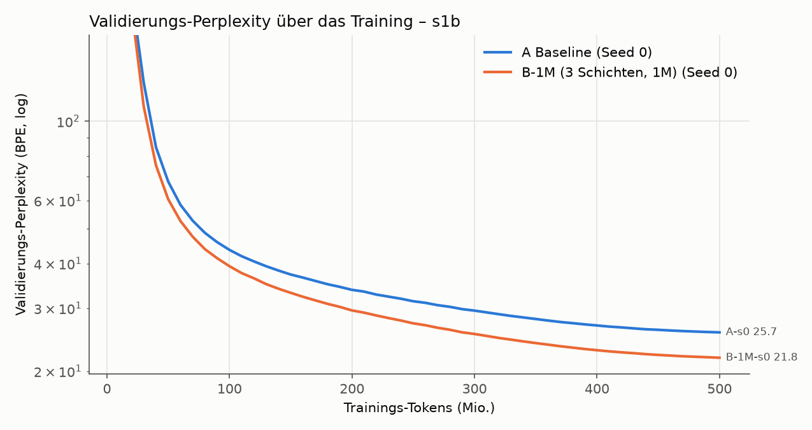

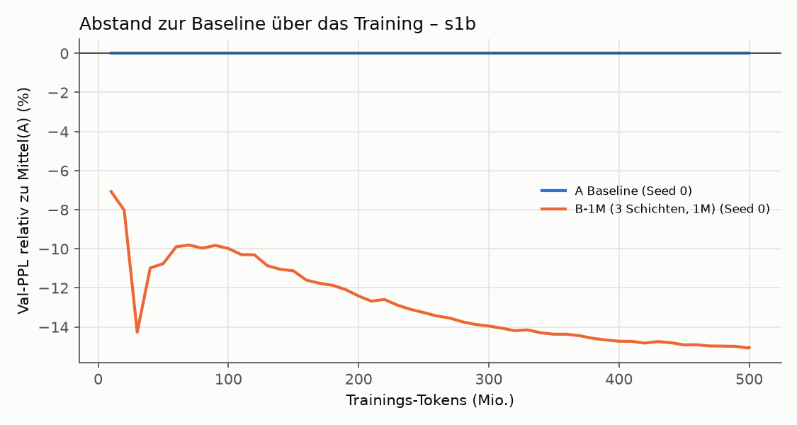

**Verlauf:** Der Vorsprung von B-1M wächst über das ganze Training: −10,0 % bei 100 M Tokens, −12,4 % bei
200 M, −14,0 % bei 300 M, −15,1 % am Ende, und ist am Ende noch nicht ganz gesättigt. Auf dem
WikiText-Validierungsset (anderes Textformat, nie trainiert) ist der Abstand gleich groß (−15,4 %).
Auswendiglernen ist bei frischen Daten kein Thema: Val minus Train liegt bei beiden Modellen gleich
(≈ 0,07 nats, Unterschied zwischen Trainings- und Validierungsartikeln).

**Tabelle und Speicher** (`runs/s1b/B-1M-s0/diagnostics.json`, erste 246.784 Val-Tokens):

- Nutzung der geteilten Tabelle 100 %, das meistgelesene 1 % bekommt 11,8 % der Zugriffe, KL 0,62.
  Einzeln liest die Schicht in Layer 3 91,9 % der Einträge (Top-1 %-Anteil 26 %), Layer 7 und 11 je ≈ 99 %.
  Jeder Eintrag wurde im Training gelesen (10 %-Quantil ≈ 44 k, Median ≈ 115 k Zugriffe).
- **Das Modell hängt stark am Speicher:** alle drei Speicherschichten auf null → PPL 22,5 → 88,0;
  zufällige statt gefundener Einträge → 93,8. Die Ausgabenormen der Speicherschichten (4,6 / 11,0 / 20,2)
  wachsen mit der Tiefe wie die der dichten FFNs.
- Die Gewichtung innerhalb der Top-32 ist wie in Stufe 1 flach (effektiv 28,6 von 32 Einträgen,
  Top-1-Gewicht 0,095; je Schicht 29,1 / 28,6 / 28,0). Der Gewinn kommt also nicht über schärferes Abrufen.
- Die Werte haben sich stark bewegt (Norm ≈ 3,6–3,7 statt 1,0 bei der Initialisierung, Werte-LR 2,4e-3).

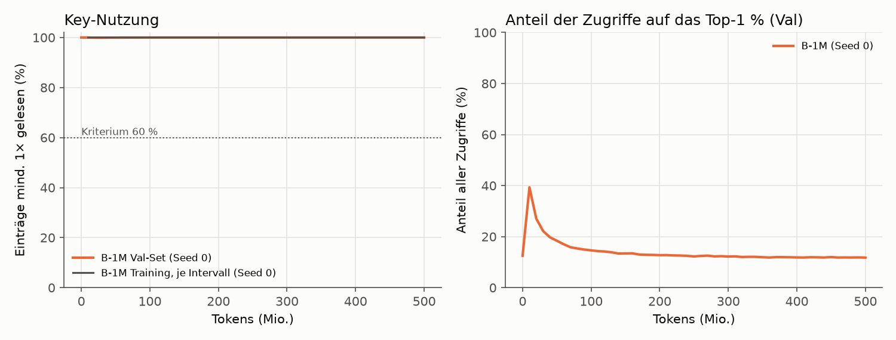

**Zugriffsmuster (Stufe 3, `report/s1b_access_stats.json`):** Top 1 / 10 / 20 / 50 % der Einträge bekommen
12 / 39 / 55 / 82 % der Val-Zugriffe; die im Training heißesten 20 % decken 53 % der Val-Zugriffe ab
(Spearman 0,92). Wiederholung innerhalb von 1 / 16 / 256 Tokens: 1,6 / 11,3 / 41,5 % (über alle drei
Schichten). Die Index-Stichprobe hat jetzt die Form [Token, Schicht, Kopf, k].

**Was das Ergebnis nicht sagt (nichts schönreden):**

- **Gleiche FLOPs, aber nicht gleiche Zeit.** B-1M hat +4 % MACs pro Token, braucht auf dieser Hardware
  aber 2,7× so lange (33,4 k statt 91,6 k tok/s), 48 % mehr VRAM (11,7 statt 7,9 GiB), ist im Prefill
  2,6× und im Batch-1-Decoding 1,25× langsamer. In derselben Rechenzeit hätte A ≈ 2,7× so viele Tokens
  sehen können. Wie gut A dann wäre, wurde nicht gemessen; As eigene Kurve fällt zwischen 250 M und 500 M
  Tokens noch um 18 % (Zwischenstand bei hoher LR gegen Endstand, daher nur ein grober Hinweis). Die
  Frage „lohnt sich der Speicher pro Rechenzeit?“ ist damit offen und gehört in den großen Test bzw. in die
  späteren Stufen (eigene Kernels, Auslagerung).
- **Mehrere Dinge gleichzeitig geändert.** Gegenüber Stufe 1 (B: −4,4 % bei 354 M wiederholten Tokens)
  unterscheiden sich Tabellengröße (4×), Zahl der Speicherschichten (3 statt 1), Werte-LR (2,4× höher),
  Datensatz und Wiederholung. Welcher Faktor wie viel bringt, sagt dieser Test nicht.
- **Kein dichter Vergleich mit gleicher Parameterzahl.** B-1M hat 445 M Parameter (A: 41 M). Ein C-artiges
  Modell fehlt hier; der Schnelltest beantwortet nur „deutlich besser als A bei gleichem Rechenaufwand
  pro Token?“.
- **Ein Seed je Modell**, ein Datensatz, ein Zeitpunkt (500 M Tokens).

## Zusatztest: Quantisierung der Wertetabelle von B-1M (ohne Training, 2026-10-02)

Nur die Wertetabelle von `runs/s1b/B-1M-s0` wird nachträglich quantisiert (im Speicher, Checkpoint nur gelesen:
SHA-256 vor und nach dem Test identisch); alle anderen Gewichte bleiben fp32. Gemessen auf dem kompletten
Wikipedia-Validierungsset (1,484,009 Tokens), gleicher Auswertungscode wie im Training.
Skript: `scripts/quantize_table_eval.py`, Rohdaten: `report/quant_B-1M-s0.json`.

**Verfahren** (ein fp16-Skalierungsfaktor pro Zeile, also pro Eintrag mit 384 Werten; 2,1 MB für alle Faktoren):
8/4/3/2 Bit wie llama.cpp `Q_0`, aber pro Zeile: Codes von −2^(b−1) bis 2^(b−1)−1, der betragsgrößte Wert der
Zeile wird exakt getroffen. Ternär wie BitNet b1.58: Skala = mittlerer Betrag der Zeile, Werte −1/0/+1.

| Bits pro Wert | Tabelle (MB) | Val-PPL Wikipedia | Verlust gegenüber unquantisiert | rel. Fehler der Tabelle |
|---|---|---|---|---|
| 32 (fp32, Referenz) | 1.610,6 | 21,801 | – | 0,000 |
| 16 (bf16) | 805,3 | 21,800 | −0,001 (−0,00 %) | 0,002 |
| 8 | 404,8 | 21,799 | −0,002 (−0,01 %) | 0,007 |
| 4 | 203,4 | 21,828 | +0,027 (+0,12 %) | 0,115 |
| 3 | 153,1 | 21,911 | +0,110 (+0,50 %) | 0,231 |
| 2 | 102,8 | 22,281 | +0,480 (+2,20 %) | 0,467 |
| 1,6 (ternär, 1,58 Bit Information) | 82,6 | 25,237 | +3,436 (+15,76 %) | 0,512 |

**Einordnung:**

- Bis 4 Bit kostet die Quantisierung praktisch nichts: +0,12 % PPL bei einem Achtel der fp32-Größe
  (203 statt 1.611 MB). 8 Bit und bf16 sind nicht von fp32 zu unterscheiden. 3 Bit kostet 0,5 %, 2 Bit 2,2 %.
- Ternär bricht ein (+15,8 %, PPL 25,24): Damit ist fast der ganze Vorsprung vor A (25,67) weg. Bemerkenswert,
  weil der relative Fehler der Tabelle bei 2 Bit (0,47) und ternär (0,51) ähnlich ist; die vierte Stufe und die
  Absmax-Skala von 2 Bit erhalten offenbar die großen Werte, auf die es ankommt.
- Für Stufe 3 (SSD): Bei 4 Bit ist ein Eintrag 194 Byte groß (384 × 0,5 + 2). Pro Token und Speicherschicht
  werden 128 Einträge gelesen, also ≈ 25 KB; die ganze Tabelle passt mit 203 MB problemlos in den RAM.
- Einschränkungen: nur nachträgliche Quantisierung (quantisierungsbewusstes Training könnte 2 Bit und ternär
  verbessern), ein Modell, ein Seed, nur die Tabelle (der Rest bleibt fp32), je Stufe ein Verfahren.

## Stufe 1c („Hampter“): sparsamer Optimizer, zweiter Seed, gleiche Rechenzeit (Kriterien vor dem Start festgelegt, 2026-10-03)

> Status: **abgeschlossen am 2026-10-03** (Warteschlange 01:01–14:07, alle vier Läufe auf `0a5260e`, nicht dirty).
> Kriterien und Ablauf festgelegt in Commit `8cd1fde`, bevor einer der Läufe gestartet wurde.
> **Ergebnis: Optimizer ok – erfüllt (+0,16 %). Stabil – erfüllt (beide Seeds −15 % gegenüber A).
> Gleiche Rechenzeit – „konkurrenzfähig“ (−3,0 %), der „klare Vorteil“ (≥ 5 %) wurde verfehlt.**

**Fragen:** (1) Liefert ein Optimizer, der nur die gelesenen Tabellenzeilen anfasst, dasselbe Ergebnis wie
der dichte? (2) Ist der Vorsprung von B-1M aus dem Schnelltest über zwei Seeds stabil? (3) Hält B-1M mit,
wenn A dieselbe **Rechenzeit** (statt derselben Tokenzahl) bekommt?

### Schritt 1–2: sparsamer Optimizer und Messung (vor der Freigabe)

- **Optimizer** (`smlm/sparse_values.py`, Modell `B-1M-sparse`): Die Wertetabelle bekommt keinen dichten
  Gradienten mehr. Gelesene Zeilen werden in einem eigenen Akkumulator gesammelt, Adam (ohne Weight Decay)
  aktualisiert nur gelesene Zeilen. Werte **und** Adam-Zustand nicht gelesener Zeilen bleiben bitgenau
  gleich (Unit-Test `tests/test_sparse_values.py`, CPU und GPU; dazu gleiche Gradienten wie der dichte Pfad,
  gleiche Clipping-Norm, erster Schritt identisch mit `torch.optim.Adam`). Alle anderen Parameter: AdamW wie
  bisher. Ohne eigene Kernels.
- **Unterschied zum bisherigen B-1M:** Dort bewegt AdamW über das Momentum auch Zeilen, die im Schritt nicht
  gelesen wurden. Bei 32.768 Tokens pro Schritt wird aber fast jede Zeile gelesen, deshalb wird ein
  ähnliches Ergebnis erwartet, aber nicht vorausgesetzt (dafür das Kriterium „Optimizer ok“).
- **Geschwindigkeit** (je 122 Schritte, Mikro-Batch 4): 39.525 tok/s gegenüber 35.374 tok/s dicht =
  **1,12×**. Die geforderte 1,5× wurde verfehlt und gemeldet; Entscheidung: trotzdem laufen lassen,
  Grenze entfällt, kein eigener Kernel. VRAM-Spitze 11,66 statt 11,70 GiB.
  Rohdaten: `report/hampter_measure_B-1M-sparse.json`, `report/hampter_measure_B-1M_dense.json`.
- **Wartet die GPU auf Daten?** Nein: GPU-Auslastung im Median und Minimum 100 %, der Datenpfad
  (Memmap → pinned → GPU) braucht 0,2 ms je Schritt (0,02 % von 829 ms). Prozess-CPU ≈ 4,7 Kerne, RSS
  3,2 GB, System-RAM 14,6 von 125 GB. **Am Datenpfad wurde deshalb nichts geändert.**
- **Wärme** (10 min B-1M-sparse unter Volllast): edge 51 °C, Hotspot 82 °C, Speicher 82 °C, ≈ 240 W,
  nach 3 min konstant, keine Drosselung.

### Läufe (Warteschlange `scripts/run_hampter.py`, ohne Eingriff, in dieser Reihenfolge)

| # | Lauf | Daten | Tokens | geschätzte Dauer | VRAM (Spitze Training) |
|---|---|---|---|---|---|
| 1 | B-1M-sparse, Init-Seed 0 | wie Schnelltest (500 M Wikipedia, Daten-Seed 1234) | 500 M | ≈ 3,8 h | ≈ 11,7 GiB |
| 2 | A bei gleicher Rechenzeit wie Lauf 1, Init-Seed 0 | 1,5-Mrd.-Token-Wikipedia-Strom (s. u.) | Trainzeit(1) × tok/s(A) ≈ 1,16 Mrd. | ≈ 3,8 h | ≈ 7,9 GiB |
| 3 | A, Init-Seed 1 | wie Schnelltest | 500 M | ≈ 1,6 h | ≈ 7,9 GiB |
| 4 | B-1M-sparse, Init-Seed 1 | wie Schnelltest | 500 M | ≈ 3,8 h | ≈ 11,7 GiB |

Summe ≈ 13 h. Alles andere wie im Schnelltest: Werte-LR 2,4e-3, Mikro-Batch 4 (B) bzw. 8 (A), Auswertung
alle 10 M Tokens, WikiText-103-Val als zweites Val-Set. Mikro-Batch 8 für B-1M-sparse ist ausgeschlossen:
Er füllte im Test 99 % des VRAM und löste einen Grafik-Reset des Desktops aus (2026-10-03, 00:14).

**Vorab geprüft (Funktionstests, nicht Teil der Auswertung):**

- **Paarung:** B-1M-sparse s0 mit dem echten 500-M-Plan startet bitgleich wie B-1M s0 (Val-PPL bei Schritt 0
  identisch). Die Trainingsverluste der ersten 60 Schritte stimmen auf 5–6 Stellen überein. Damit misst
  „Optimizer ok“ den Optimizer und nicht eine geänderte Initialisierung.
- **Abbruchpfad:** Ein erzwungener Abbruch endet mit Exit-Code 3 und Status `aborted`, `abort_check` steht in
  `run-info.json`.
- **Komplettlauf** bis Inferenz-Benchmark: fehlerfrei. Dabei gefunden und behoben: Der Gradienten-Akkumulator
  der Tabelle (1,5 GiB) blieb über den Autograd-Graphen des letzten Verlusts bis zum Inferenz-Benchmark
  belegt. Die VRAM-Werte der Inferenz wären dadurch um 1,5 GiB zu hoch gewesen; jetzt 2,31 / 3,89 GiB wie
  beim dichten B-1M. Auf das Training hat das keinen Einfluss.
- **Keine VRAM-Obergrenze für PyTorch:** Getestet wurde eine Grenze von 13,5 GiB. Sie greift auf diesem
  ROCm-Stack nicht, weil mit `expandable_segments` freigegebener Speicher nicht an den Treiber
  zurückgeht. Der Prozess belegte trotz Grenze das ganze VRAM, und der Inferenz-Benchmark brach ab
  (bei einem Testlauf, der wegen 3 Warmup-Schritten divergierte und dadurch mehr Speicher brauchte).
  Darum bleibt die Konfiguration, die im Schnelltest 4,4 h und im 10-min-Wärmetest ohne Probleme lief
  (Spitze ≈ 11,7 GiB PyTorch, ≈ 14,1 GiB belegt insgesamt).

- **Gleiche Rechenzeit:** Tokenbudget von A = reine Trainzeit von Lauf 1 (ohne Auswertungen) × gemessener
  Durchsatz von A s0 im Schnelltest (Tokens / reine Trainzeit = 91.569 tok/s), abgerundet auf ganze
  Schritte. A bekommt einen eigenen Cosine-Plan über diese Länge (Warmup 5 %, Abfall auf 10 %). Damit A
  keine Daten wiederholt, wurde ein größerer Wikipedia-Ausschnitt aufbereitet
  (`data/wikipedia_en_gpt2_1500m`, Artikelband 0,35 statt 0,125): **gleiches Val-Set** (bytegleich), und die
  ersten 505 M Trainingstokens sind bytegleich mit den Schnelltest-Daten (beides mit `cmp` geprüft). 1,5 Mrd.
  Trainingstokens aus 2.052.458 Artikeln; 34 der 122 WikiText-Val/Test-Titel lagen im breiteren Band und
  wurden entfernt. Bei langsamerem Lauf 1 (z. B. GPU
  durch den Desktop belegt) bekäme A mehr Tokens; deshalb wird der Durchsatzverlauf von Lauf 1 mitberichtet.
- **Temperatur:** alle 10 s edge, Hotspot, Speicher, Leistung, Shader- und Speichertakt, Lüfter, VRAM in
  `runs/hampter/<lauf>/gpu_thermal.csv`; Höchstwerte im Zwischenstand.

### Kriterien (Vorgabe wörtlich, darunter die Auswertung)

- **Optimizer ok:** B-1M-sparse s0 höchstens 2 % schlechter als das bisherige B-1M s0.
- **Stabil:** Beide B-1M-sparse-Seeds mindestens 10 % besser als der Mittelwert beider A-Seeds
  (A s0 aus dem Schnelltest, A s1 neu).
- **Gleiche Rechenzeit (gegen B-1M-sparse s0):** mindestens gleichauf = konkurrenzfähig; mindestens 5 %
  besser = klarer Vorteil.

| Kriterium | Operationalisierung (Val-PPL Wikipedia am Trainingsende, gleiches Val-Set wie Schnelltest) |
|---|---|
| Optimizer ok | PPL(B-1M-sparse s0) ≤ 1,02 × PPL(B-1M s0) = 1,02 × 21,801 = **22,237** |
| Stabil | PPL(B-1M-sparse s0) **und** PPL(B-1M-sparse s1) ≤ 0,90 × ½ (PPL(A s0) + PPL(A s1)); PPL(A s0) = 25,665 |
| Gleiche Rechenzeit | Q = PPL(B-1M-sparse s0) / PPL(A gleiche Zeit). Q ≤ 0,95 → **klarer Vorteil**; 0,95 < Q ≤ 1,00 → **konkurrenzfähig**; Q > 1,00 → **nicht konkurrenzfähig** |

„Besser“ heißt niedrigere PPL, „10 % besser“ wie im Schnelltest PPL ≤ 0,90 × Referenz. „Gleichauf“ werte
ich wörtlich (Q ≤ 1,00); liegt Q innerhalb des Seed-Rauschens (aus A s0/s1 und B-1M-sparse s0/s1), wird
das im Bericht dazugesagt, das Urteil bleibt wie festgelegt. WikiText-103-Val-PPL, Tabellengesundheit,
Durchsatz und VRAM werden berichtet, entscheiden aber nicht.

**Abbruchregel:** Liegt B-1M-sparse s0 bei 100 M Tokens mehr als 5 % hinter dem bisherigen B-1M s0 beim
selben Stand, wird angehalten und gemeldet. Umsetzung in `smlm/train.py` (`--abort_ref`): an der
Auswertung bei 99,94 M Tokens (Schritt 3050, derselbe Punkt wie im Schnelltest) wird abgebrochen, wenn
PPL > 1,05 × 39,293 = **41,258**. Der Lauf endet dann mit Status `aborted` (Gewichte werden gespeichert),
und die ganze Warteschlange hält an.

### Zwischenstand

<!-- HAMPTER-STATUS:BEGIN -->

**Zwischenstand** (automatisch erzeugt von `scripts/hampter_status.py`, Stand 2026-10-03 14:07)

| Lauf | Status | Tokens | Val-PPL Wikipedia | Val-PPL WikiText | Trainzeit | tok/s Median (5 %-Quantil) | VRAM Train | max. edge / Hotspot / Speicher | max. Leistung | Takt unter Last |
|---|---|---|---|---|---|---|---|---|---|---|
| B-1M s0 (Schnelltest, dichter Optimizer, Referenz) | fertig | 500 M | 21,801 | 66,28 | 249 min | 33.383 (33.345) | 11,70 GiB | – | – | – |
| A s0 (Schnelltest, Referenz) | fertig | 500 M | 25,665 | 78,38 | 91 min | 91.563 (91.488) | 7,89 GiB | – | – | – |
| B-1M-sparse s0 | fertig | 500 M | 21,837 | 65,51 | 216 min | 38.517 (38.464) | 10,52 GiB | 48 / 79 / 80 °C | 238 W | 3.120 MHz |
| A s0 bei gleicher Rechenzeit | fertig | 1.186 M | 22,508 | 66,44 | 216 min | 91.498 (91.395) | 7,89 GiB | 49 / 83 / 80 °C | 261 W | 2.993 MHz |
| A s1 | fertig | 500 M | 25,756 | 78,48 | 91 min | 91.641 (91.467) | 7,89 GiB | 49 / 82 / 80 °C | 261 W | 2.991 MHz |
| B-1M-sparse s1 | fertig | 500 M | 21,752 | 65,09 | 216 min | 38.577 (38.519) | 10,52 GiB | 51 / 81 / 82 °C | 240 W | 3.121 MHz |

**Abbruchregel** (B-1M-sparse s0 bei 99,9 M Tokens): PPL 39,339 gegenüber 39,293 beim bisherigen B-1M s0 = +0,12 % (Grenze +5 %) → **weiter**.

**Budget A bei gleicher Rechenzeit:** 12.957 s Trainzeit von B-1M-sparse s0 × 91.569 tok/s (A s0 im Schnelltest) = 1.186,4 M Tokens (36206 Schritte).

| Kriterium (vorher festgelegt) | Bedingung | Messwert | Ergebnis |
|---|---|---|---|
| Optimizer ok | PPL(B-1M-sparse s0) ≤ 1,02 × 21,801 = 22,237 | 21,837 (+0,16 %) | **erfüllt** |
| Stabil | beide B-1M-sparse-Seeds ≤ 0,90 × Mittel(A s0, A s1) = 23,140 | s0 0,849×, s1 0,846× (Mittel A 25,711) | **erfüllt** |
| Gleiche Rechenzeit | PPL(B-1M-sparse s0) / PPL(A gleiche Zeit): ≤ 1,00 konkurrenzfähig, ≤ 0,95 klarer Vorteil | 0,970 (−3,0 %); Trainzeit B 216 min, A 216 min | **konkurrenzfähig** |

**GPU-Höchstwerte über alle Hampter-Läufe** (alle 10 s gemessen, `gpu_thermal.csv` je Lauf): edge 51 °C, Hotspot 83 °C, Speicher 82 °C (Grenzen laut Treiber 110 / 110 / 108 °C), Leistung 261 W.

<!-- HAMPTER-STATUS:END -->

### Ergebnis Stufe 1c (Auswertung von Hand)

| | Val-PPL Wikipedia | Val-PPL WikiText | Tokens | reine Trainzeit | Train tok/s | VRAM Train | Decode b=1 tok/s | Prefill tok/s |
|---|---|---|---|---|---|---|---|---|
| A s0 / s1 (Mittel) | 25,711 (25,665 / 25,756) | 78,43 | 500 M | 91 min | 91.600 | 7,89 GiB | 219 | 385.000 |
| **A s0 bei gleicher Rechenzeit** | **22,508** | 66,44 | 1.186 M | 216 min | 91.498 | 7,89 GiB | 215 | 385.555 |
| B-1M s0, dichter Optimizer (Schnelltest) | 21,801 | 66,28 | 500 M | 249 min | 33.383 | 11,70 GiB | 175 | 150.398 |
| **B-1M-sparse s0** | **21,837** | 65,51 | 500 M | 216 min | 38.517 | 10,52 GiB | 182 | 150.541 |
| B-1M-sparse s1 | 21,752 | 65,09 | 500 M | 216 min | 38.577 | 10,52 GiB | 178 | 150.039 |

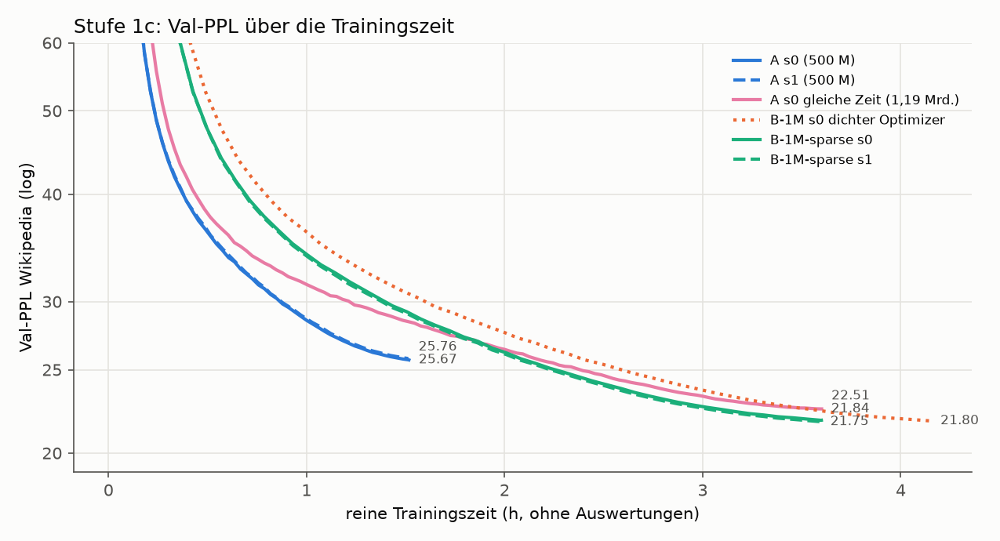

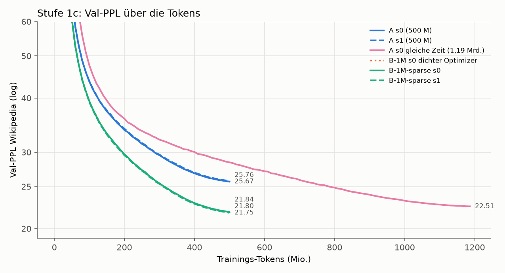

**1. Optimizer ok – erfüllt.** B-1M-sparse s0 endet bei 21,837 statt 21,801 (+0,16 %, erlaubt +2 %). Der
Abstand bleibt über das ganze Training bei +0,1 bis +0,3 % (100 / 200 / 300 / 400 / 500 M Tokens: +0,12 / +0,34 /
+0,12 / +0,12 / +0,16 %). Das liegt innerhalb des Seed-Rauschens (B-1M-sparse s0 ↔ s1: 0,39 %). Die Tabelle ist
gleich gesund (Nutzung 100 %, meistgelesenes 1 % bekommt 11,7 % bzw. 11,4 % der Zugriffe, KL 0,62 / 0,60; vorher
11,8 % und 0,62). Die Softmax ist gleich flach (28,6 / 28,5 effektive Einträge von 32). Gewinn: 1,15× schneller
(216 statt 249 min) und 1,2 GiB weniger VRAM im Training. Bei der Inferenz ändert der Optimizer nichts.
**Aber:** Ziel war 1,5×. B-1M ist pro Token weiterhin 2,4× langsamer als A (38,5 k gegenüber 91,6 k tok/s).

**2. Stabil – erfüllt.** Beide Seeds liegen klar unter der Grenze von 0,90 × 25,711 = 23,140: s0 bei 0,849×,
s1 bei 0,846× (−15,1 % bzw. −15,4 %). Die Seeds liegen bei B-1M-sparse 0,39 % und bei A 0,35 % auseinander.
Der Vorsprung ist also rund 40-mal so groß wie das Seed-Rauschen. Auf WikiText-Val (nie trainiert, anderes
Format) ist der Abstand gleich groß (−16,5 % / −17,0 % gegenüber Mittel A).

**3. Gleiche Rechenzeit – „konkurrenzfähig“, nicht „klarer Vorteil“.** Mit derselben reinen Trainzeit
(216 min, die Zeiten weichen nur um 5 s voneinander ab) sieht A 2,37× so viele Tokens und erreicht 22,508.
B-1M-sparse s0 liegt mit 21,837 um 3,0 % darunter (Q = 0,970; s1, nicht Teil des Kriteriums: 0,966). Damit
ist das Kriterium „mindestens gleichauf“ erfüllt, „mindestens 5 % besser“ (Q ≤ 0,95) verfehlt.
Der Unterschied von 0,67 PPL ist mehr als dreimal so groß wie 2 × Seed-Spanne (0,18). A bei gleicher Zeit hat
allerdings nur einen Seed, das ist also ein deutlicher Hinweis, kein statistischer Beleg (korrigiert 2026-10-05 nach Codex-Review; vorher
hieß es „ist echt“). Auf WikiText-Val ist der Vorsprung kleiner (−1,4 % / −2,0 %).
Bei gleicher Tokenzahl lag B-1M 15 % vorn, bei gleicher Zeit bleibt davon etwa ein Fünftel.

**Einordnung (nichts schönreden):**

- **Der Vorteil pro Token ist robust, der Vorteil pro Rechenzeit ist klein.** Auf dieser Hardware und mit
  dieser Implementierung kauft die Speichertabelle bei gleicher Trainingszeit 3 % Perplexity. Das ist
  messbar und echt, aber weit entfernt von den 15 % bei gleicher Tokenzahl.
- **Die Inferenz kostet mehr, A bei gleicher Zeit nicht.** A bei gleicher Zeit ist im Einsatz genauso
  billig wie A: 155 MB Gewichte, 385 k tok/s Prefill, 215 tok/s Decoding. B-1M braucht 1,7 GB Gewichte
  (fp32; mit 4-Bit-Tabelle und fp32-Rest ≈ 0,37 GB, siehe Quantisierung), hat 2,6× weniger Prefill-Durchsatz und ist beim
  Decoding ≈ 17 % langsamer. Rechnet man Training und Inferenz zusammen, steht A bei gleicher Zeit
  derzeit kaum schlechter da: 3 % höhere PPL, dafür deutlich billiger im Einsatz.
- **Das Zeiturteil hängt an der Implementierung.** Die Rechenmenge pro Token ist fast gleich (+4 % MACs).
  Die 2,4× Laufzeit kommen aus dem Speicher-Lookup (Top-k-Suche, `embedding_bag`, Adam-Schritt über
  1 M Zeilen) auf ROCm ohne eigene Kernels. Ein schnellerer Lookup würde das Ergebnis zugunsten von B
  verschieben; wie weit, ist nicht gemessen. Umgekehrt wurde auch A nicht weiter optimiert (z. B.
  `torch.compile`).
- **Ein Messpunkt.** Gleiche Zeit wurde nur bei ≈ 3,6 h verglichen. Ob der Zeitvorteil bei längerem
  Training wächst (bei gleicher Tokenzahl wuchs der Vorsprung von −10 % bei 100 M auf −15 % bei 500 M
  Tokens), ist offen; die Zwischenstände beider Kurven sind wegen der verschiedenen Cosine-Pläne nicht
  direkt vergleichbar.
- **Daten:** A bei gleicher Zeit hat Tokens jenseits der 505 M aus demselben Artikel-Pool gesehen
  (dieselbe Aufbereitung, gleiches Val-Set). Ein Verteilungsunterschied ist damit praktisch
  ausgeschlossen, die Daten sind aber nicht dieselben.
- **Temperaturen** (alle 10 s, 13 h): Höchstwerte edge 51 °C, Hotspot 83 °C, Speicher 82 °C, 261 W
  (Grenzen 110 / 110 / 108 °C). Keine Drosselung: Der Durchsatz war in allen Läufen konstant
  (5-%-Quantil ≤ 0,3 % unter dem Median).

## Optimierung (Triton-Kernels) und Cloud-Vorbereitung (ab 2026-10-03)

**Ziel:** B-1M so schnell wie realistisch möglich, ohne die Ergebnisse zu verändern. Danach Läufe mit
größeren Tabellen auf einer gemieteten GPU (zuerst IONOS H200-S geplant, jetzt Runpod: 1 × H200 SXM 141 GB).
Kernels nur in Triton (ROCm **und** CUDA). Die PyTorch-Implementierung bleibt als Referenz und Fallback
per Konfiguration umschaltbar.

**Zielwerte** (gegenüber A auf derselben GPU):

| | Ziel | vorher (B-1M-sparse) |
|---|---|---|
| Training | ≥ 0,6× so schnell wie A pro Token | 0,42× |
| Decoding (Batch 1) | höchstens 10 % langsamer als A | 17 % |
| Prefill (16 × 1024) | höchstens 1,5× langsamer als A, gemessen mit bf16-Tabelle; fp32, bf16 und 4 Bit getrennt berichtet | 2,6× (fp32) |

**Abbruchregel:** Bringt ein Optimierungsschritt weniger als 10 % Gewinn, wird aufgehört und berichtet,
wo die Grenze liegt. Ausnahme: der fusionierte Lazy-Adam-Kernel wird wegen des Speicherbedarfs großer
Tabellen trotzdem gebaut.

**Korrektheit:** Jeder Kernel gegen die Referenz (vorwärts und Gradienten), Tabellen mit 262k, 1M und 4M
Zeilen. Scores exakt gleich, Indizes gleich bis auf Gleichstände an der Top-k-Grenze, Ausgaben und
Gradienten mit festen Toleranzen. Tests auch auf der CPU (`TRITON_INTERPRET=1`, kleine Größen).
Vergleichslauf über 20 M Tokens Kernel gegen Referenz: Loss-Kurven praktisch identisch. Alle alten Tests
bleiben grün.

### Ausgangsmessung (Profiler, vor jedem Kernel)

`scripts/profile_memory.py` → `report/profile_before.json`. RX 9070, trainierte Checkpoints, echte Batches.

- **Training:** B-1M-sparse braucht 848 ms je Schritt (32.768 Tokens), A 357 ms (0,42×). Die 490 ms
  Mehrzeit verteilen sich so:
  - Zeilen-Gradienten sammeln: **285 ms** (24 Aufrufe à 11,9 ms; davon `index_put_` mit Sortieren
    6,2 ms, Gewichten 2,8 ms, Gathern 1,4 ms, Gewichts-Gradienten 1,2 ms)
  - Lookup vorwärts: 134 ms (Top-k 72, `embedding_bag` 48)
  - übrige Speicher-Rückwärtsrechnung: 40 ms
  - Lazy Adam: 29 ms
  - Statistik und Clipping: 10 ms
  - abzüglich der 3 FFNs, die A stattdessen hat: −19 ms
- **Prefill** (16 × 1024): B 109 ms, A 42 ms. Pro Speicherschicht 24,4 ms (Top-k 14, Mischen 8,2), ein
  FFN braucht 0,8 ms.
- **Decoding:** B 5,67 ms pro Token, A 4,67 ms. Pro Speicherschicht 0,44 ms (≈ 15 kleine Kernel-Starts),
  ein FFN 0,10 ms.

### Kriterien für die Cloud-Läufe (vor dem Bau festgelegt, 2026-10-03)

Läufe auf einer gemieteten H200 (bei der Festlegung IONOS, jetzt Runpod; die Kriterien gelten unverändert)
mit den Daten, Einstellungen und dem Val-Set von B-1M-sparse: B-1M
(Kontrolllauf auf derselben Hardware und mit denselben Kernels), B-4M (2048² = 4.194.304 Einträge) und
B-16M (4096² = 16.777.216 Einträge), je Init-Seed 0, 500 M Tokens.

Vorgabe (wörtlich):

- **lohnt sich:** B-4M mindestens 3 % besser als B-1M (Cloud) UND B-16M nochmal besser als B-4M
- **unklar:** Verbesserung, aber unter 3 %
- **lohnt sich nicht:** B-4M nicht besser als B-1M (Cloud)

Operationalisierung: Val-PPL Wikipedia am Trainingsende, gleiches Val-Set wie Stufe 1b/1c.

| Urteil | Bedingung |
|---|---|
| lohnt sich | PPL(B-4M) ≤ 0,97 × PPL(B-1M) **und** PPL(B-16M) < PPL(B-4M) |
| unklar | PPL(B-4M) < PPL(B-1M), aber nicht „lohnt sich“ |
| lohnt sich nicht | PPL(B-4M) ≥ PPL(B-1M) |

Zum Fall „unklar“: Er umfasst auch B-4M ≥ 3 % besser, aber B-16M nicht besser als B-4M. Das wird im
Bericht ausdrücklich so benannt. Das Seed-Rauschen von B-1M-sparse lag bei 0,39 %; Unterschiede unter
≈ 0,8 % (2 × Spanne) gelten als nicht belastbar und werden so benannt.

### Schritt 1: Zeilen-Gradienten sammeln, fusioniert (Kernel 1)

`smlm/kernels.py::bag_backward_rows`, eingeschaltet mit `mem_impl="triton"` (`--mem_impl triton`).

- **Vorher:** Für jeden der 524.288 Lookups (4096 Tokens × 128) wird w·grad materialisiert (0,8 GB) und
  mit `index_put_` (Sortieren) addiert.
- **Kernel:** Die Lookups werden einmal nach Tabellenzeile sortiert (`torch.sort`, 0,25 ms). Jedes
  Programm nimmt 32 sortierte Positionen. Gleiche Zeilen summiert ein segmentierter Scan in Registern.
  Läufe, die ganz im Programm liegen, werden normal geschrieben; nur die höchstens zwei Läufe an den
  Programmgrenzen atomar. Der Gewichts-Gradient dot(grad, Zeile) entsteht im selben Durchlauf.
- **Erster Versuch:** atomare Addition für jeden Lauf, 17 ms je Aufruf, also langsamer als die
  Referenz. Atomics sind auf der RX 9070 teuer.
- **Ein Aufruf mit Trainingsform** (echte Indizes eines trainierten Modells, 254k verschiedene Zeilen):
  Referenz 14,3 ms, Kernel 2,74 ms + 0,25 ms Sortieren (≈ 4,8×).
  Abweichung zur Referenz: relativ 3·10⁻⁷ (Akkumulator) bzw. 2·10⁻⁷ (Gewichts-Gradient), `touched` identisch.
- **Tests** (`tests/test_kernels.py`): Tabellen mit 262k / 1M / 4M Zeilen (4M auf GPUs < 40 GB mit 64
  statt 384 Spalten, sonst passt der Test nicht in 16 GB), Toleranz rtol = atol = 1e-5 relativ zur Skala.
  Dazu das ganze Modell (3 Speicherschichten, geteilte Tabelle, 2 Micro-Batches): alle Gradienten gleich.
  Auf der CPU über `TRITON_INTERPRET=1` mit kleinen Größen. Alle 59 Tests grün.
  Nebenbei behoben: Auf der CPU liefert `_embedding_bag` für fp32 kein `offset2bag`; die Referenz baut es
  jetzt selbst.

| Trainingsschritt (32.768 Tokens) | vorher | Kernel 1 |
|---|---|---|
| vorwärts | 261 ms | 262 ms |
| rückwärts | 545 ms | 339 ms |
| Lazy Adam + Rest | 42 ms | 42 ms |
| **gesamt** | **848 ms (38,7 k tok/s)** | **643 ms (50,9 k tok/s)** |
| gegenüber A (357 ms) | 0,42× | **0,56×** |

Gewinn 1,32× (Abbruchregel: > 10 %, weiter). Rohdaten: `report/profile_k1.json`.

### Schritt 2: Lookup fusioniert (Kernel 2)

`smlm/kernels.py::pk_select` / `PKSelect` (Auswahl) und `bag_forward` (gewichtetes Mischen).

- **Gleiche Teil-Scores:** s1, s2 kommen weiter aus demselben `einsum` wie in der Referenz und sind
  deshalb bitgleich.
- **Auswahl in einem Kernel**, ein Programm je (Token, Kopf):
  - Top-32 jeder Hälfte (int32-Schlüssel aus ordnungserhaltendem bf16-Code und Index, zweistufig über
    128er-Blöcke).
  - Paar-Summen, auf bf16 gerundet wie `s1 + s2` in PyTorch (RTNE mit Integer-Arithmetik, damit GPU und
    CPU-Interpreter gleich runden).
  - Top-32 der Paare und Softmax in fp32.
  - Von den 32 × 32 Paaren kommen nur die 130 mit (i+1)(j+1) ≤ 32 überhaupt in Frage, alle anderen werden
    von ≥ 32 mindestens gleich großen Paaren dominiert.
- **Rückwärts:** Softmax-Ableitung, dann der Gradient jedes gewählten Scores in seine zwei Teil-Scores,
  in fp32 summiert und einmal auf bf16 gerundet (wie der Autograd der Referenz). Der `einsum`-Backward
  bleibt PyTorch.
- **Mischen:** ein Programm je (Token, 128 Spalten), 32 Lookups pro Kachel; Tabelle fp32 oder bf16.
- **Exaktheit:**
  - Die gewählten Scores sind **bitgleich** mit der Referenz. Jeder gewählte Index hat nachweislich genau
    seinen Score, die Auswahl ist also ein exaktes Top-k.
  - Indizes weichen nur bei gleichen Scores ab. Bei bf16 ist das häufig: Mit Zufallsdaten haben 59 % der
    Zeilen irgendwo einen Gleichstand mit anderer Wahl. Auch `torch.topk` legt die Reihenfolge bei
    Gleichstand nicht fest.
  - Softmax-Gewichte: Abweichung ≤ 3·10⁻⁸.
- **Tests:** Auswahl bei 512 / 1024 / 2048 Keys je Hälfte und bei N = 1. Rückwärts gegen die exakt
  summierte Ableitung: ≤ 1 bf16-ulp. Mischen gegen `embedding_bag` bei 262k / 1M / 4M Zeilen, fp32 und
  bf16. CPU-Interpreter grün. Gesamt 71 Tests grün.

| Ein Aufruf (Trainingsform N = 4096) | Referenz | Kernel |
|---|---|---|
| Top-k beider Hälften + Kreuz-Top-k + Softmax | 2,83 ms | 0,86 ms |
| Mischen (`embedding_bag` → Kernel), fp32-Tabelle | 1,97 ms | 0,84 ms |
| Speicherschicht vorwärts gesamt | 5,57 ms | 2,45 ms |

| | vorher | Kernel 1 | Kernel 1 + 2 | A |
|---|---|---|---|---|
| Trainingsschritt | 848 ms | 643 ms | **584 ms** (vorwärts 187, rückwärts 355) | 358 ms |
| Training tok/s | 38,7 k | 50,9 k | **56,1 k** | 91,5 k |
| gegenüber A | 0,42× | 0,56× | **0,61×** ✅ (Ziel ≥ 0,6) | |
| Prefill 16 × 1024 (fp32-Tabelle) | 109 ms (2,6×) | | 64,0 ms (1,52×) | 42,2 ms |
| Decoding pro Token | 5,67 ms | | 5,70 ms (+21 %) | 4,69 ms |

- **Trainingsgewinn von Schritt 2:** 1,10× (643 → 584 ms), knapp über der 10-%-Grenze.
- **Rückwärts** wurde etwas langsamer (339 → 355 ms): Die dichten Teil-Score-Gradienten entstehen mit
  `scatter_add` in fp32 plus Rundung statt mit dem Top-k-Backward der Referenz.
- **Decoding** ändert sich nicht. Bei einem Token pro Schritt bestimmen die ≈ 15 Kernel-Starts pro
  Speicherschicht die Zeit, nicht die Rechenarbeit.

Rohdaten: `report/profile_k2.json`, `report/profile_k2_infer.json`. Die Stufenzeiten dort messen die
PyTorch-Teilschritte; maßgeblich für die Kernels ist `forward_total`.

### Schritt 3: Inferenz-Lookup auf bf16- und 4-Bit-Tabelle (Kernel 4) und Decoding-Graph

- **Inferenztabelle:** `Transformer.set_memory_inference_table("fp32" | "bf16" | "q4")` legt eine
  Inferenzkopie der geteilten Tabelle an.
  - 4 Bit nach genau dem Verfahren des Quantisierungstests: je Zeile fp16-Skala, Codes −8…7, zwei pro
    Byte. Der Test prüft, dass die Dequantisierung bitgleich mit `quantize_table_eval.py` ist.
- **Kernel `bag_infer`:** mischt direkt aus fp32-, bf16- oder 4-Bit-Zeilen. Das swilu-Produkt
  `out * bf16(silu(pre))` und der bf16-Cast vor `value_proj` sind eingebaut. Er gilt nur ohne Gradienten
  und unter bf16-Autocast; das Training bleibt unverändert.
- **Decoding:** Gemessen bremst dort nicht die GPU, sondern die CPU. Eine Speicherschicht braucht
  0,39 ms nur zum Absetzen der ≈ 20 PyTorch-Ops und Triton-Starts; die GPU-Arbeit liegt bei ≈ 0,05 ms,
  ein FFN braucht 0,07 ms.
  - Abhilfe: `Transformer.set_memory_decode_graphs(True)` nimmt `_forward` der Speicherschicht für ein
    Token einmal als CUDA/HIP-Graph auf und spielt ihn danach ab.
  - Es laufen dieselben Kernels, die Logits sind bitgleich (Test über 5 Decoding-Schritte, alle drei
    Tabellenarten). A läuft ohne Graphen. **Der Decoding-Gewinn kommt also aus den Graphen, nicht aus
    einem Triton-Kernel**; A würde mit Graphen auch schneller.
- **Val-PPL** auf dem ganzen Wikipedia-Val-Set, B-1M-sparse s0 (`scripts/eval_kernels.py`,
  `report/eval_kernels.json`):

  | Variante | Val-PPL | Abweichung | Zeit |
  |---|---|---|---|
  | Referenz | 21,8369 | – | 12,3 s |
  | Kernel, fp32 | 21,8357 | −0,005 % | 8,5 s |
  | Kernel, bf16 | 21,8368 | −0,000 % | 8,1 s |
  | Kernel, 4 Bit | 21,8663 | +0,13 % (Quantisierungstest: +0,12 %) | 8,3 s |

| Inferenz (RX 9070) | Prefill 16 × 1024 | gegenüber A | Decoding pro Token | gegenüber A |
|---|---|---|---|---|
| A | 42,4 ms | | 4,62 ms | |
| B vorher (Referenz) | 109,3 ms | 2,6× | 5,67 ms | +21 % |
| B Kernel, fp32-Tabelle | 62,9 ms | 1,48× | 5,75 ms | +25 % |
| **B Kernel, bf16-Tabelle** | **60,8 ms** | **1,44×** ✅ | 5,77 ms | +25 % |
| B Kernel, 4 Bit | 62,5 ms | 1,47× | 5,69 ms | +23 % |
| B Kernel + Decoding-Graph, fp32 | 62,6 ms | 1,48× | **4,53 ms** | **−2 %** ✅ |
| B Kernel + Decoding-Graph, bf16 | 61,0 ms | 1,44× | 4,57 ms | −1 % |
| B Kernel + Decoding-Graph, 4 Bit | 62,6 ms | 1,48× | 4,55 ms | −2 % |

- **Prefill:** bf16 bringt nur 2 ms gegenüber fp32, 4 Bit nichts. Die Werte werden nicht mehr nur aus dem
  Speicher gelesen; Auswahl (≈ 3,2 ms je Schicht bei 16k Tokens), Teil-Scores und Projektionen sind jetzt
  ein ebenso großer Anteil. 4 Bit spart vor allem Speicher (Tabelle 203 statt 1.611 MB).
- **Prefill-Tokens:** Der Benchmark nimmt Zufallstokens wie in `train.py`. Mit echtem Text liegen die
  Zugriffe dichter und die Lookups werden eher schneller.

Rohdaten: `report/profile_k4_infer.json`.

### Schritt 4: Lazy Adam fusioniert (Kernel 3, wegen des Speichers großer Tabellen)

`smlm/kernels.py::lazy_adam_step`, automatisch mit `mem_impl="triton"`.

- **Kernel:** Gleiche Rechnung wie `LazyRowAdam` (Adam-Formel von PyTorch, globaler Schritt für die
  Bias-Korrektur, kein Weight Decay), aber direkt in der Tabelle: gelesene Zeilen werden aktualisiert und
  ihr Akkumulator genullt. Ungelesene Zeilen werden gar nicht geladen.
- **Speicher:** Die Referenz sichert und restauriert die ungelesenen Zeilen (Werte und beide Momente),
  das sind 3 × 1,5 KB temporär pro ungelesener Zeile. Bei 16M Zeilen und vielen ungelesenen wären das
  zweistellige GB, beim Kernel 0.
- **Gefundener Fehler:** Die erste Version löschte die `touched`-Maske im Kernel mit maskierten
  Byte-Stores. Dabei wurden auf der RX 9070 Zeilen benachbarter Programme gelöscht, bevor diese sie
  gelesen hatten (Folge: 60–133 gelesene Zeilen ohne Update). Der Test hat das gefunden. Die Maske wird
  jetzt nach dem Kernel mit einem `zero_()` gelöscht.
  *Nachtrag 2026-10-05:* Minimale Nachbauten (`docs/rocm-issues/repro_byte_store.py`, 42 Varianten, dazu eine
  Variante nah am damaligen Kernel) zeigen auf der RX 9070 **keinen** Fehler bei maskierten Byte-Stores. Die
  damalige Ursache war deshalb sehr wahrscheinlich ein Fehler in meinem eigenen Kernel, nicht in ROCm oder Triton;
  die alte Fassung ist nicht erhalten. Es wurde kein Fehlerbericht eingereicht.
- **Tests:** 3 Schritte gegen `LazyRowAdam` bei 262k / 1M / 4M Zeilen, mit Clipping-Faktor:
  - ungelesene Zeilen bitgleich
  - gelesene Zeilen und beide Momente innerhalb rtol = atol = 1e-5
  - Akkumulator und Maske danach leer

  Auf GPUs < 40 GB mit 16 Spalten (sonst > 13 GB VRAM). 87 GPU-Tests grün, CPU-Interpreter 20 grün
  (3 Graph-Tests nur GPU). VRAM-Spitze des ganzen Testlaufs 7,4 GiB.
- **Tempo:** Tabellen-Optimizer 29,0 → 22,5 ms je Schritt, Trainingsschritt 584 → 575 ms
  (57,0 k tok/s, 0,62× A). Gewinn < 10 %, wie erwartet; gebaut wegen des Speichers.

### Schritt 5: Vergleichslauf Kernel gegen Referenz (Korrektheit)

Gleiches Modell (B-1M-sparse), gleiche Initialisierung, gleiche Daten, einmal mit `mem_impl="torch"`,
einmal mit `"triton"` (alle Kernels). Abbildungen: `report/kernel_check_*.png`, Zahlen:
`report/kernel_check_*.json`.

| Vergleich | Trainings-Loss, Abweichung Median / max. | Val-PPL Referenz → Kernel |
|---|---|---|
| **erste 22 M Tokens des echten 500-M-Plans** (Warmup 763 Schritte, wie in der Cloud), Seed 0 | **0,04 % / 0,13 %** | **184,52 → 184,56 (+0,02 %)**; Zwischenwerte −1,0 … +0,5 % |
| 20 M Tokens mit eigenem kurzem Plan (Warmup 31 Schritte), Seed 0 | 0,37 % / 0,46 % | 181,93 → 178,01 (−2,2 %) |
| dasselbe, Seed 1 | | 186,73 → 193,73 (+3,8 %) |
| zum Vergleich: Referenz Seed 0 → Referenz Seed 1 (kurzer Plan) | | 181,93 → 186,73 (+2,6 %) |

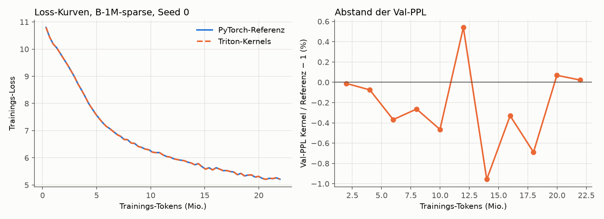

- **Im Regime der echten Läufe sind die Kurven praktisch identisch.** Bei Schritt 10–90 stimmen die
  Losses auf 5–6 Stellen überein. Danach wachsen die Abweichungen langsam, bleiben aber unter 0,13 %.
- **Im kurzen Plan** springt die Lernrate nach 31 Schritten auf den vollen Wert, die Tabellennutzung
  bricht kurz ein (13 % bei 2 M Tokens) und erholt sich wieder. Diese Phase ist chaotisch:
  - Beide Läufe sind bis Schritt 20 gleich und trennen sich ab Schritt 30.
  - Am Ende liegt der Kernel einmal 2,2 % besser, einmal 3,8 % schlechter.
  - Das ist dieselbe Größenordnung wie zwei Seeds der Referenz (2,6 %). Ein systematischer Unterschied
    ist nicht zu sehen.
- **Warum die Läufe überhaupt auseinanderlaufen (neuer Befund):**
  - Die Teil-Scores sind wie in der Referenz bf16 (Autocast). Bei 8 Bit Mantisse haben sehr viele
    Kandidaten exakt denselben Score.
  - Auf echten Aktivierungen des trainierten B-1M haben **65 % der (Token, Kopf)-Zeilen einen
    Gleichstand beim 32. Score**. In **41 %** wählen Kernel und `torch.topk` andere, gleichwertige
    Einträge, im Mittel 15 von 32.
  - Gleiche Scores bedeuten gleiche Gewichte, die Ausgabe mischt dann aber andere Werte-Zeilen. Welche,
    legt auch `torch.topk` nicht fest; die PyTorch-Referenz auf CUDA kann ebenso anders wählen als
    auf ROCm (nicht gemessen; der Cloud-Kontrolllauf B-1M zeigt es).
  - **Exakt gleiche Kurven sind deshalb nicht garantierbar**, wahrscheinlich auch nicht mit der
    Referenz auf anderer Hardware. Erreichbar und gezeigt ist: exakt gleiche Scores, gültige exakte
    Top-k-Auswahl, gleiche Kurven im echten Plan.
  - Die vollständige Kontrolle ist der Cloud-Lauf B-1M (500 M Tokens) gegen B-1M-sparse s0 von zu
    Hause; das Seed-Rauschen dort lag bei 0,39 %.
- **Nebenbefund fürs Modell (nicht geändert):** Die Auswahl hat wegen der bf16-Scores nur eine grobe
  Auflösung. Ob fp32-Teil-Scores (kaum teurer) die Speicherschicht verbessern, wäre ein eigener Versuch.
  Er würde die Ergebnisse gegenüber allen bisherigen B-Läufen verändern und gehört deshalb nicht in diese
  Optimierung.

### Ergebnis der Optimierung

Gemessen mit `scripts/profile_memory.py` (RX 9070, trainierte Checkpoints; `report/profile_before.json`
→ `report/profile_after.json`).

| | Ziel | vorher | nachher | erreicht |
|---|---|---|---|---|
| Training: Schritt (32.768 Tokens) | | 848 ms (38,7 k tok/s) | 577 ms (56,8 k tok/s) | |
| Training gegenüber A (359 ms) | ≥ 0,6× | 0,42× | **0,62×** | ✅ |
| Prefill 16 × 1024 gegenüber A (42,7 ms), bf16-Tabelle | ≤ 1,5× | 2,6× (fp32) | **1,43×** (61,1 ms) | ✅ |
| Prefill, fp32-Tabelle / 4 Bit | (berichtet) | 2,6× | 1,47× / 1,49× | |
| Decoding pro Token gegenüber A (4,60 ms) | ≤ +10 % | +21 % | **−2 %** (4,50 ms, mit Decoding-Graph) | ✅ |
| Decoding ohne Graph | (berichtet) | +21 % | +23 % | |
| Val-PPL B-1M-sparse s0 (fp32 / bf16 / 4 Bit) | unverändert | 21,837 | 21,836 / 21,837 / 21,866 | ✅ |

**Gewinn je Schritt** (Abbruchregel: ab < 10 % aufhören, außer Kernel 3):

| Schritt | Gewinn |
|---|---|
| Kernel 1 (Zeilen-Gradienten) | Training 1,32× |
| Kernel 2 (Lookup) | Training 1,10×, Prefill 109 → 63 ms (1,73×) |
| Kernel 4 (bf16 / 4 Bit) | Prefill 63 → 61 ms (1,03×) |
| Decoding-Graph | Decoding 1,26× |
| Kernel 3 (Lazy Adam) | Training 1,02×; gebaut wegen des Speichers |

Danach habe ich aufgehört: Alle Ziele sind erreicht, und keiner der verbleibenden Posten verspricht
noch 10 %.

**Wo die Grenze liegt (ehrlich):**

- **Training:** Von den 577 ms je Schritt sind 359 ms der Rechenkern, den A auch hat. Die Speicherschichten
  kosten noch ≈ 220 ms:
  - Rückwärtsrechnung ≈ 130 ms, davon Kernel 1 ≈ 3 ms je Aufruf, der Rest sind Teil-Score-Gradienten,
    Projektionen und BatchNorm.
  - Vorwärts ≈ 60 ms.
  - Lazy Adam 22 ms, Statistik und Clipping 10 ms.

  Ein weiterer großer Schritt bräuchte einen fusionierten Backward für Auswahl und Teil-Scores (heute
  `scatter_add` + `einsum`-Backward in PyTorch) oder fusionierte Projektionen. Mehr als 10 % sind davon
  einzeln nicht zu erwarten.
- **Prefill:** Die Werte-Lesezugriffe sind kein Engpass mehr: bf16 bringt nur 2 ms, 4 Bit nichts. Die
  Auswahl kostet ≈ 3,2 ms je Schicht bei 16k Tokens; sie ist an eine bitonische Sortierung in Triton
  gebunden.
- **Decoding:** Der Gewinn kommt **aus den CUDA/HIP-Graphen, nicht aus einem Kernel.** Ohne Graph liegt B
  bei +23 %, weil eine Speicherschicht ≈ 20 Ops absetzt (0,39 ms CPU). A läuft ohne Graphen; mit Graphen
  würde auch A schneller, der Abstand bliebe aber klein.
- **Hardware:** Alle Messungen stammen von der RX 9070. Auf der H200 sind die Verhältnisse anders: mehr
  Bandbreite, und die Kernel-Konfigurationen sind nicht für NVIDIA abgestimmt.

### Cloud-Vorbereitung (Runpod, 1 × H200)

**Anbieterwechsel (2026-10-03):** Zuerst war IONOS geplant (H200-S, 3,00 €/h; Stand in Commit `36eccfe`),
jetzt **Runpod**. Kriterien, Läufe und Daten bleiben unverändert; geändert haben sich nur Setup,
Speicherort und das Stoppen am Ende.

**Anbieter-Fakten** (Runpod-Doku und runpod.io/pricing, abgerufen 2026-10-03):

- **GPU und Preis:** H200 SXM 141 GB On-Demand: Secure Cloud 4,59 $/h, Community Cloud 3,59 $/h
  (24 vCPU, 276 GB RAM). Sekundengenaue Abrechnung; maßgeblich ist der Preis in der Konsole. H100 mit
  80/94 GB reicht für B-16M nicht.
- **Stoppen:** Ein Stop gibt die GPU frei und beendet die Rechenkosten. `/workspace` (Volume Disk) bleibt
  und kostet gestoppt 0,20 $/GB/Monat (150 GB ≈ 1 $/Tag); die Container Disk wird geleert.
  **Terminate** löscht alles.
- **Stopp aus dem Pod:** Jeder Pod bekommt `RUNPOD_POD_ID` und einen Pod-eigenen `RUNPOD_API_KEY`. Damit
  stoppt sich der Pod selbst (`POST https://rest.runpod.io/v1/pods/$RUNPOD_POD_ID/stop`, ersatzweise
  `runpodctl pod stop`). Du musst keinen Schlüssel erzeugen.
- **Neustart:** Nach einem Stop kann die GPU vergeben sein; dann startet der Pod auf Wunsch mit 0 GPUs. Das
  reicht, um die Checkpoints zu holen.
- **Treiber und SSH:** Treiber und SSH sind im Template „Runpod PyTorch“ dabei. `scp`/`rsync` brauchen
  eine öffentliche IP („SSH over exposed TCP“), deshalb Secure Cloud.
- **Guthaben:** Fällt es auf 0 $, werden Pods gestoppt, und Pods ohne Netzwerk-Volume **samt Daten
  gelöscht**. Vorher genug aufladen (≥ 40 $).

**Gebaut** (alles in Git, Anleitung `docs/notes/CLOUD.md`):

- **`cloud/setup.sh`:** ein Befehl im Pod.
  - Ablauf: Pakete, GPU-Check, Deploy-Key + Klonen nach `/workspace`, Python-Umgebung (PyTorch-CUDA-Wheels
    mit Triton), Daten, alle Tests, Probelauf aller drei Konfigurationen, dann die Warteschlange in tmux.
  - Alles, was einen Stop überleben muss, liegt auf `/workspace`; Pakete und SSH-Key werden nach jedem
    Start neu eingerichtet.
  - Fertige Schritte werden beim erneuten Start übersprungen.
  - Bei einem Fehler: Log nach GitHub, Nachricht, Pod stoppen.
- **`cloud/fetch_data.py`:**
  - Lädt WikiText-103 und Wikipedia 20231101.en in **festgepinnten Hugging-Face-Revisionen** und prüft
    jede Rohdatei per SHA-256. Alle 45 Rohdateien zu Hause stimmen mit den LFS-Prüfsummen dieser Revisionen
    überein.
  - Erzeugt die Token-Dateien neu und bricht ab, wenn eine nicht **bytegleich** mit zu Hause ist
    (`cloud/data_sha256.txt`).
- **`scripts/run_cloud.py`:** Warteschlange B-1M (Kontrolle) → B-4M → B-16M.
  - Je 500 M Tokens, Einstellungen von B-1M-sparse, `--mem_impl triton`.
  - GPU-Temperatur, Leistung und Takt alle 10 s (`smlm/gpu_monitor.py`, über `nvidia-smi`).
  - Nach jedem Lauf: Zwischenstand in REPORT.md, `git pull --rebase` + Push, Handy-Nachricht (ntfy,
    optional).
  - Am Ende: Prüfsummenliste der Checkpoints, dann **Stopp über die Runpod-API** (`cloud/stop_pod.sh`).
  - Schutz: Ein Lauf ohne Log-Änderung für 30 min wird beendet; Obergrenze 12 h für alles.
- **GitHub:** privates Repo `re133/sparse-memory-lm`, Deploy-Key mit Schreibrecht nur für dieses Repo.
  Das Starter-Paket `~/smlm-cloud-kit/` liegt auf dem PC (`setup.sh`, `stop_pod.sh`, `deploy_key`,
  `cloud.env`).
- **Nicht benutzt:** das Runpod-Plugin für Claude Code. Die Installation wurde von der Rechte-Prüfung
  blockiert, und es ist auch nicht nötig. Den Pod legst du in der Weboberfläche an; nur der Pod-eigene
  Schlüssel wird benutzt.

**Speicherbedarf auf der H200** (141 GB ≈ 131 GiB):

- Die Tabelle braucht pro Zeile 4 fp32-Kopien × 384 × 4 B = 6 KiB: Werte, Akkumulator, Adam m und v.
- „Rest“ wurde bei B-1M gemessen: 10,5 GiB Spitze minus 6,0 GiB Tabelle.

| | Einträge | Tabelle + Optimizer | + Rest | Spitze (Schätzung) | Checkpoint |
|---|---|---|---|---|---|
| B-1M | 1.048.576 | 6,0 GiB | 4,5 GiB | ≈ 10,5 GiB (gemessen) | 1,7 GB |
| B-4M | 4.194.304 | 24,0 GiB | ≈ 4,8 GiB | ≈ 29 GiB | ≈ 6,5 GB |
| B-16M | 16.777.216 | 96,0 GiB | ≈ 5,5 GiB | ≈ 102 GiB | ≈ 26 GB |

B-16M passt nur mit dem fusionierten Lazy Adam (Kernel 3). Die Referenz bräuchte für die Kopien der
ungelesenen Zeilen zusätzlich bis zu 3 × 1,5 KiB pro Zeile, bei 16M Zeilen und der Hälfte ungelesen
≈ 36 GiB, und das passt nicht mehr.

**Laufzeit und Kosten** (H200 SXM, Secure Cloud 4,59 $/h). Hochgerechnet von der RX 9070 (575 ms je
Schritt, H200 ≈ 7,5× Bandbreite, ≈ 5× Rechenleistung; das kleine Modell lastet die H200 nicht aus),
**bis Faktor 2 unsicher**:

| | Dauer | Kosten (Secure) |
|---|---|---|
| Setup (Python, 11 GB Daten + Tokenisieren, Tests, Probelauf) | 40–55 min | 3,10–4,20 $ |
| B-1M | 25–45 min | 1,90–3,40 $ |
| B-4M | 30–55 min | 2,30–4,20 $ |
| B-16M (Adam über 16M Zeilen, Top-k über 4096 Keys) | 40–75 min | 3,10–5,70 $ |
| Checkpoints holen (Pod wieder gestartet, mit 0 GPUs billiger) | 20–60 min | 0–4,60 $ |
| **Summe** | **≈ 2,5–4,5 h** | **≈ 11–22 $** (Community Cloud ≈ 9–17 $; + ≈ 1 $/Tag, solange der gestoppte Pod nicht gelöscht ist) |

**Vor dem Start geprüft (hier, ohne NVIDIA-GPU):**

- **Daten:** `cloud/fetch_data.py` in einer frischen Kopie des Repos. Alle 45 Rohdateien bestehen die
  SHA-256-Prüfung; alle 7 Token-Dateien und meta.json entstehen **bytegleich** neu (126 s).
  Der Download über die gepinnte Hugging-Face-URL ist mit einer Datei getestet, inklusive Prüfsumme.
- **Warteschlange:** Probelauf mit `SMLM_CLOUD_DRYRUN=1` (B-1M, 2 M Tokens, Triton): Lauf, GPU-Log alle
  10 s, Prüfsummenliste und Ende funktionieren. Außerhalb eines Pods findet das Stopp-Skript keinen
  Pod-Schlüssel, die Warteschlange meldet „stop FAILED“ und schickt die Warnung, von Hand zu stoppen; der
  Fehlerpfad ist damit auch geprüft (damals mit dem IONOS-Skript, das Runpod-Skript prüft dasselbe).
- **GitHub:** privates Repo angelegt, gepusht. Klonen mit dem Deploy-Key getestet.
- **Tests:** 87 GPU-Tests auf ROCm grün, CPU-Interpreter grün.
- **Nachträglich ergänzt, nur auf der CPU getestet** (die GPU war nach dem Messfenster nicht mehr
  freigegeben):
  - Kernel 1 setzt die `touched`-Maske nicht mehr selbst; das ist dasselbe Muster wie beim
    Kernel-3-Fehler, jetzt ein PyTorch-Scatter.
  - Neue Tests: Auswahl mit 4096 Keys je Hälfte (B-16M) und Offsets über 2³¹ Elemente (nur ≥ 60 GB GPU).
  - Ein Probelauf aller drei Konfigurationen in `setup.sh`.
  - `git pull --rebase` vor jedem Push.

  CPU-Suite 42 grün, CPU-Interpreter 21 grün. Auf GPU laufen sie zuerst in der Cloud (Setup-Schritt 6/7)
  bzw. im nächsten Zeitfenster zu Hause.

**Nicht getestet** (geht ohne die Maschine nicht). Das Setup prüft jeden dieser Punkte, bevor gerechnet
wird, und stoppt den Pod bei einem Fehler:

- **Kernels auf CUDA/H200:** Die Tests laufen dort als Erstes, dazu der Probelauf aller drei
  Konfigurationen mit je 1 M Tokens. Nur wenn beides klappt, startet die Warteschlange.
- **Runpod-spezifisches:** Template, `/workspace`-Volume und Stopp mit dem Pod-Schlüssel.
  `setup.sh` prüft den API-Zugang vorher (`stop_pod.sh --check`) und warnt, falls er nicht klappt. Ob
  ein Pod-Schlüssel den eigenen Pod stoppen darf, steht so in der Runpod-Doku („Schedule a stop“), ist aber
  nicht ausprobiert.

**Bereit für die Cloud: ja.** Ablauf in `docs/notes/CLOUD.md`: Konto aufladen, Pod anlegen, Paket hochladen,
`setup.sh` starten.

**Durchführung (2026-10-03/04, Runpod Pod `7yajarg09lrzdn`, 1 × H200 SXM, EUR-IS-4):**

- **Erster Versuch:** 88 von 89 GPU-Tests grün. Durchgefallen ist der neue Großtabellen-Test für Lazy Adam;
  der Fehler lag im Test. Er verglich mit einem anders summierten Gradienten, und bei |g| ≈ 0 kippt bei Adam
  das Vorzeichen. Korrigiert in `409dd49`. Der Pod hat sich dabei wie vorgesehen nach dem Fehler gestoppt.
  Zweiter Versuch: GPU 89/89 und CPU-Interpreter 21/21 grün.
- **Probelauf auf der H200** (VRAM-Spitze Training): B-1M 10,4 GiB, B-4M 28,5 GiB, B-16M 100,9 GiB, wie
  geschätzt.
- **Ein Lauf ist auf dem Pod CPU-gebunden:** ein Python-Thread bei ≈ 90 %, GPU ≈ 24 % ausgelastet,
  ≈ 81 k tok/s.
  - Deshalb ab 22:01 UTC eine **parallele Ausführung** (Freigabe durch den Nutzer):
    `scripts/run_cloud_parallel.py` übernimmt den laufenden B-1M und startet B-16M sofort auf derselben
    GPU.
  - B-4M startet erst nach B-1M und nur, wenn B-16M fertig ist oder vorher ≥ max(15 GB, 30,5 GiB) frei
    sind.
  - Ein abgestürzter Lauf wird gemeldet, nicht neu gestartet; es gibt keine Zwischen-Checkpoints.
  - Die alte Warteschlange ist eingefroren (SIGSTOP), nicht beendet: Beim Schließen ihres tmux-Fensters hätte
    B-1M ein SIGHUP bekommen.
- **Gleicher Trainingscode und gleiche Einstellungen.** Die **Tempo-Werte der Cloud-Läufe (tok/s, Trainzeit)
  sind wegen der geteilten GPU nicht vergleichbar**, weder untereinander noch mit der RX 9070.
- **Selbst-Stopp funktioniert nicht:** Der Pod-eigene `RUNPOD_API_KEY` bekommt von der Runpod-REST-API
  HTTP 403. Gestoppt wird am Ende über das MCP (Claude Code, mit dem Konto des Nutzers).

<!-- CLOUD-STATUS:BEGIN -->

**Zwischenstand Cloud** (automatisch, `scripts/cloud_status.py`, Stand 2026-10-04 04:28)

| Lauf | Status | GPU | Val-PPL Wikipedia | Val-PPL WikiText | Trainzeit | tok/s | VRAM Train | Nutzung | max. Temp. GPU / Speicher | max. Leistung |
|---|---|---|---|---|---|---|---|---|---|---|
| B-1M-sparse s0 zu Hause (RX 9070, PyTorch-Referenz) | fertig | AMD Radeon RX 9070 | 21,837 | 65,51 | 216 min | 38.517 | 10,5 GiB | 100,0 % | 48 / 80 °C | 238 W |
| B-1M (Cloud, Kontrolle) | fertig | NVIDIA H200 | 21,837 | 65,87 | 138 min | 55.226 | 10,4 GiB | 100,0 % | 41 / 40 °C | 343 W |
| B-4M (Cloud) | fertig | NVIDIA H200 | 20,799 | 63,07 | 119 min | 77.551 | 28,5 GiB | 99,7 % | 46 / 47 °C | 379 W |
| B-16M (Cloud) | fertig | NVIDIA H200 | 19,960 | 59,97 | 155 min | 52.684 | 100,9 GiB | 91,3 % | 47 / 48 °C | 404 W |

| Kriterium (vorher festgelegt) | Messwert | Ergebnis |
|---|---|---|
| lohnt sich: B-4M ≥ 3 % besser als B-1M (Cloud) und B-16M besser als B-4M | B-4M / B-1M = 0,9525 (−4,75 %; Grenze 0,97); B-16M / B-4M = 0,9596 (−4,04 %) | **lohnt sich** |

Kontrolle: B-1M in der Cloud (Triton-Kernels, H200) gegenüber zu Hause (PyTorch-Referenz, RX 9070): 21,837 gegenüber 21,837 (−0,00 %; Seed-Spanne zu Hause 0,39 %).

<!-- CLOUD-STATUS:END -->

### Ergebnis der Cloud-Läufe (Auswertung von Hand, 2026-10-04)

**Urteil nach den vorher festgelegten Kriterien: „lohnt sich“.** B-4M ist 4,75 % besser als B-1M (Cloud),
gefordert waren ≥ 3 %, und B-16M ist nochmal 4,0 % besser als B-4M.

| | Einträge | Val-PPL Wikipedia | gegenüber B-1M | Val-PPL WikiText | Nutzung (Val) | Top-1 %-Anteil | KL | VRAM Train |
|---|---|---|---|---|---|---|---|---|
| B-1M-sparse s0 zu Hause (RX 9070, PyTorch) | 1,05 M | 21,837 | | 65,51 | 100 % | 11,7 % | 0,62 | 10,5 GiB |
| **B-1M** (H200, Triton, Kontrolle) | 1,05 M | **21,837** | – | 65,87 | 100 % | 11,8 % | 0,62 | 10,4 GiB |
| **B-4M** | 4,19 M | **20,799** | **−4,75 %** | 63,07 (−4,3 %) | 99,7 % | 18,9 % | 0,99 | 28,5 GiB |
| **B-16M** | 16,8 M | **19,960** | **−8,6 %** (gegenüber B-4M −4,0 %) | 59,97 (−9,0 %) | 91,3 % | 23,4 % | 1,35 | 100,9 GiB |

Verlauf, Val-PPL bei gleicher Tokenzahl:

| Tokens | B-1M | B-4M | B-16M | B-4M / B-1M | B-16M / B-4M |
|---|---|---|---|---|---|
| 100 M | 39,18 | 38,12 | 37,36 | 0,973 | 0,980 |
| 200 M | 29,62 | 28,64 | 27,78 | 0,967 | 0,970 |
| 300 M | 25,46 | 24,43 | 23,65 | 0,959 | 0,968 |
| 400 M | 22,93 | 21,90 | 21,09 | 0,955 | 0,963 |
| 500 M | 21,84 | 20,80 | 19,96 | 0,953 | 0,960 |

**Einordnung (nichts schönreden):**

- **Kontrolle bestanden:** B-1M in der Cloud (H200, Triton-Kernels) und zu Hause (RX 9070, PyTorch-Referenz)
  liegen 0,00 % auseinander (21,8365 gegenüber 21,8369). Kernels und Hardware verändern das Ergebnis nicht,
  auch nicht über die Gleichstände bei der bf16-Auswahl.
- **Deutlich größer als das Seed-Rauschen:** Die Abstände (4,75 % und 4,0 %) sind rund sechsmal so groß wie zwei
  Seed-Spannen von B-1M-sparse (2 × 0,39 %). Die Seed-Spanne stammt aber von B-1M und ist auf die großen Tabellen
  nur übertragen (korrigiert 2026-10-05 nach Codex-Review; vorher „Belastbar trotz eines Seeds“). Auf dem nie trainierten WikiText-Val-Set sind sie gleich groß.
  Trotzdem bleibt es ein Seed je Größe.
- **Der Vorsprung wächst noch:** Bei 100 M Tokens bringt die 4-fache Tabelle 2,7 %, bei 500 M 4,7 %; für
  B-16M gegenüber B-4M wachsen die Werte von 2,0 % auf 4,0 %. Mit mehr Daten dürfte der Abstand weiter
  steigen; gemessen ist das nicht.
- **Die großen Tabellen werden ungleichmäßiger genutzt:** Bei B-16M wurden 8,7 % der 16,8 M Einträge auf dem
  Val-Set nie gelesen, das meistgelesene 1 % bekommt 23 % der Zugriffe (B-1M: 12 %). Pro Eintrag gesehen
  sind 500 M Tokens für 16,8 M Einträge wenig (B-16M: ≈ 11 k Lesezugriffe pro Eintrag, B-1M: ≈ 180 k).
- **Gleiche Tokens, nicht gleiche Kosten:**
  - B-16M hat 6,5 Mrd. Parameter, davon 6,44 Mrd. Tabelle.
  - Pro Token rechnet B-16M 20 % mehr als B-1M, B-4M 7 % mehr (Teil-Scores über 4096 bzw. 2048 statt
    1024 Keys je Hälfte: 56,5 / 50,2 / 47,1 M MACs).
  - Die Tabelle braucht aber 26 GB in fp32, mit 4 Bit ≈ 3,3 GB, und im Training ≈ 100 GiB GPU-Speicher
    (Werte, Akkumulator, Adam).
  - Ein Vergleich bei gleicher Rechenzeit gegen A wurde für die großen Tabellen nicht gemacht.
- **Tempo-Werte nicht vergleichbar:** B-1M und B-16M teilten sich zeitweise die GPU, später B-16M und B-4M.
  Trainzeit, tok/s und die Inferenz-Benchmarks in den `run-info.json` der Cloud-Läufe sind deshalb nicht
  vergleichbar.
- **Kosten:** **25,51 $** für alles laut Runpod-Abrechnung (`list-billing`, abgefragt am 04.10. nach dem
  Löschen des Pods: GPU 24,98 $, Platte 0,52 $), einschließlich des ersten Versuchs mit dem Testfehler und
  der Plattenkosten bis zum Löschen am 04.10. gegen 13:30 Uhr.
  *Korrektur:* Hier stand zuerst 21,01 $ (GPU 20,89 $, Platte 0,12 $). Dieser Wert war zu niedrig. Er stammte
  aus einer Abfrage kurz nach Ende der Läufe, als die Abrechnung offenbar noch nicht vollständig war. Die
  Pod-Laufzeit von ≈ 5,4 h × 4,59 $/h passt zu den 24,98 $ GPU-Kosten.
- **Ablauf:**
  - Alle Checkpoints wurden per `rsync` geholt und mit `runs/cloud/checkpoints.sha256` geprüft: 12 von 12 OK.
  - Der Pod hat sich am Ende **doch selbst gestoppt**: Ein POST-Stop mit dem Pod-Schlüssel ging, obwohl das
    Lesen 403 lieferte. Danach wurde er noch einmal kurz gestartet, um den Rest des B-4M-Downloads zu holen,
    und dann über das MCP gestoppt.
  - GPU-Höchstwerte: 48 °C, 404 W.

## Schritt 1: Gegenwert der Tabelle – dichte Vergleichsmodelle (Plan vor dem Lauf festgelegt, 2026-10-04)

**Frage:** Wie groß müsste ein normales dichtes Modell ohne Tabelle sein, um bei denselben 500 M Tokens so gut
zu sein wie B-1M (21,84), B-4M (20,80) und B-16M (19,96)? Das ist eine **Messung ohne Bestanden-Kriterium**.

**Modelle:** Llama-Stil wie A, ohne Speicherschicht. Breite und Tiefe wachsen gemeinsam. `head_dim = 64`; die
FFN-Breite ist ≈ 8/3 · d, gerundet auf ein Vielfaches von 64 (wie A: 384 → 1024). Presets in `smlm/train.py`.

| Modell | d | Layer | Köpfe | FFN | Parameter ohne Emb. | Emb. | MACs/Token vorwärts | Mikro-Batch |
|---|---|---|---|---|---|---|---|---|
| A (vorhanden, RX 9070) | 384 | 12 | 6 | 1024 | 21,24 M | 19,32 M | 45,3 M | 8 |
| D-50M | 640 | 10 | 10 | 1728 | 49,58 M | 32,19 M | 88,3 M | 8 |
| D-100M | 768 | 14 | 12 | 2048 | 99,11 M | 38,63 M | 148,7 M | 8 |
| D-200M | 1024 | 16 | 16 | 2752 | 202,41 M | 51,51 M | 270,7 M | 8 |
| D-400M | 1280 | 20 | 20 | 3456 | 396,55 M | 64,39 M | 487,1 M | 4 |
| *zum Vergleich:* B-1M / B-4M / B-16M | 384 | 12 | 6 | 1024 | aktiv 23,1 / 26,2 / 32,5 M | 19,32 M | 47,1 / 50,2 / 56,5 M | 4 |

**Training:** wie A und B, ohne Abweichung.
- Daten:
  - 500 M Wikipedia-Tokens, jede Sequenz genau einmal
  - Daten-Seed 1234, Init-Seed 0
  - Validierung: Wikipedia-Val-Set (1,48 M Tokens); WikiText-103-Val nur als Nebenwert
- Optimierung:
  - AdamW (0,9 / 0,95), LR 6e-4, Warmup 5 %, Cosine auf 10 %
  - Weight Decay 0,1, Clip 1,0
  - 32.768 Tokens/Schritt, bf16-Autocast
- Der Mikro-Batch wird nur an den Speicher angepasst, die Gradient-Akkumulation füllt auf 32.768 Tokens auf.
  `tests/test_dense.py` prüft, dass das die Gradienten nicht ändert.
- **A** geht als kleinster Punkt mit seinem vorhandenen Lauf ein: Seed 0, PPL 25,665, gleiche Daten, gleiches
  Val-Set, zu Hause gerechnet. Dass zu Hause und in der Cloud dasselbe herauskommt, zeigt B-1M: 21,8369
  gegenüber 21,8365.

**Auswertung (festgelegt):**
1. **Kurve:** Val-PPL (Wikipedia) gegen Parameter ohne Embeddings, log–log. Punkte: A, D-50M, D-100M, D-200M,
   D-400M, soweit gelaufen.
2. **Gleichwertige Größe N_eq** für B-1M, B-4M und B-16M:
   - Hauptwert: stückweise lineare Interpolation von log PPL über log N zwischen den beiden benachbarten
     dichten Punkten.
   - Vergleichswert: Fit PPL = E + a · N^(−α) über alle dichten Punkte. Gitter über α und E, a je Gitterpunkt
     per kleinster Quadrate in PPL, gewählt wird der Punkt mit dem kleinsten Fehler in log PPL (korrigiert 2026-10-05 nach Codex-Review;
     vorher „kleinste Quadrate in log PPL“; ein exakter Log-Fit verschiebt die Fit-Werte um höchstens 0,3 M).
3. **Unsicherheit** (ein Sensitivitätsbereich, kein Konfidenzintervall):
   - Die PPL von B und die der beiden Nachbarpunkte werden um ±0,4 % verschoben. Das ist die Seed-Spanne aus
     Stufe 1c: A s0/s1 0,35 %, B-1M s0/s1 0,39 %.
   - Die Extremfälle ergeben einen Bereich für N_eq.
   - Weicht der Fit-Wert stärker ab, wird der Bereich bis zu ihm erweitert.
4. **Einklammerung:**
   - Ist B besser als das größte gelaufene dichte Modell, wird nur „> N_max“ berichtet. Eine
     Fit-Extrapolation erscheint höchstens als gekennzeichneter Hinweis.
   - Ist B schlechter als A, lautet das Ergebnis „< 21 M“.
5. **Rechenaufwand pro Token:**
   - Vorwärts-MACs (`macs_per_token`, Kontext 1024) für alle Modelle; Training ≈ 3×.
   - Für B zusätzlich die gelesenen Tabellenwerte pro Token: 3 Schichten × 4 Köpfe × 32 Zeilen × 384 Werte
     = 147.456 Werte, also 295 KB in bf16 bzw. 74 KB in 4 Bit.
   - Dazu die Größe der Tabelle.

**Durchführung (Runpod, 1 × H100 SXM 80 GB, Secure Cloud, 3,49 $/h; `cloud/setup_dense.sh`,
`scripts/run_dense.py`):**
- **Daten:** Die Token-Dateien kommen von der Hetzner Storage Box. Sie werden per sha256 gegen
  `cloud/data_sha256.txt` geprüft, sind also bytegleich mit zu Hause.
- **Tests:** `tests/test_dense.py` und `tests/test_stage1b.py`, auf der GPU.
- **Probelauf:** Jede Größe läuft allein 3 M Tokens. Gemessen werden tok/s, VRAM-Spitze, Auswertung, Speichern
  und Inferenz.
- **Budget-Wächter (Deckel 18 $ für den ganzen Pod):**
  - Hochrechnung = Pod-Laufzeit + 0,1 h + 1,15 × Σ (500 M Tokens + Auswertungs-Tokens / 3) / (tok/s allein)
    + 0,4 h.
  - Zugelassen wird in der Reihenfolge 50M, 100M, 200M, 400M, solange die Hochrechnung ≤ 18 $ / 3,49 $/h
    = 5,16 h bleibt.
  - Was wegfällt, wird gemeldet. Ein größeres Modell wird dann nicht mehr zugelassen.
- **Parallelbetrieb:** Die zugelassenen Läufe laufen gleichzeitig, das größte startet zuerst.
- **Abbruch:**
  - Ab 5,16 h − 0,3 h Laufzeit wird beendet, was noch läuft, und gesichert.
  - Ein unabhängiger Watchdog stoppt den Pod bei 5,16 h − 6 min.
  - Abgebrochene oder abgestürzte Läufe werden berichtet, nicht neu gestartet (keine Zwischen-Checkpoints).
- **Nach jedem Lauf:**
  - kleine Dateien auf GitHub
  - Laufordner samt Checkpoint per rsync auf die Storage Box, dort per sha256 geprüft
  - ntfy-Nachricht
- **Ende:**
  - Prüfsummenliste gepusht, alles noch einmal gesichert und geprüft.
  - Danach stoppt und löscht Claude den Pod.
  - Schlägt das Sichern fehl, wird der Pod nur gestoppt, und es geht eine Nachricht raus.
- **Messwerte:** GPU-Temperatur, Leistung und Takt alle 10 s je Lauf (`gpu_thermal.csv`). Weil sich die Läufe
  die Karte teilen, zeigen diese Dateien die ganze GPU; tok/s und Trainzeit sind **nicht** mit Einzelläufen
  vergleichbar.

**Grenzen (vorab bekannt):**
- **Token-Budget:** 500 M Tokens sind für 200–400 M Parameter wenig (Chinchilla-optimal wären ≈ 20 Tokens
  pro Parameter). N_eq gilt **nur für dieses Token-Budget**.
- **Lernrate:** Der LR-Plan ist für A gewählt und nicht je Größe abgestimmt. Größere dichte Modelle wären mit
  angepasster LR vermutlich etwas besser; das lässt die Tabelle eher **zu gut** aussehen.
- **Seeds:** ein Seed je dichter Größe.
- **Instabilität:** Wird ein großes Modell mit LR 6e-4 instabil (NaN bricht ab; eine Loss-Explosion ohne NaN
  ist in den Kurven sichtbar), wird das berichtet, nicht wiederholt.

## Schritt 2: B-16M zu Hause – die Tabelle muss nicht im Grafikspeicher liegen (gemessen 2026-10-04)

**Frage:** Lässt sich B-16M (Tabelle 16,8 M Zeilen × 384) auf einem normalen PC betreiben, wenn die Tabelle nicht im
teuren Grafikspeicher liegt? Messung ohne Bestanden-Kriterium.

**Rechner:**
- GPU: RX 9070 (16 GB)
- CPU: Ryzen 9 5900XT
- RAM: 125 GB
- NVMe: Samsung 990 PRO (`/home`)
- Der Desktop lief mit ≈ 0,6–1 GB VRAM. Sonst lief nichts.

**Vorbereitung:**
- `scripts/convert_table.py` zerlegt den Cloud-Checkpoint in den kleinen Rest (`rest.pt`, 71 M Parameter) und die
  Tabelle als flache Dateien: bf16 12,9 GB, 4 Bit 3,2 GB plus 32 MB Skalen.
- Die 4-Bit-Quantisierung auf der CPU ist bitgleich mit `quantize_q4` auf der GPU (geprüft an 1 M Zeilen).

**Varianten** (`smlm/offload.py`, `scripts/bench_offload.py`, ein Prozess je Variante):
- **a) Tabelle im Grafikspeicher:** bf16 oder 4 Bit. Der Kernel liest direkt; Decode-Graphen sind möglich.
- **b) Tabelle im RAM:** bf16, fp32 oder 4 Bit.
  - Pro Speicherschicht und Aufruf gehen die gelesenen Zeilen-Indizes zur CPU.
  - Die CPU sammelt die Zeilen in einen gepinnten Puffer, von dort gehen sie zur GPU.
  - Dort läuft derselbe Kernel wie in a) auf der kompakten Tabelle.
  - Das sind drei Hin- und Rückwege pro Token. Decode-Graphen sind dadurch nicht möglich.
- **c) 4-Bit-Datei auf der NVMe:**
  - Zugriff per mmap; Readahead ist aus (`MADV_RANDOM`).
  - Fehlende Zeilen werden je Aufruf gesammelt mit `MADV_WILLNEED` angefordert.
  - RAM-Cache: fest die im Training meistgelesenen x % der Zeilen, optional zusätzlich ein FIFO-Teil für zuletzt
    verfehlte Zeilen.
  - **Kalt:** Die Datei wird vorher ohne root mit `posix_fadvise(DONTNEED)` aus dem Seiten-Cache geworfen;
    `fincore` bestätigt 0 Byte.
  - **„Begrenzt“:** Der Prozess läuft in einer systemd-Scope mit `MemoryMax=4G`. Damit kann Linux die 3,2-GB-Datei
    nicht ganz im Seiten-Cache halten. Gemessen hält die Scope 1,4–2,0 GB der Datei, `memory.current` bleibt bei
    4,0 GB.

**Messungen:**
- **Schreiben (Batch 1):** greedy, 128-Token-Prompt + 256 neue Tokens, drei verschiedene Prompts; der erste ist
  bei c) kalt.
- **Einlesen:** 4 × 1024 Tokens Val-Text, Median über 3 Batches nach einem Aufwärm-Batch.
- **Val-PPL:** auf dem ganzen Wikipedia-Val-Set (wie am Trainingsende, Batch 1) und auf den ersten 64 Fenstern
  (für den Bitvergleich).

**Ergebnisse** (`report/offload/*.json`, `report/offload_summary.json`, Grafik `report/offload_cache.png`):

| Variante | Schreiben tok/s (ms/Token, 1. Prompt) | Einlesen tok/s | Cache-Treffer Schreiben / Einlesen | NVMe beim Einlesen | VRAM belegt (gesamt, mit Desktop; GiB) | RAM-Spitze (RSS; GiB) | Val-PPL ganz |
|---|---|---|---|---|---|---|---|
| a) bf16 im VRAM, mit Graphen | 216 (4,6) | 108.000 | – | – | 13,1 | 12,9¹ | 19,9615 |
| a) bf16, ohne Graphen | 171 (5,8) | 108.000 | – | – | | | |
| a) 4 Bit im VRAM, mit Graphen | 212 (4,7) | 107.500 | – | – | 3,6 | 4,0 | 19,9795 |
| a) 4 Bit, ohne Graphen | 173 (5,8) | 107.400 | – | – | | | |
| b) bf16 im RAM | 139 (7,2) | 31.200 | – | – | 0,53 | 14,7 | 19,9615 |
| b) fp32 im RAM | 143 (7,0) | 18.900 | – | – | 0,53 | 48,8¹ | **19,9601** |
| b) 4 Bit im RAM | 154 (6,5) | 61.700 | – | – | 0,53 | 5,0 | = a) 4 Bit² |
| c) NVMe, ohne Cache | 114 (8,7) | 4.900 | 0 / 0 % | 57 k Lesezugriffe/s, 235 MiB/s | 0,53 | 5,1³ | = a) 4 Bit² |
| c) NVMe, Cache 5 % (155 MB) | 120 (8,3) | 4.500 | 38 / 28 % | 75 k/s | 0,53 | 5,3³ | = a) 4 Bit² |
| c) NVMe, Cache 10 % (310 MB) | 127 (7,8) | 4.400 | 53 / 41 % | 86 k/s | 0,53 | 5,5³ | = a) 4 Bit² |
| c) Cache 10 % + FIFO 20 % | 127 (7,8) | 4.500 | 73 / 52 % | 89 k/s | 0,53 | 6,1³ | = a) 4 Bit² |
| c) NVMe, Cache 30 % (930 MB) | 137 (7,3) | 4.800 | 80 / 72 % | 110 k/s, 469 MiB/s | 0,53 | 6,1³ | 19,9795 |
| c) NVMe, Cache 50 % (1,55 GB) | 138 (7,2) | 6.500 | 92 / 87 % | 111 k/s | 0,53 | 6,5³ | = a) 4 Bit² |
| c) Cache 10 %, **RAM begrenzt 4 GiB** | 124 (8,0) | **1.500** | 53 / 41 % | 65 k/s | 0,53 | ≤ 4 (Scope)⁴ | = a) 4 Bit² |
| c) Cache 30 %, **RAM begrenzt 4 GiB** | 133 (7,5) | **2.600** | 80 / 72 % | 84 k/s | 0,53 | ≤ 4 (Scope)⁴ | = a) 4 Bit² |

¹ Beim Laden: Datei bzw. Checkpoint wird einmal komplett gelesen. Bei b) fp32 zählen die gemappten
Checkpoint-Seiten mit; die Tabelle selbst belegt 25,8 GB.
² Auf den 64 Vergleichsfenstern **bitgleich** zu a) 4 Bit: gleiche NLL-Summe 205849,488. Das ganze Val-Set wurde
nur für c) mit 30 % gerechnet und ergibt ebenfalls genau 19,9795.
³ RSS enthält die gemappten Seiten der 4-Bit-Datei. Ohne RAM-Grenze lag die Datei am Ende zu 2–3 GB im
Seiten-Cache von Linux.
⁴ Grenze der systemd-Scope (cgroup `MemoryMax=4G`), gezählt wird, was der Kernel dieser Gruppe anrechnet. Das ist
nicht dasselbe wie „läuft auf einem Rechner mit 4 GB RAM“: Treiber, Desktop und der übrige Seiten-Cache liegen
außerhalb. Die RSS des Prozesses lag dabei höher (bis ≈ 5,9 GiB), weil sie gemappte Dateiseiten mitzählt
(korrigiert 2026-10-05 nach Codex-Review; die Einheiten in dieser Tabelle sind GiB, vorher stand „GB“).

**Was das zeigt:**
- **Qualität: gleich.**
  - b) und c) rechnen bitgleich zu a) mit derselben Genauigkeit: bf16 19,9615 in a) und b); 4 Bit 19,9795 in
    a), b) und c).
  - Gegenüber fp32 aus der Cloud (19,9600) kostet bf16 +0,007 % und 4 Bit +0,10 %.
  - fp32 aus dem RAM trifft den Cloud-Wert auf 0,001 % (19,9601). Der Rest ist die andere GPU.
- **Wort für Wort schreiben geht ohne Tabelle im Grafikspeicher:**
  - Aus dem RAM: 139–154 tok/s. Aus der NVMe: 114–138 tok/s, kalt und mit nur 4 GB RAM 124–133 tok/s.
  - Mit der Tabelle im VRAM: 171–173 tok/s ohne Graphen, 212–216 mit Graphen.
  - Der Abstand kommt vor allem von den drei CPU-Hin- und Rückwegen pro Token, nicht von der NVMe: Selbst ohne
    jeden Cache verliert c) nur 18 % gegenüber RAM (114 gegenüber 139 tok/s).
  - Der Grafikspeicher sinkt dabei von 13,1 bzw. 3,6 GB auf 0,53 GB.
- **Lange Texte einlesen geht nur aus dem Grafikspeicher schnell:**

  | Ort der Tabelle | Einlesen tok/s |
  |---|---|
  | VRAM | 108.000 |
  | RAM | 19.000–62.000 (je nach Bytes pro Zeile) |
  | NVMe | 4.400–6.500 |
  | NVMe, RAM auf 4 GB begrenzt | 1.500–2.600 |

  Beim Einlesen braucht jedes Token ≈ 270 verschiedene Zeilen. Jede verfehlte Zeile kostet eine 4-KB-Seite, also
  21-mal mehr Daten als nötig. Die NVMe liefert dabei 57.000–111.000 Lesezugriffe/s, und das reicht nicht.
- **Cache:** Die Trefferquoten sind so, wie aus den Trainingszugriffen vorhergesagt (30 % Cache → 80 % Treffer
  beim Schreiben, vorhergesagt 79 %). Ein FIFO-Teil erhöht die Treffer, aber nicht das Tempo.

**Grenzen:**
- **Umfang:** Jede Variante wurde einmal gemessen, mit drei Prompts zu 256 Tokens und drei Einlese-Batches.
- **Implementierung:** Die Lesewege sind in Python/NumPy geschrieben. Ein C-/io_uring-Pfad oder eine
  Zeilenanordnung, die zusammen gelesene Zeilen auf dieselbe Seite legt, könnte das Einlesen von der NVMe
  deutlich beschleunigen; das ist nicht gemessen.
- **Was „kalt“ heißt:** Kalt bezieht sich nur auf den Seiten-Cache. Den festen RAM-Cache füllt das Programm beim
  Start; das dauerte 0,7–8 s.
- **Speicherbedarf beim Laden:** Die RAM-Spitzen von a) bf16 und b) fp32 enthalten das einmalige Einlesen.

## Schritt 3: Tabelle als Zusatzgedächtnis für Qwen3.5-0.8B (vorbereitet; Kriterien zur Freigabe, 2026-10-04)

**Nichts davon ist trainiert.** Hier stehen Aufbau, Daten, Basis-Messungen, der Kriterien-Vorschlag und die
Abschätzung. Trainiert wird erst nach Freigabe der Kriterien.

**Basis:**
- **Modell:** `Qwen/Qwen3.5-0.8B`, Revision `2fc06364715b967f1860aea9cf38778875588b17`, veröffentlicht am
  02.03.2026.
- **Lizenz:** **Apache 2.0** laut Modellkarte und `LICENSE` im Repo (sha256 `bbedc3fd…e57a`, Standardtext Apache 2.0).
- **Variante:** die nachtrainierte, multimodale Fassung; genutzt wird nur der Textteil (`Qwen3_5ForCausalLM`).
  Es gibt auch `Qwen3.5-0.8B-Base`.
- **Textteil:** 752,4 M Parameter; davon 254 M Embedding, an den Ausgang gekoppelt.
  - 24 Blöcke: 18 × Gated DeltaNet (lineare Attention), 6 × Gated Attention
  - d = 1024, FFN 3584
  - Vokabular 248.320
- **Umgebung:** eigene Python-Umgebung `.venv-qwen` mit transformers 5.18.0, lm-eval 0.4.13 und accelerate. Die
  bestehende `.venv` bleibt unverändert.

**Einbau** (`smlm/qwen_memory.py`, `tests/test_qwen_memory.py`):
- **Position:** hinter Block 6, 12 und 18 je ein **zusätzlicher** Block, per Forward-Hook; Qwens Modulbaum bleibt
  unverändert.
- **Formel:** h ← h + g · M(RMSNorm(h)). g ist ein Skalar je Block und startet bei 0; RMSNorm hat keine
  Parameter.
- **M (Q+T):** Speicherschicht wie in B.
  - Eine gemeinsame Tabelle mit 1024² = 1.048.576 Zeilen × 1024 (1,07 Mrd. Werte).
  - Je Block: 4 Köpfe, Top-32, Query-Projektion 1024 → 4 × 256 mit BatchNorm, Sub-Keys 4 × 2 × 1024 × 128.
  - Die swilu-Projektionen (Memory+) 1024 × 1024, zweimal je Block, gehören zur Speicherschicht wie in B.
    **Bitte bestätigen**, dass sie als Teil der Speicherschicht mittrainiert werden dürfen. Alternative: ohne
    swilu, dann trainieren wirklich nur Tabelle, Suche und Regler.
  - Tabelle mit zeilenweisen Gradienten und Lazy Adam wie bei B (Triton-Kernel).
  - Trainierbar: ≈ 1,09 Mrd. Parameter, davon 1,07 Mrd. Tabelle.
- **Kontrolle Q+D:** ein SwiGLU-Block mit Breite 1408 an denselben Stellen.
  - Gleiche MACs pro Token wie ein Speicherblock (4,33 M), gleicher Regler, gleiche Daten und Schritte.
  - Trainierbar 13 M Parameter.
- **Tests** (CPU, kleine Zufalls-Qwen-Konfiguration; alle grün):
  - Bei g = 0 sind die Logits **bitgleich** zu Qwen allein, im Train- und im Eval-Modus.
  - Im ersten Schritt bewegt sich nur g, ab dem zweiten auch die Blöcke.
  - Eingefrorene Gewichte bleiben unverändert.
  - Die MACs der Kontrolle stimmen.

**Daten** (`scripts/prepare_qwen_data.py`, Qwen-Tokenizer, uint32; auf der Storage Box per sha256 geprüft):
- **Neue Artikel:** aus dem enwiki-Dump vom 01.09.2026, nur die letzten Teildateien (Seiten-IDs ≥ 77,5 M).
  Hauptnamensraum, keine Weiterleitungen und Begriffsklärungen, ≥ 300 Zeichen Klartext (mwparserfromhell).
  - Anlege-Monat über Seiten-ID-Schwellen aus dem Anlege-Log der Wikipedia-API, gespeichert in
    `page_id_months.json`.
  - 286.766 Artikel, angelegt ab 01/2025.

| Teil | Artikel | Tokens | Zweck |
|---|---|---|---|
| `train_new` | 79.864 | 55,3 M | Training: angelegt 03–08/2026, nach Qwens Veröffentlichung |
| `val_new` | 1.500 | 1,02 M | **entscheidend:** zurückgehaltene neue Artikel |
| `mem_probe` | 1.000 | 0,66 M | Teil des Trainings: wie viel die Tabelle speichert |
| `val_known` | 1.917 | 1,54 M | Val-Set von Stufe 1b (Wikipedia 2023, HF-Aufbereitung) |
| `val_known_same` | 1.500 | 1,62 M | alte Artikel (Seiten-IDs 4,0–5,4 M, ≈ 2006) aus demselben 2026-Dump, gleich aufbereitet wie die neuen |
| `curve_YYYY-MM` | je 150 | je 0,08–0,19 M | Stichtags-Kurve 01/2025–08/2026 (nie trainiert) |

**Basis-Messung: Qwen allein, zu Hause** (`runs/qwen/Q-base`, `report/qwen/cutoff_curve.json` und `.png`):
- **Token-PPL, Fenster 2048:**

  | Set | PPL |
  |---|---|
  | `val_new` | 12,98 |
  | `mem_probe` | 13,36 |
  | `val_known` | 13,94 |

- **Median-PPL je Artikel** (erste 1024 Tokens, 90-%-Bootstrap-Intervall):

  | Set | Median-PPL | Intervall |
  |---|---|---|
  | Neue Artikel je Monat, 2025–2026 | 10,9–12,8 | |
  | `val_new` | 11,47 | [10,63; 12,07] |
  | `val_known` | 13,07 | |
  | `val_known_same` | 13,72 | [13,24; 14,53] |

- **Ehrliche Folgerung:**
  - **Ein Wissens-Stichtag ist nicht zu sehen.** Artikel aus der Zeit nach Qwens Veröffentlichung sind für Qwen
    nicht schwerer als solche aus 2025, und sie sind *leichter* als alte, gleich aufbereitete Artikel.
  - Bei einem 0,8B-Modell misst die Wikipedia-PPL also vor allem Sprache und Stil (neue Artikel sind kürzer und
    gleichförmiger), kaum Faktenwissen.
  - Ein Gewinn auf `val_new` ist deshalb nicht automatisch „neues Wissen“. Er kann auch Anpassung an den
    Wikipedia-Stil sein, und genau die misst der Kontrolllauf Q+D mit.
  - Zusätzlich wird die PPL nur über „Wissens-Tokens“ berichtet: Ziffern und großgeschriebene Wörter, die nicht
    am Satzanfang stehen; das sind ≈ 29 % der Tokens.
- **Standard-Tests zu Hause:** nicht möglich. Qwen3.5 stürzt unter ROCm auf der RX 9070 reproduzierbar ab
  („illegal instruction“ in lm-eval, „memory access fault“ mit Gradient-Checkpointing). Die Standard-Tests laufen
  deshalb für Q, Q+T und Q+D auf derselben Cloud-GPU.

**Training (Vorschlag):**
- **Umfang:** 2 Durchgänge über `train_new` (110,5 M Tokens), Sequenzlänge 2048, 16 Sequenzen pro Schritt
  (32.768 Tokens, 3.373 Schritte).
- **Optimierung:** wie B: LR 6e-4, Tabelle 2,4e-3, Warmup 5 %, Cosine auf 10 %, Weight Decay 0,1, Clip 1,0,
  bf16. Qwen bleibt in bf16 eingefroren.
- **Loss:** stückweise über das 248k-Vokabular, mit Neuberechnung im Rückwärtsschritt.
- **Läufe:** je 1 Seed für Q+T und Q+D (`scripts/train_qwen_memory.py`).

**Kriterien (Vorschlag zur Freigabe; Q = Qwen allein, Messung auf derselben GPU):**

*Hilft es?* Entscheidend ist die Token-PPL auf `val_new`:

| Urteil | Bedingung |
|---|---|
| **hilft deutlich** | PPL(Q+T) ≤ 0,95 × PPL(Q) **und** PPL(Q+T) ≤ 0,98 × PPL(Q+D) |
| **hilft etwas** | PPL(Q+T) ≤ 0,98 × PPL(Q), aber nicht „deutlich“ |
| **hilft nicht** | sonst |

Nur berichtet:
- Wissens-Token-PPL auf `val_new`
- `mem_probe` (gespeichertes Wissen)
- `val_known_same`
- die Monatskurve

*Schadet es?* „Schadet nicht“ verlangt alle drei Punkte, je für Q+T (und Q+D) gegenüber Q:
1. **Standard-Test** (lm-eval 0.4.13, zero-shot, je Aufgabe die ersten 500 Beispiele, MMLU je Fach; Aufgaben
   MMLU, ARC-Easy, ARC-Challenge, HellaSwag, PIQA, WinoGrande):
   - Der Mittelwert der sechs Genauigkeiten fällt um höchstens 1,0 Prozentpunkte.
   - Keine Aufgabe fällt um mehr als max(2 Pp., 2 × Standardfehler).
2. **Bekannte Texte:** PPL auf `val_known` und `val_known_same` höchstens +1 %.
3. **Chat:** 12 feste Fragen (`scripts/eval_qwen_general.py`, 6 deutsch, 6 englisch), Chat-Vorlage ohne
   Denkmodus, gierig, 200 Tokens.
   - Je Frage zwei Antworten verblindet in zufälliger Reihenfolge; du urteilst besser / gleich / schlechter.
   - „Schadet“, wenn Q+T bei mehr als 3 von 12 Fragen schlechter ist.

**Abschätzung:**
- **Zu Hause** (Probe mit 30 Schritten, verworfen; Sequenz 2048, Mikro-Batch 1):

  | Variante | Tempo | Speicher |
  |---|---|---|
  | Qwen + Speicher (65 k Zeilen) | 2.990 tok/s | 10,7 GiB |
  | Qwen + dichter Block | 3.060 tok/s | 9,6 GiB |

  - Die geplante Tabelle braucht mit Adam-Zuständen ≈ 17 GB und passt nicht neben Qwen in 16 GB.
  - Zwei Läufe mit kleiner Tabelle würden zu Hause ≈ 20 h dauern, bei instabilem ROCm.
  - **Nicht empfohlen.**
- **H100 SXM (3,49 $/h):**
  - Speicher ≈ 45 GB: Tabelle mit Optimierer 17 GB, Qwen, Aktivierungen bei Mikro-Batch 4.
  - Tempo unsicher: 25.000–60.000 tok/s, je nachdem, ob die schnellen DeltaNet-Kernel
    (flash-linear-attention) laufen. Das ergibt 0,5–1,2 h je Lauf.
  - Mit Setup, Q-Messungen, zwei Läufen und allen Auswertungen 1,7–3,2 h ≈ 6–11 $ (5,30–9,90 €).
  - Nach Schritt 1 (≈ 17–18 $) bleiben ≈ 16 $; das reicht.
- **Noch zu bauen nach der Freigabe:** Cloud-Ablauf für Schritt 3 (Setup wie Schritt 1, Daten von der Box,
  Ergebnisse und Tabelle zurück auf die Box) und das kleine Verblindungs-Skript für die Chat-Antworten.

### Schritt 3: Freigabe und Faktentest (2026-10-04, vor jedem Training)

**Freigabe:**
- Die Kriterien oben sind grundsätzlich freigegeben, die PPL- und „Schadet es?“-Kriterien gelten unverändert.
- Die swilu-Projektionen werden mittrainiert.
- Trainiert wird in der Cloud auf einer H100.
- **Ergänzung (Vorgabe, sinngemäß):**
  - Die zurückgehaltenen Artikel prüfen nur, ob die Tabelle allgemein hilft.
  - Ob sie Wissen einpflanzt, zeigt nur ein Faktentest auf den *Trainingsartikeln*.
  - Dazu dieselbe Art Lückentexte aus den zurückgehaltenen Artikeln als Gegenprobe.
  - Verglichen werden Q, Q+T und Q+D.

**Faktentest** (`scripts/make_fact_cloze.py` → `data/qwen_fact_cloze.jsonl`; Bewertung `scripts/eval_fact_cloze.py`):
- **Umfang:** 500 Lücken aus Trainingsartikeln (`train_new`) und 500 aus zurückgehaltenen Artikeln (`val_new`),
  je eine Lücke pro Artikel, Artikel per festem Hash zufällig gewählt.
- **Mischung:** 40 % Namen (2–4 großgeschriebene Wörter), 30 % Daten/Jahre, 30 % andere Zahlen (≥ 2 Ziffern;
  nur Tagesangaben nach einem Monatsnamen oder gezählte Mengen vor einem kleingeschriebenen Wort).
- **Lücke:** Titel + Leerzeile + der Satz mit dem Fakt, abgeschnitten direkt vor dem Fakt.
- **Filter:**
  - Die Antwort steht nicht im Prompt und nicht im Titel.
  - Satzanfang vor der Lücke ≥ 5 Wörter; der Fakt steht nicht am Satzanfang.
  - Die Jahre 2025 und 2026 sind ausgeschlossen, weil sie in neuen Artikeln fast immer erratbar sind.
- **Bewertung:** gierige Fortsetzung (bis 16 Tokens, ohne Chat-Vorlage). Richtig ist ein exakter Treffer am Anfang
  der Fortsetzung, danach kein Buchstabe und keine Ziffer.
- **Auswertung:** Genauigkeit je Teil und Art mit 95-%-Wilson-Intervall; der Vergleich zweier Modelle läuft
  paarweise über dieselben Lücken.

**Hauptkriterium „Wissen eingepflanzt“:**
- Genauigkeit(Q+T) − Genauigkeit(Q+D) auf den Trainings-Lücken ≥ **10 Prozentpunkte**,
- **und** bei der Gegenprobe ist Q+T nicht schlechter als Q+D.
- Operationalisiert heißt „nicht schlechter“: höchstens 2 Prozentpunkte weniger. Das liegt im Bereich des
  Zufallsrauschens eines paarweisen Vergleichs mit 500 Lücken. **(Bitte bestätigen.)**
- Q allein wird mitberichtet.

**Freigabe zum Start (2026-10-04, ≈ 23:30):**
- Die Toleranz „nicht schlechter = höchstens 2 Prozentpunkte unter Q+D“ ist bestätigt.
- Der Start ist freigegeben.
- **Ablauf:**
  - Ein eigener H100-Pod, erst nachdem der Pod von Schritt 1 gesichert und gelöscht ist; zwei gleichzeitige
    Kostendeckel könnten zusammen das Guthaben übersteigen.
  - Kostendeckel 13 $: Guthaben nach Schritt 1 ≈ 16 $ minus Puffer.
  - Ausgangswert Q, zu Hause gemessen (`report/qwen/facts_Q_home.json`): Trainings-Lücken 5,0 % [3,4; 7,3],
    Gegenprobe 3,8 % [2,4; 5,9]. Für die Entscheidung zählt die Messung auf derselben Cloud-GPU.

### Ergebnis Schritt 1 (2026-10-05, Runpod H100, Pod 4,92 h ≈ 17,20 $)

**Ablauf:**
- **Budget-Wächter:** Er hat D-400M zuerst wie festgelegt weggelassen (Hochrechnung 5,44 h > 5,16 h bei 18 $).
  Auf deine Freigabe hin wurde der Deckel auf 22 $ erhöht; D-400M lief ab Pod-Stunde 0,7 mit.
- **Laufzeit:** ≈ 4,9 h insgesamt, genauso lange wie die vorsichtige Hochrechnung. Vier Läufe gleichzeitig auf
  einer GPU waren nicht schneller als nacheinander; der Wirkungsgrad lag bei ≈ 0,9.
- **Setup:** Wegen eines harmlosen rsync-Rechtefehlers fiel das Setup zunächst auf den Daten-Neubau aus Hugging
  Face zurück. Ich habe ihn nach Prüfung der Box-Daten (7/7 sha256 OK) beendet; das kostete ≈ 10 min. Der Fehler
  ist für künftige Läufe behoben (`rsync -rt`).
- **Sicherung:** Alle vier Checkpoints liegen auf der Storage Box und zu Hause, per sha256 geprüft (4/4). Der Pod
  ist gelöscht.

| Modell | Parameter ohne Emb. | Val-PPL Wikipedia (entscheidend) | Val-PPL WikiText-103 (Nebenwert) | MACs/Token vorwärts |
|---|---|---|---|---|
| A | 21,2 M | 25,665 | 78,38 | 45,3 M |
| D-50M | 49,6 M | 22,452 | 65,37 | 88,3 M |
| D-100M | 99,1 M | 20,270 | 59,66 | 148,7 M |
| D-200M | 202,4 M | 18,758 | 51,63 | 270,7 M |
| D-400M | 396,5 M | 17,598 | 47,16 | 487,1 M |

**Fit:** PPL = 13,60 + 7.361 · N^(−0,380), RMSE in log PPL 0,0024. Die fünf dichten Punkte liegen sehr glatt auf
einer Kurve.

**Gleichwertige dichte Größe** (Regeln wie oben festgelegt; `scripts/dense_equiv.py`, `report/dense_equiv.json`):

| | Val-PPL | **gleichwertige dichte Größe** | Sensitivitätsbereich (±0,4 %, inkl. Fit) | Fit allein | MACs/Token | Parameter aktiv pro Token / Tabelle |
|---|---|---|---|---|---|---|
| B-1M | 21,837 | **60 M** | 57–63 M | 58 M | 47,1 M | 23,1 M / 0,40 Mrd. |
| B-4M | 20,799 | **83 M** | 79–88 M | 83 M | 50,2 M | 26,2 M / 1,61 Mrd. |
| B-16M | 19,960 | **114 M** | 106–123 M | 116 M | 56,5 M | 32,5 M / 6,44 Mrd. |

Alle drei liegen innerhalb des gemessenen Bereichs; eine Extrapolation war nicht nötig.

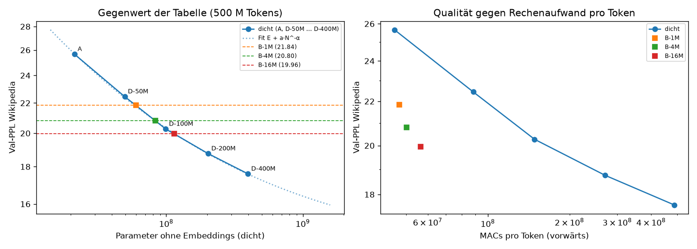

**Was das heißt:**
- **B-16M** ist so gut wie ein dichtes Modell mit ≈ 114 M Parametern, also gut fünfmal so viele wie sein
  Rechenkern (21 M). Pro Token rechnet es aber nur 56,5 M MACs; das gleichwertige dichte Modell bräuchte ≈ 165 M,
  also ≈ 2,9× so viel.
- **Jede Vervierfachung der Tabelle** bringt ≈ 1,4× gleichwertige Größe (60 → 83 → 114 M). Der Gewinn je
  Verdopplung bleibt in diesem Bereich etwa gleich und flacht noch nicht ab.
- **Der Preis dafür ist Speicher:** Die Tabelle von B-16M hat 6,44 Mrd. Parameter, 56-mal so viele wie das
  gleichwertige dichte Modell (114 M; korrigiert 2026-10-05 nach Codex-Review, vorher „dreißigmal“). Im Training brauchte B-16M ≈ 101 GB GPU-Speicher, D-200M 16 GB. Zum Schreiben muss
  die Tabelle aber nicht im Grafikspeicher liegen (Schritt 2).

**Nebenwert WikiText-103, nicht vorab als Kriterium festgelegt:**
- Auf diesem anders formatierten Set ist der Vorteil kleiner. Log-log interpoliert entspricht B-1M ≈ 48 M, B-4M
  ≈ 65 M und B-16M ≈ 95 M.
- Die Tabelle hilft also auf Text wie dem Trainingsmaterial (Wikipedia-Artikel) stärker als auf anderer
  Aufbereitung derselben Quelle.

**Grenzen** (wie vorab genannt):
- Ein Seed je dichter Größe.
- 500 M Tokens sind für 200–400 M Parameter wenig; N_eq gilt nur für dieses Token-Budget.
- Die LR ist nicht je Größe abgestimmt. Das lässt die Tabelle eher zu gut aussehen.
- Tempo-Werte nicht vergleichbar: Die Läufe teilten sich die GPU.

### Ergebnis Schritt 3 (2026-10-05, Runpod H100; Auswertung `scripts/qwen_step3_eval.py` → `report/qwen/step3_summary.json`)

**Ablauf, ehrlich:**
- **Zwei gescheiterte Setups** (≈ 1,40 $):
  - Die CPU-Tests riefen die GPU-only-Kernel von flash-linear-attention auf.
  - Danach verweigerte fla 0.5.2 mit Triton 3.6 den Rückwärtsschritt auf Hopper-GPUs (bekannter Fehler). Behoben
    mit Triton 3.7.1; geprüft mit den Unit-Tests und dem Test am echten Modell mit Regler 0: bitgleich, Training
    läuft.
- **Eigener Fehler, ≈ 7,40 $:** Ein Tippfehler aus einer ungetesteten Änderung an `run_dense.py` ließ die
  Warteschlange beim Start abstürzen. Der Pod lief ≈ 2,1 h leer, weil mein Wächter nur Log-Zeilen beobachtete.
  - Behoben: Vor dem Start werden alle Skripte kompiliert; 90 s nach dem Start wird geprüft, ob die Warteschlange
    lebt; der Wächter meldet eine tote Warteschlange.
- **Grenze erhöht:** Mit Freigabe von 13 $ auf 16,50 $ für den eigentlichen Lauf, nachdem die Tempo-Proben 13,50–15,70 $
  hochrechneten.
- **Standard-Tests von Q+T zunächst fehlgeschlagen:** lm-eval schaltet Autocast um den Modellaufruf ab, die
  fp32-Zusatzblöcke passten dann nicht zu Qwen. Behoben; Q wurde mit derselben Einstellung wiederholt und ergab
  exakt dieselben Werte.
- **Laufender Pod:** 3,92 h ≈ 13,70 $.
- **Schritt 3 insgesamt:** ≈ 22,50 $ (davon ≈ 7,40 $ Leerlauf durch meinen Fehler).
- **Sicherung:** alles auf der Storage Box und zu Hause, sha256 geprüft. Der Pod ist gelöscht.

**Tempo und Speicher (H100):**

| Lauf | Training | Speicher | Dauer (110,5 M Tokens) |
|---|---|---|---|
| Q+T | 32.600 tok/s | 33 GB | 66 min |
| Q+D | 35.800 tok/s | 17 GB | 64 min |

Q ist auf der H100 (mit fla-Kerneln) und zu Hause (PyTorch-Weg) bei der PPL identisch (12,977).

**PPL** (Token-PPL, Fenster 2048):

| Set | Q (Qwen allein) | Q+T (Tabelle) | Q+D (dichte Kontrolle) |
|---|---|---|---|
| `val_new`: zurückgehaltene neue Artikel (entscheidend) | 12,977 | 10,093 (−22,2 %) | **10,014 (−22,8 %)** |
| `val_new`, nur Wissens-Tokens | 16,32 | 12,57 | 12,73 |
| `val_known`: Val-Set 2023, HF-Aufbereitung | 13,935 | **14,904 (+7,0 %)** | 13,730 (−1,5 %) |
| `val_known_same`: alte Artikel, gleiche Aufbereitung | 14,282 | 14,029 (−1,8 %) | 12,930 (−9,5 %) |
| `mem_probe`: trainierte Artikel | 13,362 | **5,638 (−58 %)** | 9,382 (−30 %) |

**Standard-Test** (zero-shot, Genauigkeit in %, ± Standardfehler von lm-eval):

| Aufgabe | Q | Q+T | Q+D |
|---|---|---|---|
| MMLU | 49,7 ± 0,4 | **47,0 (−2,7; Grenze −2,0)** | 49,6 (−0,1) |
| ARC-Easy | 63,2 ± 2,2 | 65,8 (+2,6) | 65,0 (+1,8) |
| ARC-Challenge | 31,0 ± 2,1 | 38,0 (+7,0) | 37,0 (+6,0) |
| HellaSwag | 42,4 ± 2,2 | 41,6 (−0,8) | 42,0 (−0,4) |
| PIQA | 70,2 ± 2,0 | 71,2 (+1,0) | 69,2 (−1,0) |
| WinoGrande | 56,2 ± 2,2 | 58,8 (+2,6) | 57,0 (+0,8) |
| Mittel | 52,1 | 53,7 (+1,6) | 53,3 (+1,2) |

Die Grenze je Aufgabe ist max(2 Pp., 2 × Standardfehler der Differenz). Der Standardfehler der Differenz ist
√(se_Q² + se_X²); so habe ich „2 × Standardfehler“ umgesetzt.

**Faktentest** (exakter Treffer im ersten Versuch; 500 Lücken je Teil):

| | Q | Q+T | Q+D | Q+T − Q+D (95-%-Bootstrap, paarweise) |
|---|---|---|---|---|
| Trainings-Lücken | 4,8 % | 10,2 % | 7,8 % | **+2,4 Pp. [0,4; 4,6]** |
| Gegenprobe (nie gesehen) | 4,0 % | 10,2 % | 8,0 % | +2,2 Pp. [0,2; 4,2] |

**Urteile nach den vorab festgelegten Kriterien:**

| Kriterium | Ergebnis |
|---|---|
| **Hilft es?** (PPL `val_new`) | **„hilft etwas“.** Q+T ist 22 % besser als Q, aber **nicht besser als die dichte Kontrolle** (Q+T/Q+D = 1,008). Für „hilft deutlich“ hätte es ≤ 0,98 sein müssen. |
| **Schadet es? Q+T** | **„schadet“**, ohne dass der Chat-Teil das noch ändern kann. MMLU fällt um 2,7 Pp. (Grenze 2,0), und die PPL auf `val_known` steigt um 7,0 % (Grenze 1 %). Der Mittelwert der sechs Aufgaben steigt dagegen (+1,6 Pp.). |
| **Schadet es? Q+D** | „schadet nicht“ nach Standard-Test und bekannten Texten; der verblindete Chat-Vergleich steht noch aus. |
| **Wissen eingepflanzt?** | **Nicht erreicht.** Q+T trifft nur 2,4 Pp. mehr Trainings-Fakten als Q+D (gefordert ≥ 10). Bei der Gegenprobe ist der Vorsprung genauso groß (+2,2 Pp.); die Tabelle wird also beim Ergänzen allgemein etwas besser, nicht gezielt bei den gesehenen Fakten. |

**Was das bedeutet:**
- **Kein Vorteil gegenüber einem gleich teuren Zusatzblock:** Als Zusatz zu einem fertigen, eingefrorenen Qwen
  bringt die Tabelle in diesem Aufbau keinen Vorteil gegenüber einem kleinen dichten Block mit gleichem
  Rechenaufwand. Beide passen Qwen gleich gut an neue Wikipedia-Texte an.
- **Kein Hinweis auf eingepflanzte Fakten:** Das Add-on mit Tabelle passt sich den Trainingsartikeln als Text sehr
  stark an (PPL auf trainierten Artikeln −58 %, dichte Kontrolle −30 %). Im Faktentest wird es aber bei Trainings-
  und Gegenprobe-Artikeln gleich viel besser. Ein gezielter Abruf trainierter Fakten ist damit nicht nachgewiesen.
  Ob das Gelernte in der Tabelle oder in Keys, Projektionen und Gates steckt, habe ich nicht getestet (korrigiert 2026-10-05 nach Codex-Review;
  vorher „Gespeichert, aber nicht abrufbar“).
- **Nebenwirkungen bei der Tabelle:**
  - MMLU (Wissensfragen) sinkt.
  - Auf dem anders aufbereiteten 2023er Val-Set wird Qwen schlechter.
  - Beides tritt vor allem im 2. Durchgang auf; die Zwischenwerte bei 40 M Tokens waren besser
    (`runs/qwen_cloud/QT-s0/metrics.csv`).
  - Die dichte Kontrolle zeigt diese Nebenwirkungen nicht.

**Grenzen:**
- **Umfang:** ein Seed je Variante, eine Tabellengröße (1 M Zeilen), eine Position (hinter Block 6, 12, 18), ein
  LR-Plan (wie B, nicht für Qwen abgestimmt) und 2 Durchgänge.
- **Chat-Teil:** steht noch aus.
- **Faktentest:**
  - Exakter Treffer im ersten Versuch ist streng.
  - Viele Lücken lassen auch für einen Menschen mehrere richtige Fortsetzungen zu.
  - Ein kleiner Effekt kann darunter verschwinden; ein Vorsprung von 10 Pp. hätte aber sichtbar sein müssen.
- **Wissens-Stichtag:** In der PPL war keiner sichtbar (siehe oben). „Neues Wissen“ ist bei 0,8B-Qwen schwer von
  Stil zu trennen.

## AMD Instinct MI350X: Tests und Tempo auf AMDs Rechenzentrums-GPU (2026-10-05)

**Frage:** Laufen Code und Triton-Kernel unverändert und korrekt auf einer AMD-Rechenzentrums-GPU? Wie schnell?

**Aufbau:**
- **GPU:** Runpod, 1× AMD Instinct **MI350X** (gfx950, 288 GB), Secure Cloud, 5,49 $/h. Geplant war eine MI300X
  (2,39 $/h); die war nicht verfügbar, die MI350X wurde mit Freigabe genommen.
- **Laufzeit und Kosten:** 0,6 h ≈ 3,30 $.
- **Software:** PyTorch 2.13.0+rocm7.1, HIP 7.1, Triton 3.7.1, Python 3.12.
- **Ablauf:** `cloud/setup_amd.sh`, `scripts/run_amd.py`, Auswertung `scripts/amd_summary.py`.
- **Code:** Er wurde unverändert hochkopiert, ohne GitHub (die Historie wurde parallel bereinigt).
- **Ergebnisse:** in `runs/amd_mi350x/`, auf der Storage Box gesichert und zu Hause per sha256 geprüft (62/62
  Dateien gleich).

**Tests:** **107 von 107 bestanden** (10,6 min), darunter:
- alle Kernel-Tests mit Tabellen von 262k / 1M / 4M Zeilen
- Auswahl mit 4096 Keys je Hälfte
- Tabellen mit mehr als 2³¹ Elementen
- Decode-Graphen und Lazy Adam
- Tabelle außerhalb der GPU

**Tempo:**
- **Messaufbau:** jedes Modell allein, 3 M Tokens, gleiche Argumente wie der H100-Probelauf von Schritt 1.
- **H100-Vergleichswerte:** aus `runs/cloud_dense_preflight`.
- **RX 9070:** aus der Optimierung (Abschnitt „Ergebnis der Optimierung“); andere Messart, nur zur Einordnung.

| Modell | Training tok/s | H100 | Speicher-Spitze | Schreiben (Batch 1) tok/s | H100 | Einlesen tok/s | H100 |
|---|---|---|---|---|---|---|---|
| A | 164.900 | – | 7,9 GiB | 266 | – | 2.390.000 | – |
| D-100M | 155.900 | 208.300 | 11,8 GiB | 231 | 192 | 1.171.000 | 844.000 |
| D-400M | 71.800 | 83.000 | 15,3 GiB | 155 | 126 | 497.500 | 332.900 |
| B-1M, PyTorch-Referenz | 77.100 | – | 11,6 GiB | 185 | – | 737.700 | – |
| **B-1M, Triton-Kernel** | **125.900** | – | 10,5 GiB | 210 | – | 1.387.000 | – |
| B-4M, Triton-Kernel | 119.400 | – | 28,6 GiB | 216 | – | 1.094.000 | – |
| **B-16M, Triton-Kernel** | **112.800** | – | **101,0 GiB** | 230 | – | 764.100 | – |

- **Die Kernel helfen auf der MI350X noch mehr als zu Hause:**
  - Training 1,63×, Einlesen 1,88×, Schreiben 1,14× gegenüber der PyTorch-Referenz.
  - Gleiches Ergebnis: Val-PPL nach 3 M Tokens 1168,46 gegenüber 1168,63.
  - B-1M erreicht 76 % des Trainingstempos des Modells ohne Tabelle; auf der RX 9070 waren es 62 %.
- **B-16M passt komplett auf eine Karte:** 101 GiB, 113.000 tok/s. Ein 500-M-Token-Lauf wie in der Cloud dauerte
  allein auf einer MI350X ≈ 75 min, ≈ 7 $.
- **Gegenüber der H100**, gleicher einfacher PyTorch-Code, nicht auf eine der Karten abgestimmt:
  - Das Training dichter Modelle ist auf der MI350X langsamer (0,75× bzw. 0,87×).
  - Schreiben (1,2×) und Einlesen (1,4–1,5×) sind schneller.

**Gleiche Ergebnisse auf drei GPUs:**
- **Vergleichslauf:** B-1M mit Triton-Kerneln, die ersten 20 M Tokens des 500-M-Plans, Seed 0, auf der MI350X.
  Derselbe Lauf existiert von der RX 9070 (`runs/kernel_check/triton_500msched`) und der H200 (`runs/cloud/B-1M-s0`).
- **Ergebnis:** Val-PPL bei 20 M Tokens: MI350X 210,11, RX 9070 208,72, H200 210,75. Bei 22 M: 184,81 gegenüber
  184,56 (RX 9070).
- **Einordnung:** Unterschiede bis ≈ 1 % in dieser frühen Phase sind das bekannte Rauschen durch Gleichstände an der
  Top-k-Grenze und nicht-deterministische Summen (vgl. Optimierung: über 500 M Tokens 0,002 %).
- **Dichte Modelle:** D-100M und D-400M treffen nach 3 M Tokens auf MI350X und H100 dieselbe PPL auf 0,06 %.

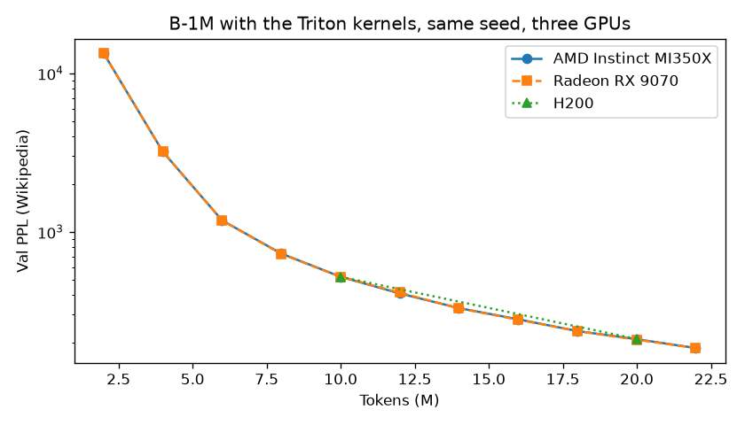

**Grenzen:**
- Je ein kurzer Lauf. Die Tempo-Werte sind Richtwerte und wurden nicht wiederholt.
- PyTorch meldet die Karte als „AMD Radeon Graphics“ (gfx950).
- Das GPU-Log hat auf der MI350X Temperatur (≈ 62 °C Junction) und Takt erfasst, aber keine Leistung. Der
  Speicherwert im Log ist unplausibel und nicht verwendet.

### Einordnung der Kernel (2026-10-05)

**Was stark ist:**
- **Portabel:** Derselbe Triton-Code rechnet auf drei grundverschiedenen GPU-Architekturen gleich: Radeon RX 9070
  (RDNA4, Consumer), Instinct MI350X (CDNA4, Rechenzentrum) und H100/H200 (Hopper).
- **Tests:** Auf der MI350X bestehen alle 107 Tests ohne Änderung.
- **Tempo** gegenüber der eigenen PyTorch-Referenz:

  | | RX 9070 | MI350X |
  |---|---|---|
  | Training | 1,47× | 1,63× |
  | Einlesen | 1,79× | 1,88× |

- **Speicher:** Der Lazy-Adam-Kernel arbeitet in place. Erst damit passt B-16M in 101 GB.

**Was die Kernel nicht sind:**
- **Kein Vergleich mit anderen optimierten Implementierungen**, etwa Metas Code zu „Memory Layers at Scale“.
- **Die Tabelle kostet weiter Zeit:** Mit Tabelle trainiert das Modell mit 62 % (RX 9070) bzw. 76 % (MI350X) des
  Tempos ohne Tabelle.
- **Nicht je GPU abgestimmt**, und nur an kleinen Modellen gemessen.

Ausführlich auf Englisch: `docs/kernels.md`.

## Zum Ausprobieren: Benchmark-Skript, Demo und Hugging Face (2026-10-05)

**Neu:**
- `scripts/kernel_speedup.py`: Kernel gegen PyTorch-Referenz auf zufälligen Tokens, ohne Daten, ~35 s.
- `scripts/demo_generate.py`: B-16M schreibt Text, Tabelle (4 Bit) auf der NVMe, im RAM oder im VRAM.
- README-Abschnitt „Try it“. Die Gewichte (4-Bit-Tabelle + Rest, 3,7 GB) sollen auf Hugging Face.

**Geprüft aus einem frischen Clone auf der RX 9070:**

| PyTorch | Tests | Benchmark (Training / Einlesen / Schreiben) |
|---|---|---|
| CachyOS-Paket (2.14.0, HIP 7.2, Triton 3.5.1) | 106 ok, 2 übersprungen, 41 s | 1,47× / 1,70× / 1,26× |
| offizielles Wheel `rocm7.2` (2.14.1, Triton 3.8.0) | 106 ok, 2 übersprungen, zweimal | 1,53× / 1,75× / 1,27× |
| offizielles Wheel `rocm7.1` (2.13.0, Triton 3.7.1) | **Abbruch** in `test_decode_graph_bit_identical[fp32]` | 1,50× / 1,77× / 1,25× |

Übersprungen werden der Qwen-Test (ohne transformers) und ein Test, der > 60 GB GPU-Speicher braucht.

- **Benchmark-Zahlen:** Die Faktoren liegen nahe an `docs/kernels.md`. Dort wurde aber anders gemessen
  (trainiertes Modell, bf16-Tabelle beim Einlesen), also keine 1:1-Wiederholung.
- **Abbruch mit `rocm7.1`:**
  - Meldung: `HSA_STATUS_ERROR_INVALID_PACKET_FORMAT` („The AQL packet is malformed“).
  - Tritt nur auf, wenn der Test nach den anderen läuft. Allein oder nur mit `tests/test_kernels.py` besteht er.
  - Ein `torch.cuda.synchronize()` vor dem Freigeben der Graphen hat nichts geändert, also wieder entfernt.
  - Ursache nicht eingegrenzt. Auf der MI350X lief dasselbe Wheel ohne Fehler.
  - README empfiehlt deshalb für Radeon `rocm7.2`.
- **`expandable_segments:True`:** Mit `PYTORCH_CUDA_ALLOC_CONF=expandable_segments:True` stürzte das Einlesen
  nach dem Training im reinen PyTorch-Pfad ab (`HSA_STATUS_ERROR_EXCEPTION`). Das Skript ignoriert die Variable
  jetzt. Ursache ebenfalls nicht eingegrenzt.

**Demo (CachyOS-PyTorch):**

| Tabelle | Tempo | GPU-Speicher (Spitze) |
|---|---|---|
| NVMe | 144 tok/s | 0,42 GB |
| VRAM | 207 tok/s | 3,75 GB |

- 200 Tokens, Page Cache warm. Gleicher Text in allen drei Modi.
- Der Text ist flüssiges Wikipedia-Englisch, die Fakten sind erfunden („Sir Isaac Newton was born on
  14 November 1803 …“). Das steht so auch im README.

**Hugging-Face-Ordner:**
- Dateien: `rest.pt`, `values_q4.bin`, `scales_q4.bin`, `hot_rows.npy` (Hardlinks auf die Tabellen-Dateien, sha256
  geprüft), dazu eine neue `meta.json` ohne lokale Pfade und eine Model Card.
- Für den Upload vorbereitet (Stand 2026-10-05).

## Codex-Review (2026-10-05)

Ein zweites Modell (OpenAI Codex) hat den alten Stand `AngryAnt` (`8cf0226`) gelesen und 22 Befunde gemeldet.
Ich habe jede genannte Codestelle nachgeprüft.

**Was sich an den Ergebnissen ändert: nichts.**
- Nach jeder Codeänderung waren bitgleich zu vorher: B-16M-Decode-Logits (Tabelle im VRAM und auf der NVMe),
  B-1M-Trainings-Logits, Loss und Gradienten sowie die Eval-Logits mit fp32-, bf16- und 4-Bit-Tabelle.
- `report/qwen/step3_summary.json` kommt unverändert heraus.
- Die strengere Faktbewertung ändert keine der 4 × 1.000 gespeicherten Antworten.

| Nr. | Befund | Stimmt? | Erledigt |
|---|---|---|---|
| 1 | Qwen-Queue meldet „fertig“ trotz gescheiterter Auswertung | ja | „fertig“ und `COMPLETE` nur, wenn alle 11 Schritte gelaufen sind, sonst „UNVOLLSTÄNDIG“ mit Liste; `run_dense` genauso |
| 2 | `bag_infer` liest über das Ende, wenn Heads × knn kein Vielfaches von 64 ist | ja, 4 × 32 = 128 nicht betroffen | letzter Block maskiert (auch `bag_forward`); Tests mit 96, 48, 40 Lookups und 3 Heads, die alte Version stürzt dabei ab |
| 3 | mehrere neue Tokens nach gefülltem KV-Cache ohne Kausalmaske | ja, nur Chunk-Prefill | Maske mit Versatz, Test gegen vollen Forward |
| 4 | Neustart nimmt leere oder halbe Dateien als fertig | ja | Prüfung (nicht leer, gültiges JSON, Status), atomares Schreiben (`smlm/atomic.py`); Dense- und Cloud-Queue: „done“ ohne `model.pt` wird gemeldet statt übersprungen oder neu trainiert. Eine Laufidentität aus Konfigurations- und Datenhash fehlt weiterhin |
| 5 | Budget-Hochrechnung nach Neustart mit 0 h Auswertung | ja | Schrittzeiten in `step_minutes.json` |
| 6 | Auswertung liest fest `Q/general_ac.json` | ja | ohne diese Datei `Q/general.json` |
| 7 | Schritt-Push ohne die Ergebnisdateien | ja | Ergebnisdatei wird mitgepusht |
| 8 | eingefrorene Tabelle wird trotzdem trainiert, Tabelle allein nicht trainierbar | ja | beides behoben, Tests |
| 9 | Optimizer-Zustand wird beim Laden falsch übernommen | ja | `load_state_dict` bricht jetzt mit Fehler ab (Training wird nie fortgesetzt) |
| 10 | BatchNorm im Training nicht präfixkausal | ja | als Grenze im README; alle berichteten PPL im Eval-Modus mit laufender Statistik |
| 11 | statistische Sicherheit überbehauptet | ja | „echt“ und „belastbar“ umformuliert, Bereiche als Sensitivitätsbereich benannt |
| 12 | „Gespeichert, aber nicht abrufbar“ erklärt mehr als gemessen | ja | umformuliert: gezielter Abruf nicht nachgewiesen, Ort des Gelernten nicht getestet |
| 13 | Parität in Kurzfassungen überzogen | ja | README präzisiert (Decoding: Tabellenmodell mit, Modell A ohne Graphen; Kernel „bis auf Rundung“); `final.md` ist privat |
| 14 | MI350X-Nachtrag nicht belegbar | nein | im Rewrite liegen `runs/amd_mi350x` und der Abschnitt oben; Codex hat den alten Ordner geprüft |
| 15 | „12“ zählt als richtig für „12.5“ | ja | Regel verschärft, Regressionstest |
| 16 | nicht unterstützte Größen scheitern erst im Kernel | ja | `mem_impl="triton"` prüft im Konstruktor und meldet klar |
| 17 | Batch-Teilbarkeit im Qwen-Training, `zero_grad` ohne Wirkung | ja | wird geprüft bzw. ist dokumentiert |
| 18 | Offload-Bitgleichheit nur über die NLL-Summe belegt | ja | Logits direkt verglichen (`scripts/check_offload_identical.py`): bitgleich mit Triton 3.5; mit Triton 3.8 weichen sie in den letzten Bits ab, gleiche Tokens |
| 19 | „dreißigmal“ statt 56-mal, GB statt GiB, 4-GB-Scope | ja | korrigiert, Fußnote zur Scope |
| 20 | v2-Status, Bildlink, „widerlegt“ | ja | korrigiert |
| 21 | Qwen-Läufe ohne Commit und Versionen | ja | `run-info.json` enthält beides jetzt; Datierung über Seiten-IDs im README genannt |
| 22 | Fit ist kein exakter Log-Fit | ja | Beschreibung korrigiert; ein exakter Log-Fit verschiebt die Fit-Werte um höchstens 0,3 M (58,5 / 83,4 / 115,7 M) |

**Neu beim Nachprüfen von 18:** Mit dem offiziellen `rocm7.2`-Wheel (Triton 3.8) rechnet `bag_infer` auf der
kleinen Staging-Tabelle (RAM/NVMe) in anderer Reihenfolge als auf der vollen Tabelle (VRAM).
- Gegen eine exakte fp64-Summe liegen beide gleich nah, mit einer Abweichung von ≈ 1e-8.
- Die Logits weichen dadurch um bis zu 0,44 ab (wenige bf16-Stufen). Die gierig erzeugten Tokens waren in allen
  Prüfungen gleich (`report/offload/identical_check_triton38.json`).
- Mit Triton 3.5 ist alles bitgleich.

**Nicht gemacht, das wären neue Experimente:** weitere Seeds, Tabellen-Ablation am Qwen-Add-on, Modell A mit
Graphen, kausale Normierung statt BatchNorm.

**Geprüft:**
- 127 Tests auf der RX 9070, aus einem frischen Clone mit dem `rocm7.2`-Wheel.
- Die Qwen-Tests (8) in `.venv-qwen`.
- Die Kernel-Tests zu den betroffenen Kerneln zusätzlich im CPU-Interpreter.
- Die Queue-Logik ohne Pod: `tests/test_cloud_queue.py` und der Fake-Modus von `run_dense.py`.
