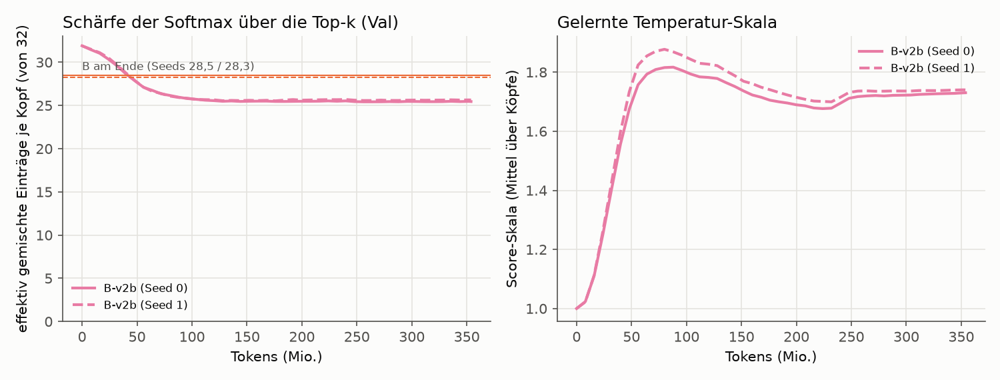

# v2 „sharpness“: Varianten von B (vorbereitet, noch nicht gelaufen)

## Anlass

Stufe 1 (1 Epoche) hat gezeigt: Die Speichertabelle ist gesund (≈ 99 % Nutzung) und trägt messbar bei
(ohne sie +17 % PPL). B ist trotzdem nur ≈ 2 % besser als A. Auffällig ist die Gewichtung **innerhalb**
der Top-32: Jeder Kopf mischt effektiv 30,5 von 32 Einträgen (Top-1-Gewicht 0,066, gleichverteilt
0,031). Die Score-Skala ist kaum gewachsen (Key-Norm 0,41 → 0,48, BatchNorm-γ ≈ 1,09). Die Schicht
ruft also nicht gezielt ab, sondern mittelt grob.

Zwei mögliche Bremsen:

1. **Weight Decay auf den Sub-Keys** (v1: 0,1, wie in der Meta-Referenz) zieht die Key-Norm und damit die
   Score-Skala Richtung null.
2. Die **Query-BatchNorm** fixiert die Skala der Query. Schärfer werden kann die Softmax dann nur noch
   über die BatchNorm-γ (1.024 einzelne Parameter je Dimension) oder über die Keys.

## Varianten (per Konfiguration schaltbar, Defaults = v1)

| Name (`--model`) | `mem_keys_weight_decay` | `mem_score_scale` | Unterschied zu B |
|---|---|---|---|
| `B` | `True` | `"none"` | – (Stufe 1) |
| `B-v2a` | `False` | `"none"` | Sub-Keys ohne Weight Decay |
| `B-v2b` | `False` | `"learned"` | v2a + lernbare Skala s_h = exp(log s_h) je Kopf: `w = softmax(s_h · scores)` |

- Die Skala wirkt **nur auf die Gewichtung**, nie auf die Auswahl der Top-k (s_h > 0 erhält die
  Reihenfolge; per Test geprüft). Startwert `--mem_score_scale_init` (Default 1,0 = exakt v1).
- `log_score_scale` liegt in der No-Decay-Gruppe mit der Basis-LR; die Sub-Keys bei v2a/v2b ebenfalls.
- Die Initialisierung verbraucht in v2a/v2b keine zusätzlichen Zufallszahlen (per Test geprüft). **B-s0, B-v2a-s0 und
  B-v2b-s0 starten also mit identischen Gewichten** (gleiches für s1) und sehen denselben Token-Strom.
  Paarweise Vergleiche sind damit sauberer als der Vergleich über Seeds (Rest-Rauschen nur durch
  nicht-deterministische GPU-Kernels).
- Neu protokolliert (alle Speichermodelle): effektiv gemischte Einträge je Kopf und Top-1-Gewicht auf
  dem Val-Set, mittlere Score-Skala, mittlere Key-Norm (`metrics.csv`), Skala je Kopf am Ende
  (`run-info.json`).

**Risiko für v2b:** Auch die BatchNorm-γ hätte schon als Temperatur wirken können und hat sich in einer
Epoche nur um ≈ 9 % bewegt. Bei Basis-LR 6e-4 kann sich log s_h mit Adam um höchstens ≈ 6e-4 pro
Schritt ändern (≈ 2 über 3600 Schritte bei konsistentem Vorzeichen). Bleibt s_h nahe 1, ist das ein
Befund („das Modell will nicht schärfer“), kein Fehler; als Folgeschritt wäre dann ein höherer
Startwert (`--mem_score_scale_init 4`) oder eine eigene LR für die Skala zu prüfen.

## Laufen lassen (erst, wenn die GPU frei ist)

```bash
cd ../AngryAnt-v2-sharpness          # dieser Worktree; data/ und .venv/ sind Symlinks auf ../AngryAnt
.venv/bin/python -m pytest -q tests  # 36 Tests inkl. GPU-Fälle (26 ohne GPU)
.venv/bin/python scripts/run_suite.py v2          # B-v2a/B-v2b × Seeds 0/1, 1 Epoche, ≈ 4 × 28 min
.venv/bin/python scripts/make_report.py v2        # vergleicht mit runs/ep1/{A,B,C}-* (gleiches Budget)
```

`runs/ep1` aus `main` muss dafür im Worktree liegen (CSV/JSON sind versioniert; für die
Zugriffs-Grafiken die `.npz`/`.npy` aus `../AngryAnt/runs/ep1` dazukopieren oder verlinken).

## Bewertung (vor den Läufen festgelegt)

Gleiche Kriterien und Schwellen wie in Stufe 1 (REPORT.de.md), je Variante gegen A und C aus `runs/ep1`:
G = (PPL_A − PPL_v)/(PPL_A − PPL_C) ≥ 0,5 und Unterschied zu A > 2·s, Tabelle gesund. Zusätzlich
berichtet: paarweise Differenz zu B bei gleichem Seed, effektiv gemischte Einträge je Kopf und die
gelernte Skala. Eine Variante gilt nur dann als „schärfer“, wenn die effektiv gemischten Einträge
deutlich unter den 30,5 von v1 liegen.

## Lauf `v2b_ep3` (festgelegt am 2026-10-02, vor dem Start)

Auf Wunsch nur **B-v2b**, **3 Epochen**, Seeds **0 und 1** (= die Seeds von B), Einstellungen exakt wie
`runs/ep3` (10.800 Schritte, Warmup 540, Cosine, Eval alle 8 M Tokens). Vergleichsbasis: `runs/ep3/{A,B,C}-*`
aus Stufe 1. Gleicher Seed heißt bei B und B-v2b: identische Startgewichte und identischer Token-Strom
(per Test geprüft), Unterschiede also nur durch die Änderung und nicht-deterministische GPU-Kernels.

```bash
.venv/bin/python scripts/run_suite.py v2b_ep3      # 2 × ≈ 82 min
for s in 0 1; do .venv/bin/python scripts/diagnose_memory.py runs/v2b_ep3/B-v2b-s$s --windows 241 --device cuda --out diagnostics_fullval.json; done
.venv/bin/python scripts/make_report.py v2b_ep3
```

**Berichtet und bewertet:**

1. **Stufe-1-Kriterien** gegen A und C aus `runs/ep3` (unverändert: G ≥ 0,5, Unterschied zu A > 2·s,
   Tabelle gesund).
2. **Paarweiser Vergleich mit B beim gleichen Seed:** Δ Val-PPL und Δ Test-PPL je Seed.
   **„B-v2b klar besser als B“** heißt: bei **beiden** Seeds besser **und** die mittlere Verbesserung
   ist größer als 2·s, mit s = größte Seed-Spanne der Val-PPL von B (0,33) bzw. B-v2b. (Meine
   Operationalisierung; sie ist streng, weil s die Streuung über *verschiedene* Startgewichte misst,
   während der paarweise Vergleich gleiche Startgewichte hat.)
3. **Greift der Fix?** Softmax-Schärfe auf dem kompletten Val-Set (246.784 Tokens, gleiches Skript
   `diagnose_memory.py --windows 241` für B und B-v2b): effektive Zahl gemischter Einträge je Kopf
   (exp(Entropie)) und Top-1-Gewicht, dazu die gelernte Skala je Kopf und der Verlauf über das Training.
   Referenz B: **28,51 / 28,28** Einträge, Top-1-Gewicht **0,095 / 0,097** (Seed 0 / 1).
   **„Fix greift“** heißt: effektive Einträge bei beiden Seeds **≤ 0,9 × B** (≤ 25,7 / ≤ 25,5).

**Entscheidungsregel (Vorgabe):** v2a wird erst gestartet, wenn B-v2b *klar besser* als B ist. Da v2b
zwei Dinge gleichzeitig ändert (kein Weight Decay auf den Keys **und** lernbare Skala), würde v2a dann
klären, welcher Teil wirkt.

## Ergebnis `v2b_ep3` (2026-10-02)

Beide Läufe auf `11ed78c`, nicht dirty, Laufzeit je 82 min, Durchsatz wie B (71,9 / 71,8 k tok/s).
Tabellen und Grafiken: `report/v2b_ep3_*`.

**1. Stufe-1-Kriterien (gegen A und C aus `runs/ep3`):**

| | PPL (Mittel; Seeds) | PPL_A − PPL | G | Urteil |
|---|---|---|---|---|
| B | 23,63 (23,80 / 23,47) | +1,10 (> 2·s = 0,67) | 0,20 | unklar |
| B-v2b | 23,59 (23,74 / 23,44) | +1,14 (> 2·s = 0,61) | 0,20 | unklar |

**2. Paarweiser Vergleich mit B (gleiche Startgewichte, gleiche Daten):**

| Seed | Val-PPL B → B-v2b | Δ Val | Test-PPL B → B-v2b | Δ Test |
|---|---|---|---|---|
| 0 | 23,80 → 23,74 | −0,059 (−0,25 %) | 24,02 → 23,99 | −0,11 % |
| 1 | 23,47 → 23,44 | −0,030 (−0,13 %) | 23,76 → 23,74 | −0,07 % |

Mittlere Differenz −0,044 PPL. Zum Vergleich: B ist 1,10 PPL besser als A; v2b legt also ≈ 4 % dieses
Abstands drauf. Über das Training schwankt der paarweise Unterschied zwischen −0,7 % und +0,2 %.
**Gate „B-v2b klar besser als B“: nein** (beide Seeds besser, aber 0,044 ≪ 2·s = 0,67).

**3. Greift der Fix? (komplettes Val-Set, `diagnostics_fullval.json`)**

| | eff. gemischte Einträge je Kopf (von 32) | Top-1-Gewicht | gelernte Skala je Kopf | Key-Norm |
|---|---|---|---|---|
| B-s0 / B-s1 | 28,51 / 28,28 | 0,095 / 0,097 | 1 (fest) | 0,59 / 0,61 |
| B-v2b-s0 / -s1 | 25,46 / 25,64 | 0,136 / 0,132 | 1,72–1,74 / 1,74–1,75 | 0,66 / 0,66 |
| Verhältnis v2b / B | 0,893 / 0,907 | 1,43 / 1,35 | | |

**Gate „Fix greift“ (≤ 0,9 × B bei beiden Seeds): nein**, knapp (Seed 0 erfüllt, Seed 1 verfehlt um
0,7 %). Die während des Trainings protokollierten Werte (bf16) stimmen mit der Messung (fp32) überein
(25,453 vs. 25,456; 25,636 vs. 25,640), die Messung misst also, was sie soll.



**Was das bedeutet:**

- Die Gewichtung wird schärfer (≈ 3 Einträge weniger gemischt, Top-1-Gewicht +35–43 %), aber die
  Perplexity ändert sich praktisch nicht (−0,2 %).
- **Die Skala ist nicht durch die Lernrate begrenzt.** Sie steigt bis ≈ 80 M Tokens auf 1,82 / 1,87,
  fällt dann wieder und bleibt ab ≈ 250 M Tokens bei ≈ 1,73. Das Modell *wählt* diese Schärfe. Zugleich
  schrumpft der rohe Score-Abstand zwischen bestem und 32. Eintrag (1,55 / 1,60 bei B → 1,24 / 1,21),
  das Modell gleicht die Skala also teilweise wieder aus. Effektiv: 1,24 × 1,73 ≈ 2,1 statt 1,55.
- Das Modell stützt sich mit v2b etwas stärker auf *bestimmte* Einträge: Speicher auf null → PPL 36,3 /
  36,3 (B: 34,2 / 35,8), zufällige Einträge → 41,2 / 42,4 (B: 37,5 / 40,8). Nutzung (≈ 100 %) und
  Zugriffsverteilung bleiben wie bei B (Top 20 % der Einträge → 57 / 54 % der Zugriffe).
- **Die Hypothese „flache Softmax bremst den Speicher“ hat sich für diese Variante nicht bestätigt.** Mit freier
  Temperatur wird das Modell nur mäßig schärfer und gewinnt dadurch fast nichts. Andere Wege zu schärferer
  Auswahl sind damit nicht ausgeschlossen (korrigiert 2026-10-05 nach Codex-Review; vorher „weitgehend widerlegt“, obwohl das Gate bei
  Seed 1 knapp verfehlt wurde). Der Engpass liegt
  woanders (Kandidaten aus REPORT.de.md: Datenregime, Werte-LR, Zahl der Speicherschichten).

**Entscheidung nach Vorgabe:** v2b ist nicht klar besser als B → **v2a wird nicht gestartet.**
